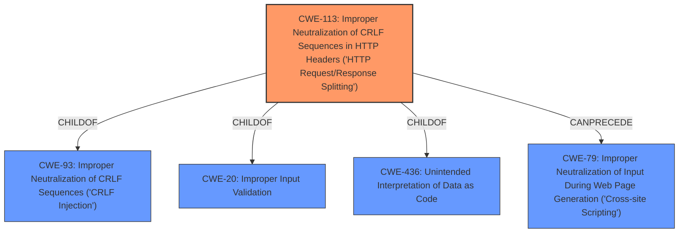

# Analysis for CVE-2021-20802

# Summary
| CWE ID | CWE Name | Confidence | CWE Abstraction Level | CWE Vulnerability Mapping Label | CWE-Vulnerability Mapping Notes |
|---|---|---|---|---|---|
| CWE-113 | Improper Neutralization of CRLF Sequences in HTTP Headers ('HTTP Request/Response Splitting') | 1.0 | Variant | Primary | Allowed |

## Evidence and Confidence

*   **Confidence Score:** 1.0
*   **Evidence Strength:** HIGH

## Relationship Analysis
The primary CWE selected is CWE-113, which is a Variant-level weakness. It is a child of CWE-93 (Improper Neutralization of CRLF Sequences) and CWE-20 (Improper Input Validation). The selection of CWE-113 is based on the specific weakness described in the vulnerability, i.e., the **improper neutralization** of CRLF sequences in HTTP headers, leading to HTTP request/response splitting. The relationship to CWE-93 indicates that the broader issue is the **improper handling** of CRLF sequences, while the relationship to CWE-20 highlights the **improper input validation** aspect.

## Vulnerability Chain
The vulnerability chain starts with **improper input handling**, leading to **HTTP header injection**. This allows a remote attacker to alter information stored in the product.
  - **Root Cause:** **Improper Input Handling/Validation**
  - **Weakness:** **Improper Neutralization** of CRLF Sequences in HTTP Headers (CWE-113)
  - **Impact:** Remote attacker can alter the information stored in the product.

## Summary of Analysis
The initial analysis pointed towards CWE-113 as the primary weakness, which is supported by the vulnerability description highlighting the **improper neutralization** of CRLF sequences in HTTP headers. The "**HTTP header injection**" vulnerability key phrase, coupled with the description of how a remote attacker can alter stored information, strongly suggests CWE-113.

The **CVE Reference Links Content Summary** section provides explicit evidence: "The vulnerability is caused by insufficient sanitization or validation of user-controlled input that is used to construct HTTP headers. This allows an attacker to inject arbitrary HTTP headers," and "HTTP Header Injection (CWE-113)".

The graph relationships also reinforce the selection of CWE-113, showing it as a child of CWE-93 and CWE-20, indicating a specific type of **improper neutralization** and **improper input validation**.

The selection of CWE-113 is at the optimal level of specificity, as it directly addresses the mechanism of the vulnerability i.e. **improper neutralization** of CRLF sequences in HTTP headers.

Relevant CWE Information:

# Enhanced Context (25 CWEs)
The following CWEs were identified as potentially relevant to this vulnerability:

## CWE-74: Improper Neutralization of Special Elements in Output Used by a Downstream Component ('Injection')
**Abstraction Level**: Class
**Similarity Score**: 0.73
**Source**: dense

**Description**:
The product constructs all or part of a command, data structure, or record using externally-influenced input from an upstream component, but it does not neutralize or incorrectly neutralizes special elements that could modify how it is parsed or interpreted when it is sent to a downstream component.

**Mapping Guidance**:
- Usage: Discouraged
- Rationale: CWE-74 is high-level and often misused when lower-level weaknesses are more appropriate.

## CWE-113: Improper Neutralization of CRLF Sequences in HTTP Headers ('HTTP Request/Response Splitting')
**Abstraction Level**: Variant
**Similarity Score**: 9822.20
**Source**: sparse

**Description**:
The product receives data from an HTTP agent/component (e.g., web server, proxy, browser, etc.), but it does not neutralize or incorrectly neutralizes CR and LF characters before the data is included in outgoing HTTP headers.

**Mapping Guidance**:
- Usage: Allowed
- Rationale: This CWE entry is at the Variant level of abstraction, which is a preferred level of abstraction for mapping to the root causes of vulnerabilities.

## CWE-93: Improper Neutralization of CRLF Sequences ('CRLF Injection')
**Abstraction Level**: Base
**Similarity Score**: 4.33
**Source**: graph

**Description**:
CWE-93: Improper Neutralization of CRLF Sequences ('CRLF Injection')

**Mapping Guidance**:
- Usage: Allowed
- Rationale: This CWE entry is at the Base level of abstraction, which is a preferred level of abstraction for mapping to the root causes of vulnerabilities.

### Other CWEs Considered:
- CWE-74: Improper Neutralization of Special Elements in Output Used by a Downstream Component ('Injection'). This is a class-level CWE, and CWE-113 is a more specific variant. CWE-74 is therefore not appropriate.
- CWE-93: Improper Neutralization of CRLF Sequences ('CRLF Injection'). While related, CWE-113 provides more specific context regarding HTTP headers. Therefore, CWE-113 is a better fit.
- CWE-79: Improper Neutralization of Input During Web Page Generation ('Cross-site Scripting'). This is not relevant because the vulnerability is about HTTP header injection, not XSS.
- CWE-20: Improper Input Validation. While input validation is a contributing factor, CWE-113 more accurately describes the specific weakness.