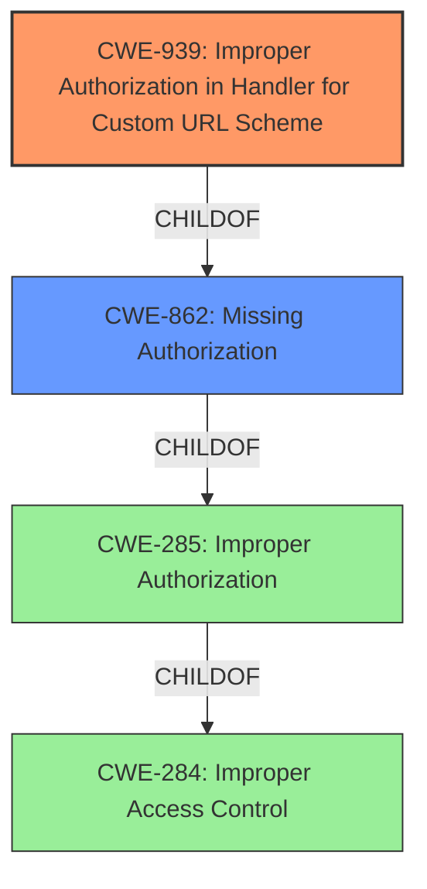

# Raw Analyzer Response for CVE-2021-20835

# Summary
| CWE ID | CWE Name | Confidence | CWE Abstraction Level | CWE Vulnerability Mapping Label | CWE-Vulnerability Mapping Notes |
|---|---|---|---|---|---|
| CWE-939 | Improper Authorization in Handler for Custom URL Scheme | 1.0 | Base | Allowed | Primary CWE |
| CWE-862 | Missing Authorization | 0.7 | Class | Allowed-with-Review | Secondary Candidate |

## Evidence and Confidence

*   **Confidence Score:** 0.9
*   **Evidence Strength:** HIGH

## Relationship Analysis
The primary CWE is CWE-939, which is a base level CWE and a child of CWE-862. The other considered CWEs were either too high-level (e.g., CWE-284, CWE-285) or did not accurately reflect the specific vulnerability. The relationship between CWE-939 and its parent CWE-862 influenced the decision to consider CWE-862 as a secondary candidate due to its relevance.

## Vulnerability Chain
The vulnerability chain starts with the **improper authorization** in the handler for a custom URL scheme, which allows a remote attacker to lead a user to access an arbitrary website. This website can then launch an arbitrary Activity of the app, potentially leading to the Mercari account's access token being obtained.

Root Cause: **Improper authorization** in handler for custom URL scheme (CWE-939)
Impact: Access arbitrary website, launch arbitrary Activity, obtain Mercari accounts access token

## Summary of Analysis
The analysis is based on the provided evidence, specifically the vulnerability description and the CVE reference links content summary. The key phrase "Improper authorization" directly points to authorization-related CWEs. The retriever results also highlight CWE-939 as a strong candidate.

The CVE reference links content summary mentions the **root cause** as "Improper handling of Intent" and that "the application does not properly validate the source or content of Intents, allowing an attacker to launch arbitrary activities within the application." It also states, "The vulnerability lies in the improper handling of Intents (CWE-939), which allows an attacker to launch arbitrary activities within the Mercari application through a crafted Intent."

CWE-939 (Improper Authorization in Handler for Custom URL Scheme) is selected as the primary CWE because it aligns precisely with the vulnerability description and the root cause identified in the CVE reference. The description of CWE-939 states, "The product uses a handler for a custom URL scheme, but it does not properly restrict which actors can invoke the handler using the scheme," which directly matches the vulnerability.

CWE-862 (Missing Authorization) is considered a secondary candidate because CWE-939 is a child of CWE-862, and there is an element of missing authorization. However, CWE-939 is more specific and accurately captures the vulnerability's essence.

The selected CWEs are at the optimal level of specificity because CWE-939 is a Base level CWE, which is preferred. Higher-level CWEs like CWE-284 (Improper Access Control) and CWE-285 (Improper Authorization) are too generic and do not capture the specific weakness in the handler for the custom URL scheme.

Relevant CWE Information:

# Enhanced Context (25 CWEs)
The following CWEs were identified as potentially relevant to this vulnerability:

## CWE-639: Authorization Bypass Through User-Controlled Key
**Abstraction Level**: Base
**Similarity Score**: 0.75
**Source**: dense

**Description**:
The system's authorization functionality does not prevent one user from gaining access to another user's data or record by modifying the key value identifying the data.

**Mapping Guidance**:
- Usage: Allowed
- Rationale: This CWE entry is at the Base level of abstraction, which is a preferred level of abstraction for mapping to the root causes of vulnerabilities.

## CWE-668: Exposure of Resource to Wrong Sphere
**Abstraction Level**: Class
**Similarity Score**: 0.74
**Source**: dense

**Description**:
The product exposes a resource to the wrong control sphere, providing unintended actors with inappropriate access to the resource.

**Mapping Guidance**:
- Usage: Discouraged
- Rationale: CWE-668 is high-level and is often misused as a catch-all when lower-level CWE IDs might be applicable. It is sometimes used for low-information vulnerability reports [REF-1287]. It is a level-1 Class (i.e., a child of a Pillar). It is not useful for trend analysis.

## CWE-1390: Weak Authentication
**Abstraction Level**: Class
**Similarity Score**: 0.73
**Source**: dense

**Description**:
The product uses an authentication mechanism to restrict access to specific users or identities, but the mechanism does not sufficiently prove that the claimed identity is correct.

**Mapping Guidance**:
- Usage: Allowed-with-Review
- Rationale: This CWE entry is a Class and might have Base-level children that would be more appropriate

## CWE-274: Improper Handling of Insufficient Privileges
**Abstraction Level**: Base
**Similarity Score**: 0.73
**Source**: dense

**Description**:
The product does not handle or incorrectly handles when it has insufficient privileges to perform an operation, leading to resultant weaknesses.

**Mapping Guidance**:
- Usage: Discouraged
- Rationale: This CWE entry could be deprecated in a future version of CWE.

## CWE-41: Improper Resolution of Path Equivalence
**Abstraction Level**: Base
**Similarity Score**: 0.73
**Source**: dense

**Description**:
The product is vulnerable to file system contents disclosure through path equivalence. Path equivalence involves the use of special characters in file and directory names. The associated manipulations are intended to generate multiple names for the same object.

**Mapping Guidance**:
- Usage: Allowed
- Rationale: This CWE entry is at the Base level of abstraction, which is a preferred level of abstraction for mapping to the root causes of vulnerabilities.

## CWE-1220: Insufficient Granularity of Access Control
**Abstraction Level**: Base
**Similarity Score**: 0.73
**Source**: dense

**Description**:
The product implements access controls via a policy or other feature with the intention to disable or restrict accesses (reads and/or writes) to assets in a system from untrusted agents. However, implemented access controls lack required granularity, which renders the control policy too broad because it allows accesses from unauthorized agents to the security-sensitive assets.

**Mapping Guidance**:
- Usage: Allowed
- Rationale: This CWE entry is at the Base level of abstraction, which is a preferred level of abstraction for mapping to the root causes of vulnerabilities.

## CWE-280: Improper Handling of Insufficient Permissions or Privileges
**Abstraction Level**: Base
**Similarity Score**: 0.73
**Source**: dense

**Description**:
The product does not handle or incorrectly handles when it has insufficient privileges to access resources or functionality as specified by their permissions. This may cause it to follow unexpected code paths that may leave the product in an invalid state.

**Mapping Guidance**:
- Usage: Allowed
- Rationale: This CWE entry is at the Base level of abstraction, which is a preferred level of abstraction for mapping to the root causes of vulnerabilities.

## CWE-451: User Interface (UI) Misrepresentation of Critical Information
**Abstraction Level**: Class
**Similarity Score**: 0.73
**Source**: dense

**Description**:
The user interface (UI) does not properly represent critical information to the user, allowing the information - or its source - to be obscured or spoofed. This is often a component in phishing attacks.

**Mapping Guidance**:
- Usage: Allowed-with-Review
- Rationale: This CWE entry is a Class and might have Base-level children that would be more appropriate

## CWE-807: Reliance on Untrusted Inputs in a Security Decision
**Abstraction Level**: Base
**Similarity Score**: 0.73
**Source**: dense

**Description**:
The product uses a protection mechanism that relies on the existence or values of an input, but the input can be modified by an untrusted actor in a way that bypasses the protection mechanism.

**Mapping Guidance**:
- Usage: Allowed
- Rationale: This CWE entry is at the Base level of abstraction, which is a