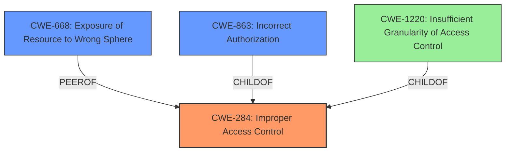

# Analysis Report for CVE-2021-20862

# Vulnerability Analysis Report: CVE-2021-20862

## Description


## Analysis (with Relationship Data)

# Summary
| CWE ID | CWE Name | Confidence | CWE Abstraction Level | CWE Vulnerability Mapping Label | CWE-Vulnerability Mapping Notes |
|---|---|---|---|---|---|
| CWE-284 | Improper Access Control | 0.9 | Pillar | Primary | Discouraged |
| CWE-668 | Exposure of Resource to Wrong Sphere | 0.6 | Class | Secondary | Discouraged |
| CWE-863 | Incorrect Authorization | 0.5 | Class | Secondary | Allowed-with-Review |

## Evidence and Confidence

*   **Confidence Score:** 0.9
*   **Evidence Strength:** HIGH

## Relationship Analysis
The primary CWE, CWE-284, is a high-level Pillar, which is generally discouraged. However, in this case, the description explicitly states "**Improper access control**" as the root cause, making it directly applicable, despite its high-level nature. The retriever results suggested more specific children like CWE-863 and CWE-1220, but the provided information doesn't give enough details to pinpoint the exact mechanism of the **improper access control**. CWE-668 is a peer as the resource i.e. settings is exposed to the wrong control sphere.



## Vulnerability Chain
The chain starts with **improper access control** (CWE-284), which allows an unauthenticated attacker to bypass access restrictions. This leads to the ability to obtain anti-CSRF tokens and change the product's settings. The missing link is the specific mechanism causing the access control failure, making it difficult to select a more specific CWE.

## Summary of Analysis
The initial assessment focused on the explicit mention of "**Improper access control**" in the vulnerability description. Despite the discouragement of using such a high-level CWE, the direct statement of the root cause and the lack of specific details about the underlying mechanism support this choice. The "CVE Reference Links Content Summary" reinforces this by stating the root cause is **improper access control**, leading to the disclosure of anti-CSRF tokens.

The graph relationships influenced the consideration of children and peers of CWE-284. However, without more specific details, selecting a child CWE would be speculative. Therefore, CWE-284 remains the most accurate classification based on the available evidence, even if it's a Pillar. The other CWEs (CWE-668, CWE-863) are secondary candidates due to representing parts of the overall vulnerability.

The selection of CWE-284 is at the appropriate level of specificity given the available information. While a more detailed CWE would be preferable, the evidence does not support a more granular classification. The decision is primarily based on the explicit mention of "**Improper access control**" as the root cause, as supported by the vulnerability description and the CVE Reference Links Content Summary.

Relevant CWE Information:

# Enhanced Context (25 CWEs)
The following CWEs were identified as potentially relevant to this vulnerability:

## CWE-807: Reliance on Untrusted Inputs in a Security Decision
**Abstraction Level**: Base
**Similarity Score**: 0.77
**Source**: dense

**Description**:
The product uses a protection mechanism that relies on the existence or values of an input, but the input can be modified by an untrusted actor in a way that bypasses the protection mechanism.

**Mapping Guidance**:
- Usage: Allowed
- Rationale: This CWE entry is at the Base level of abstraction, which is a preferred level of abstraction for mapping to the root causes of vulnerabilities.

*Not selected because* while the vulnerability allows an attacker to change settings, the root cause isn't directly tied to reliance on untrusted inputs for a security decision. The problem is that the initial access control is **improper**.

## CWE-74: Improper Neutralization of Special Elements in Output Used by a Downstream Component ('Injection')
**Abstraction Level**: Class
**Similarity Score**: 0.76
**Source**: dense

**Description**:
The product constructs all or part of a command, data structure, or record using externally-influenced input from an upstream component, but it does not neutralize or incorrectly neutralizes special elements that could modify how it is parsed or interpreted when it is sent to a downstream component.

**Mapping Guidance**:
- Usage: Discouraged
- Rationale: CWE-74 is high-level and often misused when lower-level weaknesses are more appropriate.

*Not selected because* while the attacker can change settings, there is no evidence to suggest this is due to an injection vulnerability. The primary issue is the **improper access control** that permits access to the settings in the first place.

## CWE-799: Improper Control of Interaction Frequency
**Abstraction Level**: Class
**Similarity Score**: 0.76
**Source**: dense

**Description**:
The product does not properly limit the number or frequency of interactions that it has with an actor, such as the number of incoming requests.

**Mapping Guidance**:
- Usage: Allowed-with-Review
- Rationale: This CWE entry is a Class and might have Base-level children that would be more appropriate

*Not selected because* The vulnerability doesn't seem related to limiting interaction frequency but rather to gaining unauthorized access initially.

## CWE-41: Improper Resolution of Path Equivalence
**Abstraction Level**: Base
**Similarity Score**: 0.76
**Source**: dense

**Description**:
The product is vulnerable to file system contents disclosure through path equivalence. Path equivalence involves the use of special characters in file and directory names. The associated manipulations are intended to generate multiple names for the same object.

**Mapping Guidance**:
- Usage: Allowed
- Rationale: This CWE entry is at the Base level of abstraction, which is a preferred level of abstraction for mapping to the root causes of vulnerabilities.

*Not selected because* This CWE is specific to file system path equivalence issues. There is no evidence in the description that path equivalence is the cause.

## CWE-294: Authentication Bypass by Capture-replay
**Abstraction Level**: Base
**Similarity Score**: 0.76
**Source**: dense

**Description**:
A capture-replay flaw exists when the design of the product makes it possible for a malicious user to sniff network traffic and bypass authentication by replaying it to the server in question to the same effect as the original message (or with minor changes).

**Mapping Guidance**:
- Usage: Allowed
- Rationale: This CWE entry is at the Base level of abstraction, which is a preferred level of abstraction for mapping to the root causes of vulnerabilities.

*Not selected because* The vulnerability is bypassing access restrictions and obtaining CSRF tokens, not specifically bypassing authentication through capture-replay.

## CWE-184: Incomplete List of Disallowed Inputs
**Abstraction Level**: Base
**Similarity Score**: 0.75
**Source**: dense

**Description**:
The product implements a protection mechanism that relies on a list of inputs (or properties of inputs) that are not allowed by policy or otherwise require other action to neutralize before additional processing takes place, but the list is incomplete.

**Mapping Guidance**:
- Usage: Allowed
- Rationale: This CWE entry is at the Base level of abstraction, which is a preferred level of abstraction for mapping to the root causes of vulnerabilities.

*Not selected because* The root cause is not related to an incomplete list of disallowed inputs, but rather, **improper access control**.

## CWE-668: Exposure of Resource to Wrong Sphere
**Abstraction Level**: Class
**Similarity Score**: 0.75
**Source**: dense

**Description**:
The product exposes a resource to the wrong control sphere, providing unintended actors with inappropriate access to the resource.

**Mapping Guidance**:
- Usage: Discouraged
- Rationale: CWE-668 is high-level and is often misused as a catch-all when lower-level CWE IDs might be applicable. It is sometimes used for low-information vulnerability reports [REF-1287]. It is a level-1 Class (i.e., a child of a Pillar). It is not useful for trend analysis.

*Selected as secondary because* The vulnerability allows a network-adjacent unauthenticated attacker to change the products settings. The product settings is the resource being exposed. The lack of specificity makes it secondary.

## CWE-1391: Use of Weak Credentials
**Abstraction Level**: Class
**Similarity Score**: 0.


## CWE Relationship Analysis

Current CWEs represent these abstraction levels: .


### Vulnerability Chain Analysis

**Chain starting from CWE-294:**
- 294 (Authentication Bypass by Capture-replay) - ROOT


**Chain starting from CWE-284:**
- 284 (Improper Access Control) - ROOT


### CWE Relationship Diagram

```mermaid
graph TD
    classDef primary fill:#f96,stroke:#333,stroke-width:2px
    classDef secondary fill:#69f,stroke:#333
    classDef tertiary fill:#9e9,stroke:#333
```


*Report generated on 2025-04-02 01:48:07*
