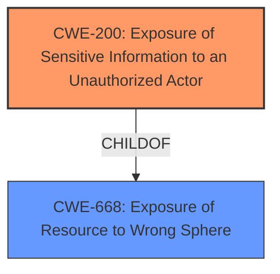

# Analysis Report for CVE-2021-20871

# Vulnerability Analysis Report: CVE-2021-20871

## Description


## Analysis (with Relationship Data)

# Summary

| CWE ID  | CWE Name                                                        | Confidence | CWE Abstraction Level | CWE Vulnerability Mapping Label | CWE-Vulnerability Mapping Notes |
| ------- | --------------------------------------------------------------- | ---------- | --------------------- | ------------------------------- | ----------------------------- |
| CWE-200 | Exposure of Sensitive Information to an Unauthorized Actor    | 0.9        | Class                 | Primary                         | Discouraged                   |

## Evidence and Confidence

*   **Confidence Score:** 0.9
*   **Evidence Strength:** HIGH

## Relationship Analysis

The primary relationship that influenced the decision was the ChildOf relationship between CWE-200 and CWE-668. Although CWE-200 is a Class level, it is the most descriptive CWE based on the evidence. There are many Base level CWEs that are children of CWE-200, but they are not suitable in this case.



## Vulnerability Chain

The vulnerability chain starts with the **improper handling of SOAP messages**, leading to the **exposure of sensitive information**, which results in unauthorized access to credentials.

## Summary of Analysis

The initial assessment considered CWE-200 as the primary candidate due to the **exposure of sensitive information**. The Retriever Results and the "CWE for similar CVE Descriptions" section both list CWE-200 as the primary match. The vulnerability description explicitly states that the root cause is the **improper handling of SOAP messages**, which leads to the **exposure of credentials**.

The final decision is based on the evidence provided in the vulnerability description and the CVE Reference Links Content Summary. The description clearly indicates that the vulnerability results in the exposure of sensitive information to an unauthorized actor, which aligns with the definition of CWE-200.

The mapping guidance for CWE-200 is "Discouraged" because it is often misused to represent the loss of confidentiality, which is a technical impact rather than a root cause. However, in this case, the **exposure of sensitive information** is a direct result of **improper handling of SOAP messages**, making CWE-200 an appropriate choice. The CWE selected is at the optimal level of specificity because it accurately describes the vulnerability and its impact. Other CWEs considered were either too high-level or did not accurately reflect the nature of the vulnerability.

Relevant CWE Information:

# Enhanced Context (25 CWEs)

## CWE-538: Insertion of Sensitive Information into Externally-Accessible File or Directory
**Abstraction Level**: Base
**Similarity Score**: 0.78

**Description**:
The product places sensitive information into files or directories that are accessible to actors who are allowed to have access to the files, but not to the sensitive information.

**Mapping Guidance**:
- Usage: Allowed

## CWE-312: Cleartext Storage of Sensitive Information
**Abstraction Level**: Base
**Similarity Score**: 0.78

**Description**:
The product stores sensitive information in cleartext within a resource that might be accessible to another control sphere.

**Mapping Guidance**:
- Usage: Allowed

## CWE-226: Sensitive Information in Resource Not Removed Before Reuse
**Abstraction Level**: Base
**Similarity Score**: 0.77

**Description**:
The product releases a resource such as memory or a file so that it can be made available for reuse, but it does not clear or "zeroize" the information contained in the resource before the product performs a critical state transition or makes the resource available for reuse by other entities.

**Mapping Guidance**:
- Usage: Allowed

## CWE-668: Exposure of Resource to Wrong Sphere
**Abstraction Level**: Class
**Similarity Score**: 0.77

**Description**:
The product exposes a resource to the wrong control sphere, providing unintended actors with inappropriate access to the resource.

**Mapping Guidance**:
- Usage: Discouraged

## CWE-319: Cleartext Transmission of Sensitive Information
**Abstraction Level**: Base
**Similarity Score**: 0.77

**Description**:
The product transmits sensitive or security-critical data in cleartext in a communication channel that can be sniffed by unauthorized actors.

**Mapping Guidance**:
- Usage: Allowed

## CWE-497: Exposure of Sensitive System Information to an Unauthorized Control Sphere
**Abstraction Level**: Base
**Similarity Score**: 0.77

**Description**:
The product does not properly prevent sensitive system-level information from being accessed by unauthorized actors who do not have the same level of access to the underlying system as the product does.

**Mapping Guidance**:
- Usage: Allowed

## CWE-212: Improper Removal of Sensitive Information Before Storage or Transfer
**Abstraction Level**: Base
**Similarity Score**: 0.77

**Description**:
The product stores, transfers, or shares a resource that contains sensitive information, but it does not properly remove that information before the product makes the resource available to unauthorized actors.

**Mapping Guidance**:
- Usage: Allowed

## CWE-1391: Use of Weak Credentials
**Abstraction Level**: Class
**Similarity Score**: 0.77

**Description**:
The product uses weak credentials (such as a default key or hard-coded password) that can be calculated, derived, reused, or guessed by an attacker.

**Mapping Guidance**:
- Usage: Allowed-with-Review

## CWE-807: Reliance on Untrusted Inputs in a Security Decision
**Abstraction Level**: Base
**Similarity Score**: 0.76

**Description**:
The product uses a protection mechanism that relies on the existence or values of an input, but the input can be modified by an untrusted actor in a way that bypasses the protection mechanism.

**Mapping Guidance**:
- Usage: Allowed

## CWE-345: Insufficient Verification of Data Authenticity
**Abstraction Level**: Class
**Similarity Score**: 0.76

**Description**:
The product does not sufficiently verify the origin or authenticity of data, in a way that causes it to accept invalid data.

**Mapping Guidance**:
- Usage: Discouraged

## CWE-200: Exposure of Sensitive Information to an Unauthorized Actor
**Abstraction Level**: Class
**Similarity Score**: 7419.35

**Description**:
The product exposes sensitive information to an actor that is not explicitly authorized to have access to that information.

**Mapping Guidance**:
- Usage: Discouraged

## CWE-693: Protection Mechanism Failure
**Abstraction Level**: Pillar
**Similarity Score**: 7047.10

**Description**:
The product does not use or incorrectly uses a protection mechanism that provides sufficient defense against directed attacks against the product.

**Mapping Guidance**:
- Usage: Discouraged

## CWE-863: Incorrect Authorization
**Abstraction Level**: Class
**Similarity Score**: 6266.81

**Description**:
The product performs an authorization check when an actor attempts to access a resource or perform an action, but it does not correctly perform the check.

**Mapping Guidance**:
- Usage: Allowed-with-Review

## CWE-639: Authorization Bypass Through User-Controlled Key
**Abstraction Level**: Base
**Similarity Score**: 5310.33

**Description**:
The system's authorization functionality does not prevent one user from gaining access to another user's data or record by modifying the key value identifying the data.

**Mapping Guidance**:
- Usage: Allowed

## CWE-285: Improper Authorization
**Abstraction Level**: Class
**Similarity Score**: 5192.18

**Description**:
The product does not perform or incorrectly performs an authorization check when an actor attempts to access a resource or perform an action.

**Mapping Guidance**:
- Usage: Discouraged

## CWE-201: Insertion of Sensitive Information Into Sent Data
**Abstraction Level**: base
**Similarity Score**: 4.33

**Description**:
CWE-201: Insertion of Sensitive Information Into Sent Data

**Mapping Guidance**:
- Usage: Allowed

## CWE-1272: Sensitive Information Uncleared Before Debug/Power State Transition
**Abstraction Level**: base
**Similarity Score**: 4.33

**Description**:
CWE-1272: Sensitive Information Uncleared Before Debug/Power State Transition

**Mapping Guidance**:
- Usage: Allowed

## CWE-523: Unprotected Transport of Credentials
**Abstraction Level**: base
**Similarity Score**: 3.64

**Description**:
CWE-523: Unprotected Transport of Credentials

**Mapping Guidance**:
- Usage: Allowed

## CWE-1289: Improper Validation of Unsafe Equivalence in Input
**Abstraction Level**: base
**Similarity Score**: 3.64

**Description**:
CWE-1289: Improper Validation of Unsafe Equivalence in Input

**Mapping


## CWE Relationship Analysis

Current CWEs represent these abstraction levels: .


### Vulnerability Chain Analysis

**Chain starting from CWE-693:**
- 693 (Protection Mechanism Failure) - ROOT


**Chain starting from CWE-1391:**
- 1391 (Use of Weak Credentials) - ROOT


### CWE Relationship Diagram

```mermaid
graph TD
    classDef primary fill:#f96,stroke:#333,stroke-width:2px
    classDef secondary fill:#69f,stroke:#333
    classDef tertiary fill:#9e9,stroke:#333
```


*Report generated on 2025-04-01 19:32:35*
