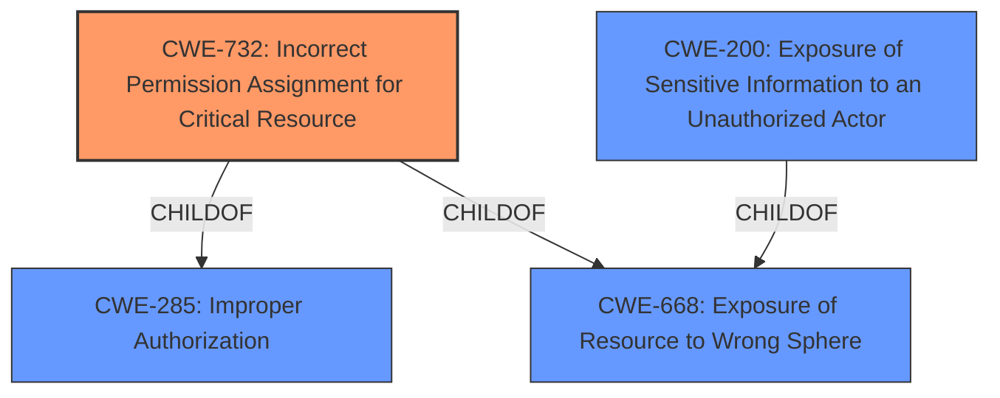

# Enhanced Analysis for CVE-2021-20874

# Summary
| CWE ID | CWE Name | Confidence | CWE Abstraction Level | CWE Vulnerability Mapping Label | CWE-Vulnerability Mapping Notes |
|---|---|---|---|---|---|
| CWE-732 | Incorrect Permission Assignment for Critical Resource | 1.0 | Class | Allowed-with-Review | Primary CWE |
| CWE-200 | Exposure of Sensitive Information to an Unauthorized Actor | 0.7 | Class | Discouraged | Secondary Candidate |

## Evidence and Confidence

*   **Confidence Score:** 0.9
*   **Evidence Strength:** HIGH

## Relationship Analysis
The primary CWE, CWE-732, is a child of CWE-285 (Improper Authorization) and CWE-668 (Exposure of Resource to Wrong Sphere). While CWE-285 represents a broader class of authorization issues, CWE-732 specifically addresses **incorrect permission assignment** for critical resources, aligning precisely with the vulnerability description. CWE-200 (Exposure of Sensitive Information to an Unauthorized Actor) is a Class level CWE and a child of CWE-668. It describes the impact of the **incorrect permission assignment**, rather than the root cause.



## Vulnerability Chain
The vulnerability chain starts with the **incorrect permission assignment** (CWE-732) for critical resources. This leads to a remote unauthenticated attacker gaining access to arbitrary files on the server, ultimately resulting in the exposure of sensitive information (CWE-200).

## Summary of Analysis
The initial analysis correctly identifies **incorrect permission assignment** as the root cause, leading to unauthorized access and sensitive information exposure. The final assessment strongly supports CWE-732 as the primary CWE due to its direct alignment with the vulnerability description's root cause and the CVE Reference Links Content Summary, which explicitly mentions "Incorrect Permission Assignment for Critical Resource (CWE-732)".

The evidence is strong:
*   Vulnerability Description Key Phrases: "**rootcause:** **Incorrect permission assignment**"
*   CVE Reference Links Content Summary: "* Incorrect Permission Assignment for Critical Resource (CWE-732)"

CWE-732 is at the Class level of abstraction, which is appropriate since more specific Base or Variant level CWEs are not available to describe the **incorrect permission assignment**. While CWE-863 (Incorrect Authorization) was also considered, it is a broader category, and CWE-732 more precisely captures the nature of the vulnerability. The MITRE mapping guidance for CWE-732 suggests reviewing the mapping because it can be misused when "permissions" are not checked, which is an authorization weakness. However, in this case, permissions were **incorrectly assigned**, making CWE-732 a suitable fit.

CWE-200 (Exposure of Sensitive Information to an Unauthorized Actor) was considered as a secondary CWE to represent the impact of the vulnerability. However, the primary focus is on the root cause, which is the **incorrect permission assignment**. While the exposure of sensitive information is a consequence, it is more accurately represented as the impact of the flawed permission assignment. CWE-200 is also discouraged for mapping because it's often misused to represent the loss of confidentiality, which is a technical impact rather than a root cause error. Therefore, CWE-200 is considered a secondary candidate.

Relevant CWE Information:

# Enhanced Context (25 CWEs)

## CWE-1004: Sensitive Cookie Without 'HttpOnly' Flag
**Abstraction Level**: Variant
**Similarity Score**: 0.76
**Source**: dense

**Description**:
The product uses a cookie to store sensitive information, but the cookie is not marked with the HttpOnly flag.

**Mapping Guidance**:
- Usage: Allowed
- Rationale: This CWE entry is at the Variant level of abstraction, which is a preferred level of abstraction for mapping to the root causes of vulnerabilities.

## CWE-226: Sensitive Information in Resource Not Removed Before Reuse
**Abstraction Level**: Base
**Similarity Score**: 0.75
**Source**: dense

**Description**:
The product releases a resource such as memory or a file so that it can be made available for reuse, but it does not clear or "zeroize" the information contained in the resource before the product performs a critical state transition or makes the resource available for reuse by other entities.

**Mapping Guidance**:
- Usage: Allowed
- Rationale: This CWE entry is at the Base level of abstraction, which is a preferred level of abstraction for mapping to the root causes of vulnerabilities.

## CWE-807: Reliance on Untrusted Inputs in a Security Decision
**Abstraction Level**: Base
**Similarity Score**: 0.75
**Source**: dense

**Description**:
The product uses a protection mechanism that relies on the existence or values of an input, but the input can be modified by an untrusted actor in a way that bypasses the protection mechanism.

**Mapping Guidance**:
- Usage: Allowed
- Rationale: This CWE entry is at the Base level of abstraction, which is a preferred level of abstraction for mapping to the root causes of vulnerabilities.

## CWE-212: Improper Removal of Sensitive Information Before Storage or Transfer
**Abstraction Level**: Base
**Similarity Score**: 0.75
**Source**: dense

**Description**:
The product stores, transfers, or shares a resource that contains sensitive information, but it does not properly remove that information before the product makes the resource available to unauthorized actors.

**Mapping Guidance**:
- Usage: Allowed
- Rationale: This CWE entry is at the Base level of abstraction, which is a preferred level of abstraction for mapping to the root causes of vulnerabilities.

## CWE-538: Insertion of Sensitive Information into Externally-Accessible File or Directory
**Abstraction Level**: Base
**Similarity Score**: 0.74
**Source**: dense

**Description**:
The product places sensitive information into files or directories that are accessible to actors who are allowed to have access to the files, but not to the sensitive information.

**Mapping Guidance**:
- Usage: Allowed
- Rationale: This CWE entry is at the Base level of abstraction, which is a preferred level of abstraction for mapping to the root causes of vulnerabilities.

## CWE-668: Exposure of Resource to Wrong Sphere
**Abstraction Level**: Class
**Similarity Score**: 0.74
**Source**: dense

**Description**:
The product exposes a resource to the wrong control sphere, providing unintended actors with inappropriate access to the resource.

**Mapping Guidance**:
- Usage: Discouraged
- Rationale: CWE-668 is high-level and is often misused as a catch-all when lower-level CWE IDs might be applicable. It is sometimes used for low-information vulnerability reports [REF-1287]. It is a level-1 Class (i.e., a child of a Pillar). It is not useful for trend analysis.

## CWE-614: Sensitive Cookie in HTTPS Session Without 'Secure' Attribute
**Abstraction Level**: Variant
**Similarity Score**: 0.74
**Source**: dense

**Description**:
The Secure attribute for sensitive cookies in HTTPS sessions is not set, which could cause the user agent to send those cookies in plaintext over an HTTP session.

**Mapping Guidance**:
- Usage: Allowed
- Rationale: This CWE entry is at the Variant level of abstraction, which is a preferred level of abstraction for mapping to the root causes of vulnerabilities.

## CWE-784: Reliance on Cookies without Validation and Integrity Checking in a Security Decision
**Abstraction Level**: Variant
**Similarity Score**: 0.74
**Source**: dense

**Description**:
The product uses a protection mechanism that relies on the existence or values of a cookie, but it does not properly ensure that the cookie is valid for the associated user.

**Mapping Guidance**:
- Usage: Allowed
- Rationale: This CWE entry is at the Variant level of abstraction, which is a preferred level of abstraction for mapping to the root causes of vulnerabilities.

## CWE-274: Improper Handling of Insufficient Privileges
**Abstraction Level**: Base
**Similarity Score**: 0.74
**Source**: dense

**Description**:
The product does not handle or incorrectly handles when it has insufficient privileges to perform an operation, leading to resultant weaknesses.

**Mapping Guidance**:
- Usage: Discouraged
- Rationale: This CWE entry could be deprecated in a future version of CWE.

## CWE-653: Improper Isolation or Compart


## CWE Relationship Analysis

Current CWEs represent these abstraction levels: .


### Vulnerability Chain Analysis

**Chain starting from CWE-732:**
- 732 (Incorrect Permission Assignment for Critical Resource) - ROOT


**Chain starting from CWE-614:**
- 614 (Sensitive Cookie in HTTPS Session Without 'Secure' Attribute) - ROOT


### CWE Relationship Diagram

```mermaid
graph TD
    classDef primary fill:#f96,stroke:#333,stroke-width:2px
    classDef secondary fill:#69f,stroke:#333
    classDef tertiary fill:#9e9,stroke:#333
```