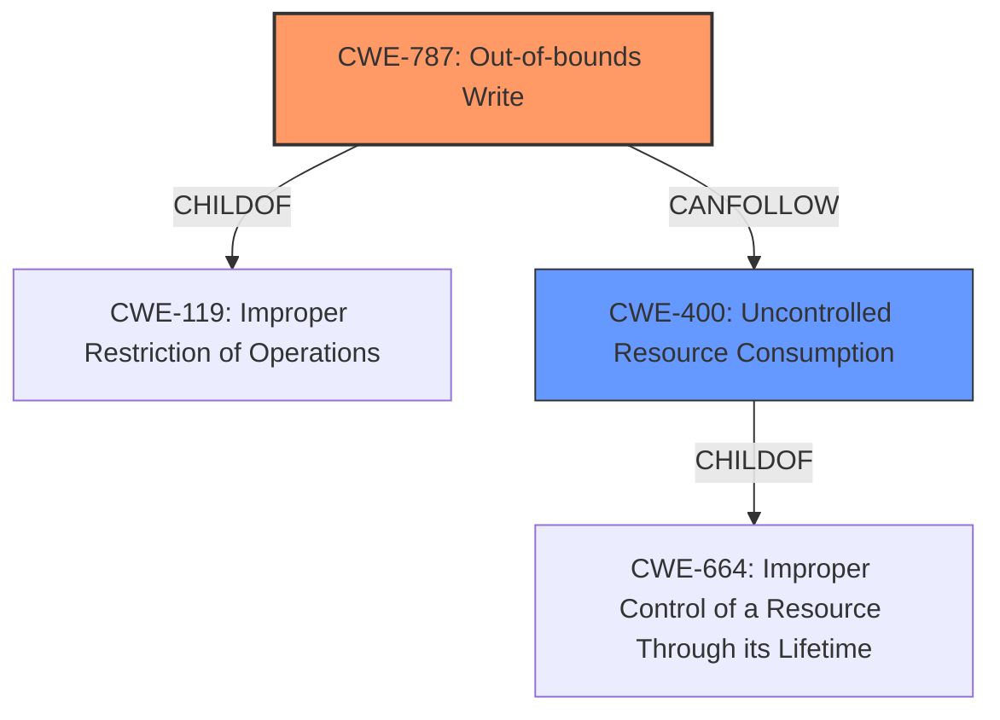

# Analysis for CVE-2021-20987

# Summary
| CWE ID | CWE Name | Confidence | CWE Abstraction Level | CWE Vulnerability Mapping Label | CWE-Vulnerability Mapping Notes |
|---|---|---|---|---|---|
| CWE-787 | Out-of-bounds Write | 1.0 | Base | Allowed | Primary CWE. The vulnerability stems from writing data beyond the intended boundaries of a memory buffer. |
| CWE-400 | Uncontrolled Resource Consumption | 0.7 | Class | Discouraged | Secondary CWE. The **denial of service** results from exhausting resources due to the **memory corruption**. |

## Evidence and Confidence

*   **Confidence Score:** 0.9
*   **Evidence Strength:** HIGH

## Relationship Analysis
The primary CWE is CWE-787, which is a base-level CWE and accurately reflects the root cause of the vulnerability. CWE-787 is a child of CWE-119 (Improper Restriction of Operations within the Bounds of a Memory Buffer), indicating a more general class of memory safety issues. CWE-400 (Uncontrolled Resource Consumption) is a related weakness that results from memory corruption.

## Vulnerability Chain
The vulnerability chain starts with an **out-of-bounds write** (CWE-787), leading to **memory corruption** and ultimately a **denial of service** (CWE-400).
  - **Root Cause:** CWE-787 (Out-of-bounds Write)
  - **Weakness:** Memory Corruption
  - **Impact:** CWE-400 (Uncontrolled Resource Consumption) - Denial of Service and potentially Code Injection

## Summary of Analysis
The primary weakness is CWE-787 (Out-of-bounds Write), which aligns directly with the vulnerability description stating that the issue stems from an **out-of-bounds write** in the Hilscher EtherNet/IP Core V2 component. This is further supported by the "CVE Reference Links Content Summary" section. The high retriever score of 1.0 for CWE-787 reinforces this selection. The secondary weakness is CWE-400 (Uncontrolled Resource Consumption). The selection of these CWEs is based on the evidence that the root cause is an out-of-bounds write which causes memory corruption and eventually leads to a denial of service. These CWEs are at the appropriate level of specificity, with CWE-787 at the Base level and CWE-400 at the Class level.

CWEs considered but not used:
* CWE-1333 (Inefficient Regular Expression Complexity): While it had a high retriever score, it does not align with the vulnerability description, which focuses on memory corruption and out-of-bounds write, not regular expression inefficiency.
* CWE-121 (Stack-based Buffer Overflow): While a buffer overflow is related, the description does not specify that it is stack-based. Therefore, the more general CWE-787 is more appropriate.
* CWE-401 (Missing Release of Memory after Effective Lifetime): This is a memory leak issue, which is different from memory corruption caused by an out-of-bounds write.
* CWE-822 (Untrusted Pointer Dereference): This CWE relates to using untrusted values as pointers, while the provided vulnerability description focuses on out-of-bounds writes.
* CWE-119 (Improper Restriction of Operations within the Bounds of a Memory Buffer): This is a more general class of memory issues, and CWE-787 is a more specific child that accurately captures the weakness.
* CWE-20 (Improper Input Validation): The vulnerability description does not focus on input validation issues, but rather on the out-of-bounds write itself.
* CWE-476 (NULL Pointer Dereference): The vulnerability is due to out-of-bounds write and memory corruption, not a null pointer dereference.

Relevant CWE Information:

# Enhanced Context (25 CWEs)
The following CWEs were identified as potentially relevant to this vulnerability:

## CWE-476: NULL Pointer Dereference
**Abstraction Level**: Base
**Similarity Score**: 0.76
**Source**: dense

**Description**:
The product dereferences a pointer that it expects to be valid but is NULL.

**Mapping Guidance**:
- Usage: Allowed
- Rationale: This CWE entry is at the Base level of abstraction, which is a preferred level of abstraction for mapping to the root causes of vulnerabilities.

## CWE-822: Untrusted Pointer Dereference
**Abstraction Level**: Base
**Similarity Score**: 0.76
**Source**: dense

**Description**:
The product obtains a value from an untrusted source, converts this value to a pointer, and dereferences the resulting pointer.

**Mapping Guidance**:
- Usage: Allowed
- Rationale: This CWE entry is at the Base level of abstraction, which is a preferred level of abstraction for mapping to the root causes of vulnerabilities.

## CWE-226: Sensitive Information in Resource Not Removed Before Reuse
**Abstraction Level**: Base
**Similarity Score**: 0.74
**Source**: dense

**Description**:
The product releases a resource such as memory or a file so that it can be made available for reuse, but it does not clear or "zeroize" the information contained in the resource before the product performs a critical state transition or makes the resource available for reuse by other entities.

**Mapping Guidance**:
- Usage: Allowed
- Rationale: This CWE entry is at the Base level of abstraction, which is a preferred level of abstraction for mapping to the root causes of vulnerabilities.

## CWE-404: Improper Resource Shutdown or Release
**Abstraction Level**: Class
**Similarity Score**: 0.74
**Source**: dense

**Description**:
The product does not release or incorrectly releases a resource before it is made available for re-use.

**Mapping Guidance**:
- Usage: Allowed-with-Review
- Rationale: This CWE entry is a Class and might have Base-level children that would be more appropriate

## CWE-824: Access of Uninitialized Pointer
**Abstraction Level**: Base
**Similarity Score**: 0.74
**Source**: dense

**Description**:
The product accesses or uses a pointer that has not been initialized.

**Mapping Guidance**:
- Usage: Allowed
- Rationale: This CWE entry is at the Base level of abstraction, which is a preferred level of abstraction for mapping to the root causes of vulnerabilities.

## CWE-170: Improper Null Termination
**Abstraction Level**: Base
**Similarity Score**: 0.73
**Source**: dense

**Description**:
The product does not terminate or incorrectly terminates a string or array with a null character or equivalent terminator.

**Mapping Guidance**:
- Usage: Allowed
- Rationale: This CWE entry is at the Base level of abstraction, which is a preferred level of abstraction for mapping to the root causes of vulnerabilities.

## CWE-667: Improper Locking
**Abstraction Level**: Class
**Similarity Score**: 0.73
**Source**: dense

**Description**:
The product does not properly acquire or release a lock on a resource, leading to unexpected resource state changes and behaviors.

**Mapping Guidance**:
- Usage: Allowed-with-Review
- Rationale: This CWE entry is a Class and might have Base-level children that would be more appropriate

## CWE-1289: Improper Validation of Unsafe Equivalence in Input
**Abstraction Level**: Base
**Similarity Score**: 0.73
**Source**: dense

**Description**:
The product receives an input value that is used as a resource identifier or other type of reference, but it does not validate or incorrectly validates that the input is equivalent to a potentially-unsafe value.

**Mapping Guidance**:
- Usage: Allowed
- Rationale: This CWE entry is at the Base level of abstraction, which is a preferred level of abstraction for mapping to the root causes of vulnerabilities.

## CWE-823: Use of Out-of-range Pointer Offset
**Abstraction Level**: Base
**Similarity Score**: 0.73
**Source**: dense

**Description**:
The product performs pointer arithmetic on a valid pointer, but it uses an offset that can point outside of the intended range of valid memory locations for the resulting pointer.

**Mapping Guidance**:
- Usage: Allowed
- Rationale: This CWE entry is at the Base level of abstraction, which is a preferred level of abstraction for mapping to the root causes of vulnerabilities.

## CWE-664: Improper Control of a Resource Through its Lifetime
**Abstraction Level**: Pillar
**