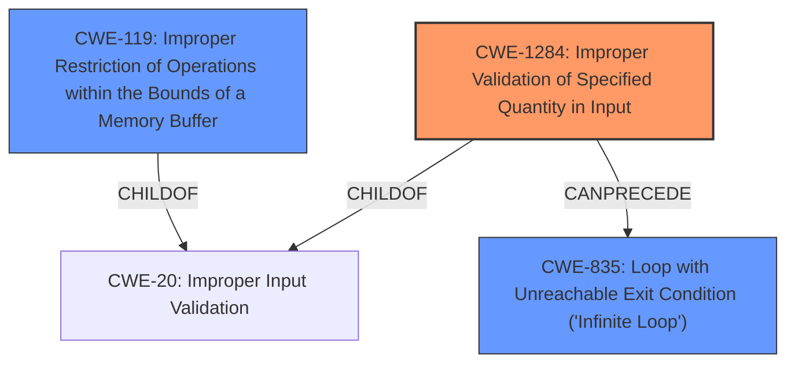

# Enhanced Analysis for CVE-2021-20988

# Summary
| CWE ID  | CWE Name                                                        | Confidence | CWE Abstraction Level | CWE Vulnerability Mapping Label | CWE-Vulnerability Mapping Notes |
| :-------- | :-------------------------------------------------------------- | :--------- | :-------------------- | :------------------------------ | :------------------------------ |
| CWE-1284  | Improper Validation of Specified Quantity in Input             | 0.9        | Base                  | Primary                         | Allowed                       |
| CWE-119   | Improper Restriction of Operations within the Bounds of a Memory Buffer | 0.75       | Class                 | Secondary                       | Discouraged                    |
| CWE-835   | Loop with Unreachable Exit Condition ('Infinite Loop')         | 0.65        | Base                  | Secondary                       | Allowed                       |

## Evidence and Confidence

*   **Confidence Score:** 0.85
*   **Evidence Strength:** HIGH

## Relationship Analysis
The primary CWE is CWE-1284 (**Improper Validation of Specified Quantity in Input**), which is a child of CWE-20 (**Improper Input Validation**). The vulnerability description states that the UDP packet length is not verified against the length indicated by the packet. This directly relates to the validation of a specified quantity (the packet length). The secondary CWE, CWE-119 (**Improper Restriction of Operations within the Bounds of a Memory Buffer**), is a more general class of weakness, and while relevant, CWE-1284 is more specific to the **root cause**. CWE-835 (**Loop with Unreachable Exit Condition**) is considered as an impact if the improper validation leads to an infinite loop.



## Vulnerability Chain
The vulnerability chain starts with the **lack of validation** of the UDP packet length (CWE-1284). This can then lead to an **improper restriction of operations** on the memory buffer (CWE-119), and potentially result in a **denial of service** due to an infinite loop (CWE-835).

## Summary of Analysis
The initial assessment identified CWE-1284 as the primary weakness due to the **lack of validation** of the UDP packet length, as stated in the vulnerability description and the CVE reference. The CVE reference specifies "**The Hilscher rcX RTOS versions prior to V2.1.14.1 do not verify the actual UDP packet length against the length indicated in the packet.**" This directly matches the description of CWE-1284, which involves the **improper validation of a specified quantity in input**.

The retriever results also show CWE-1284 as the top combined result. CWE-119, while present in the CVE reference, is a more general weakness. CWE-835 is considered as an impact of the vulnerability if the **lack of validation** results in an infinite loop.

The selected CWEs are at the optimal level of specificity, with CWE-1284 being a Base level CWE that directly addresses the **root cause** of the vulnerability.

Relevant CWE Information:

# Enhanced Context (25 CWEs)

## CWE-1284: Improper Validation of Specified Quantity in Input
**Abstraction Level**: Base
**Similarity Score**: 0.81
**Source**: dense

**Description**:
The product receives input that is expected to specify a quantity (such as size or length), but it does not validate or incorrectly validates that the quantity has the required properties.

**Mapping Guidance**:
- Usage: Allowed
- Rationale: This CWE entry is at the Base level of abstraction, which is a preferred level of abstraction for mapping to the root causes of vulnerabilities.

## CWE-119: Improper Restriction of Operations within the Bounds of a Memory Buffer
**Abstraction Level**: Class
**Similarity Score**: 0.76
**Source**: dense

**Description**:
The product performs operations on a memory buffer, but it reads from or writes to a memory location outside the buffer's intended boundary. This may result in read or write operations on unexpected memory locations that could be linked to other variables, data structures, or internal program data.

**Mapping Guidance**:
- Usage: Discouraged
- Rationale: CWE-119 is commonly misused in low-information vulnerability reports when lower-level CWEs could be used instead, or when more details about the vulnerability are available.

## CWE-835: Loop with Unreachable Exit Condition ('Infinite Loop')
**Abstraction Level**: Base
**Similarity Score**: 0.76
**Source**: dense

**Description**:
The product contains an iteration or loop with an exit condition that cannot be reached, i.e., an infinite loop.

**Mapping Guidance**:
- Usage: Allowed
- Rationale: This CWE entry is at the Base level of abstraction, which is a preferred level of abstraction for mapping to the root causes of vulnerabilities.


## CWE Relationship Analysis

Current CWEs represent these abstraction levels: .


### Vulnerability Chain Analysis

**Chain starting from CWE-835:**
- 835 (Loop with Unreachable Exit Condition ('Infinite Loop')) - ROOT


**Chain starting from CWE-119:**
- 119 (Improper Restriction of Operations within the Bounds of a Memory Buffer) - ROOT


### CWE Relationship Diagram

```mermaid
graph TD
    classDef primary fill:#f96,stroke:#333,stroke-width:2px
    classDef secondary fill:#69f,stroke:#333
    classDef tertiary fill:#9e9,stroke:#333
```