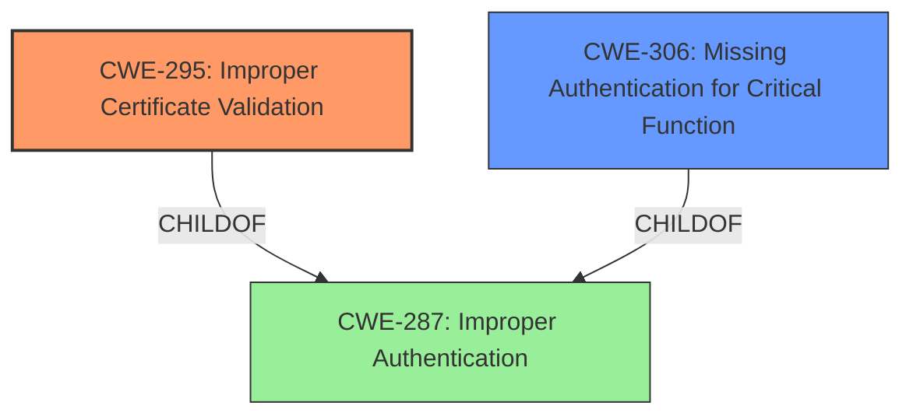

# Analysis for CVE-2021-20989

# Summary
| CWE ID | CWE Name | Confidence | CWE Abstraction Level | CWE Vulnerability Mapping Label | CWE-Vulnerability Mapping Notes |
|---|---|---|---|---|---|
| CWE-295 | Improper Certificate Validation | 0.9 | Base | Primary | Allowed |
| CWE-306 | Missing Authentication for Critical Function | 0.7 | Base | Secondary | Allowed |

## Evidence and Confidence

*   **Confidence Score:** 0.8
*   **Evidence Strength:** HIGH

## Relationship Analysis
The primary CWE is CWE-295, which describes the **improper certificate validation**. This vulnerability stems from the device's failure to properly validate the server's certificate during the SSH connection, making it susceptible to MITM attacks.

CWE-306 is a secondary CWE because the device is missing authentication for a critical function, which is setting up a secure connection.

## Vulnerability Chain
The vulnerability chain starts with the **missing host key verification** (**ROOT CAUSE**), leading to a man-in-the-middle attack. This allows the attacker to intercept the communication and potentially hijack credentials due to the unencrypted port-forward.

## Summary of Analysis
The initial assessment points to CWE-295 due to the **disabled SSH host key check**, which allows MITM attacks. The device **does not validate, or incorrectly validates, a certificate.** This aligns perfectly with the CWE description.

The provided evidence explicitly states that the `-y` option in the `dropbear ssh` command bypasses host key verification: "The devices use `dropbear ssh` client with the `-y` option, which **disables host key verification**, making them vulnerable to man-in-the-middle (MITM) attacks."

CWE-306 is also considered because there is a **missing authentication for a critical function**, specifically the secure establishment of a connection. However, the primary issue is the **improper validation** of the certificate, so CWE-295 is the best fit.

The selection of CWE-295 is at the optimal level of specificity because it directly addresses the root cause of the vulnerability, which is the **lack of proper certificate validation**.