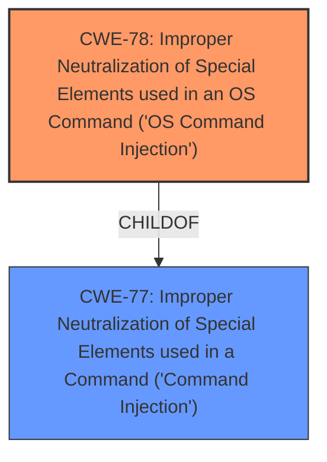

# Analysis Report for CVE-2021-20991

# Vulnerability Analysis Report: CVE-2021-20991

## Description


## Analysis (with Relationship Data)

# Summary
| CWE ID | CWE Name | Confidence | CWE Abstraction Level | CWE Vulnerability Mapping Label | CWE-Vulnerability Mapping Notes |
|---|---|---|---|---|---|
| CWE-78 | Improper Neutralization of Special Elements used in an OS Command ('OS Command Injection') | 1.0 | Base | Allowed | Primary CWE |
| CWE-77 | Improper Neutralization of Special Elements used in a Command ('Command Injection') | 0.7 | Class | Allowed-with-Review | Secondary Candidate |

## Evidence and Confidence

*   **Confidence Score:** 1.0
*   **Evidence Strength:** HIGH

## Relationship Analysis
The primary CWE is CWE-78, which is a Base level CWE and a child of CWE-77. CWE-77 is a Class level CWE. The vulnerability is clearly an OS Command Injection, so the more specific CWE-78 is the better choice.



## Vulnerability Chain
The chain of root cause and weaknesses that followed for the Vulnerability Description:
1.  **Root Cause:** Insufficient sanitization of the `version` parameter.
2.  **Weakness:** **Command injection** due to passing unsanitized input to `exec()`.
3.  **Impact:** Remote Code Execution (RCE) as root.

## Summary of Analysis
The initial analysis identified a **command injection** vulnerability. After reviewing the evidence, the primary weakness is CWE-78, OS Command Injection, because the `exec()` function is used to execute OS commands with unsanitized input.

The evidence from "CVE Reference Links Content Summary" supports this:
*   "The root cause is a **command injection** vulnerability in the backup restore functionality... This vulnerability exists due to insufficient sanitization of the `version` parameter during a backup restore operation. Specifically, the `exec()` function is used without properly escaping shell metacharacters."
*   "The parameter `$version` is passed to `exec()` function unsanitized: `exec('screen -dmS RESTORE restoreBackup.sh --' . $type. ' '. $id . ' ' . $version)`"
*   "A fix is implemented using `escapeshellarg()` in later versions: `$version = escapeshellarg($params->version);`"

The relationship graph shows that CWE-78 is a child of CWE-77. Using the more specific CWE-78 is preferred because the evidence supports it.

Relevant CWE Information:

# Enhanced Context (25 CWEs)
The following CWEs were identified as potentially relevant to this vulnerability:

## CWE-74: Improper Neutralization of Special Elements in Output Used by a Downstream Component ('Injection')
**Abstraction Level**: Class
**Similarity Score**: 0.78
**Source**: dense

**Description**:
The product constructs all or part of a command, data structure, or record using externally-influenced input from an upstream component, but it does not neutralize or incorrectly neutralizes special elements that could modify how it is parsed or interpreted when it is sent to a downstream component.

**Mapping Guidance**:
- Usage: Discouraged
- Rationale: CWE-74 is high-level and often misused when lower-level weaknesses are more appropriate.

## CWE-77: Improper Neutralization of Special Elements used in a Command ('Command Injection')
**Abstraction:** Class
**Status:** Draft

### Description
The product constructs all or part of a command using externally-influenced input from an upstream component, but it does not neutralize or incorrectly neutralizes special elements that could modify the intended command when it is sent to a downstream component.

### Extended Description
Many protocols and products have their own custom command language. While OS or shell command strings are frequently discovered and targeted, developers may not realize that these other command languages might also be vulnerable to attacks.

### Alternative Terms
Command injection: an attack-oriented phrase for this weakness. Note: often used when "OS command injection" (CWE-78) was intended.

### Relationships
ChildOf -> CWE-74
ChildOf -> CWE-74

### Mapping Guidance
**Usage:** Allowed-with-Review
**Rationale:** CWE-77 is often misused when OS command injection (CWE-78) was intended instead [REF-1287].
**Comments:** Ensure that the analysis focuses on the root-cause error that allows the execution of commands, as there are many weaknesses that can lead to this consequence. See Terminology Notes. If the weakness involves a command language besides OS shell invocation, then CWE-77 could be used.
**Reasons:**
- Frequent Misuse
**Suggested Alternatives:**
- CWE-78: OS Command Injection

## CWE-78: Improper Neutralization of Special Elements used in an OS Command ('OS Command Injection')
**Abstraction:** Base
**Status:** Stable

### Description
The product constructs all or part of an OS command using externally-influenced input from an upstream component, but it does not neutralize or incorrectly neutralizes special elements that could modify the intended OS command when it is sent to a downstream component.

### Extended Description
This weakness can lead to a vulnerability in environments in which the attacker does not have direct access to the operating system, such as in web applications. Alternately, if the weakness occurs in a privileged program, it could allow the attacker to specify commands that normally would not be accessible, or to call alternate commands with privileges that the attacker does not have. The problem is exacerbated if the compromised process does not follow the principle of least privilege, because the attacker-controlled commands may run with special system privileges that increases the amount of damage.

### Alternative Terms
Shell injection
Shell metacharacters
OS Command Injection

### Relationships
ChildOf -> CWE-77
ChildOf -> CWE-74
ChildOf -> CWE-77
ChildOf -> CWE-77
CanAlsoBe -> CWE-88

### Mapping Guidance
**Usage:** Allowed
**Rationale:** This CWE entry is at the Base level of abstraction, which is a preferred level of abstraction for mapping to the root causes of vulnerabilities.
**Comments:** Carefully read both the name and description to ensure that this mapping is an appropriate fit. Do not try to 'force' a mapping to a lower-level Base/Variant simply to comply with this preferred level of abstraction.
**Reasons:**
- Acceptable-Use

## CWE-88: Improper Neutralization of Argument Delimiters in a Command ('Argument Injection')
**Abstraction:** Base
**Status:** Draft

### Description
The product constructs a string for a command to be executed by a separate component
in another control sphere, but it does not properly delimit the
intended arguments, options, or switches within that command string.

### Mapping Guidance
**Usage:** Allowed
**Rationale:** This CWE entry is at the Base level of abstraction, which is a preferred level of abstraction for mapping to the root causes of vulnerabilities.

### CWE-184: Incomplete List of Disallowed Inputs
**Abstraction:** Base
**Status:** Draft

### Description
The product implements a protection mechanism that relies on a list of inputs (or properties of inputs) that are not allowed by policy or otherwise require other action to neutralize before additional processing takes place, but the list is incomplete.

### Mapping Guidance
**Usage:** Allowed
**Rationale:** This CWE entry is at the Base level of abstraction, which is a preferred level of abstraction for mapping to the root causes of vulnerabilities.

## CWE Selection Rationale:

*   **CWE-78: Improper Neutralization of Special Elements used in an OS Command ('OS Command Injection')**: This is the primary CWE because the vulnerability involves constructing an OS command using external input without proper neutralization, leading to command execution. The description clearly states that the `$version` parameter is passed to the `exec()` function unsanitized, which allows an attacker to inject and execute arbitrary OS commands. The fix implemented uses `escapeshellarg()` to sanitize the input, further confirming that this is an OS command injection vulnerability.
*   **CWE-77: Improper Neutralization of Special Elements used in a Command ('Command Injection')**: This is a secondary candidate. While the vulnerability is indeed a command injection, CWE-78 is more specific as it explicitly involves OS commands. CWE-77 is a more general case that encompasses other command languages, but in this instance, the commands being executed are OS commands. The mapping guidance for CWE-77 suggests using CWE-78 when OS command injection is intended, which reinforces the choice of CWE-78 as the primary CWE.
*   **CWE-88: Improper Neutralization of Argument Delimiters in a Command ('Argument Injection')**: While argument injection could be a contributing factor, the primary issue is the lack of sanitization of the entire command string, not just the delimiters. Therefore, CWE-88 is not the most appropriate choice.
*   **CWE-184: Incomplete List of Disallowed Inputs**: This CWE could be considered


## CWE Relationship Analysis

Current CWEs represent these abstraction levels: .


### Vulnerability Chain Analysis

**Chain starting from CWE-77:**
- 77 (Improper Neutralization of Special Elements used in a Command ('Command Injection')) - ROOT


**Chain starting from CWE-88:**
- 88 (Improper Neutralization of Argument Delimiters in a Command ('Argument Injection')) - ROOT


### CWE Relationship Diagram

```mermaid
graph TD
    classDef primary fill:#f96,stroke:#333,stroke-width:2px
    classDef secondary fill:#69f,stroke:#333
    classDef tertiary fill:#9e9,stroke:#333
```


*Report generated on 2025-04-02 05:16:28*
