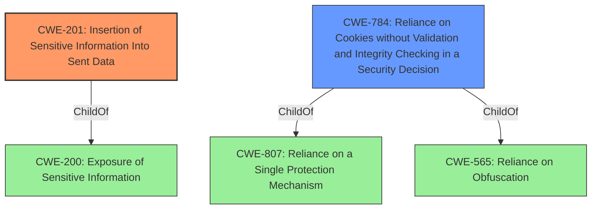

# Enhanced Analysis for CVE-2021-20996

# Summary
| CWE ID | CWE Name | Confidence | CWE Abstraction Level | CWE Vulnerability Mapping Label | CWE-Vulnerability Mapping Notes |
|---|---|---|---|---|---|
| CWE-201 | Insertion of Sensitive Information Into Sent Data | 0.9 | Base | Primary | Allowed |
| CWE-784 | Reliance on Cookies without Validation and Integrity Checking in a Security Decision | 0.7 | Variant | Secondary | Allowed |

## Evidence and Confidence

*   **Confidence Score:** 0.8
*   **Evidence Strength:** MEDIUM

## Relationship Analysis
The primary CWE is CWE-201, which focuses on the insertion of sensitive information into sent data. The secondary CWE is CWE-784, which is related to the reliance on cookies without validation and integrity checking.



## Vulnerability Chain
The vulnerability chain involves a **special crafted request** leading to **cookies being transferred to third parties**.
  - The initial flaw is the **incorrect permission assignment for a critical resource** which leads to a vulnerability.
  - The vulnerability is that **special crafted requests can lead to cookies being transferred to third parties**.
  - The consequence is that **an attacker may be able to obtain sensitive information by having cookies transferred to them**.

## Summary of Analysis
The vulnerability description states that "special crafted requests can lead to cookies being transferred to third parties" in multiple managed switches by WAGO.

The primary CWE is CWE-201 because the core issue is that sensitive information (cookies) is being inserted into data that is sent to third parties. The CVE Reference Links Content Summary states the **weakness/vulnerability** is: "Special crafted requests can lead to cookies being transferred to third parties," which directly aligns with CWE-201's description: "The code transmits data to another actor, but a portion of the data includes sensitive information that should not be accessible to that actor."

CWE-784 is selected as a secondary CWE because the vulnerability involves **reliance on cookies without validation**. The vulnerability description doesn't explicitly mention a lack of validation, but the fact that cookies are being transferred to third parties suggests a failure to properly validate the cookies' intended recipient.

The selected CWEs are at the optimal level of specificity because they directly address the root cause and contributing factors of the vulnerability. CWE-201 captures the essence of sensitive data exposure, while CWE-784 highlights the role of cookie handling in this vulnerability.

# Relevant CWE Information:

The following CWEs were identified as potentially relevant to this vulnerability:

## CWE-113: Improper Neutralization of CRLF Sequences in HTTP Headers ('HTTP Request/Response Splitting')
**Abstraction Level**: Variant
**Similarity Score**: 0.81
**Source**: dense
This CWE was not selected because the vulnerability description doesn't mention any issues related to CRLF sequences or HTTP request/response splitting.

## CWE-444: Inconsistent Interpretation of HTTP Requests ('HTTP Request/Response Smuggling')
**Abstraction Level**: Base
**Similarity Score**: 0.77
**Source**: dense
This CWE was not selected because the vulnerability description doesn't involve any inconsistencies in how HTTP requests are interpreted.

## CWE-74: Improper Neutralization of Special Elements in Output Used by a Downstream Component ('Injection')
**Abstraction Level**: Class
**Similarity Score**: 0.74
**Source**: dense
This CWE was not selected because the vulnerability description doesn't describe a scenario where special elements are injected into a downstream component.

## CWE-41: Improper Resolution of Path Equivalence
**Abstraction Level**: Base
**Similarity Score**: 0.74
**Source**: dense
This CWE was not selected because the vulnerability description doesn't involve path equivalence issues.

## CWE-668: Exposure of Resource to Wrong Sphere
**Abstraction Level**: Class
**Similarity Score**: 0.73
**Source**: dense
This CWE was considered but not selected because it is a high-level class and CWE-201 is a more specific base class that is a better fit.

## CWE-212: Improper Removal of Sensitive Information Before Storage or Transfer
**Abstraction Level**: Base
**Similarity Score**: 0.73
**Source**: dense
This CWE was considered but not selected because CWE-201 more directly captures the act of sending sensitive information, rather than simply failing to remove it. CWE-212 focuses more on data that is stored or transferred internally, whereas this vulnerability involves external exposure.

## CWE-226: Sensitive Information in Resource Not Removed Before Reuse
**Abstraction Level**: Base
**Similarity Score**: 0.72
**Source**: dense
This CWE was not selected because the vulnerability description doesn't involve the reuse of resources without properly removing sensitive information.

## CWE-1289: Improper Validation of Unsafe Equivalence in Input
**Abstraction Level**: Base
**Similarity Score**: 0.72
**Source**: dense
This CWE was not selected because the vulnerability description doesn't involve unsafe equivalence checks.

## CWE-184: Incomplete List of Disallowed Inputs
**Abstraction Level**: Base
**Similarity Score**: 0.72
**Source**: dense
This CWE was not selected because the vulnerability description doesn't involve an incomplete list of disallowed inputs.

## CWE-130: Improper Handling of Length Parameter Inconsistency
**Abstraction Level**: Base
**Similarity Score**: 0.72
**Source**: dense
This CWE was not selected because the vulnerability description doesn't involve length parameter inconsistencies.

## CWE-212: Improper Removal of Sensitive Information Before Storage or Transfer
**Abstraction Level**: Base
**Similarity Score**: 5980.70
**Source**: sparse
This CWE was considered but not selected because CWE-201 more directly captures the act of sending sensitive information, rather than simply failing to remove it. CWE-212 focuses more on data that is stored or transferred internally, whereas this vulnerability involves external exposure.

## CWE-113: Improper Neutralization of CRLF Sequences in HTTP Headers ('HTTP Request/Response Splitting')
**Abstraction Level**: Variant
**Similarity Score**: 5934.56
**Source**: sparse
This CWE was not selected because the vulnerability description doesn't mention any issues related to CRLF sequences or HTTP request/response splitting.

## CWE-226: Sensitive Information in Resource Not Removed Before Reuse
**Abstraction Level**: Base
**Similarity Score**: 5818.51
**Source**: sparse
This CWE was not selected because the vulnerability description doesn't involve the reuse of resources without properly removing sensitive information.

## CWE-201: Insertion of Sensitive Information Into Sent Data
**Abstraction Level**: Base
**Similarity Score**: 5723.20
**Source**: sparse
This CWE was selected as the primary CWE.

## CWE-668: Exposure of Resource to Wrong Sphere
**Abstraction Level**: Class
**Similarity Score**: 5703.07
**Source**: sparse
This CWE was considered but not selected because it is a high-level class and CWE-201 is a more specific base class that is a better fit.

## CWE-201: Insertion of Sensitive Information Into Sent Data
**Abstraction Level**: base
**Similarity Score**: 5.03
**Source**: graph
This CWE was selected as the primary CWE.

## CWE-22: Improper Limitation of a Pathname to a Restricted Directory ('Path Traversal')
**Abstraction Level**: base
**Similarity Score**: 4.33
**Source**: graph
This CWE was not selected because the vulnerability description doesn't involve path traversal issues.

## CWE-79: Improper Neutralization of Input During Web Page Generation ('Cross-site Scripting')
**Abstraction Level**: base
**Similarity Score**: 4.33
**Source**: graph
This CWE was not selected because the vulnerability description doesn't involve cross-site scripting issues.

## CWE-209: Generation of Error Message Containing Sensitive Information
**Abstraction Level**: base
**Similarity Score**: 3.64
**Source**: graph
This CWE was not selected because the vulnerability description doesn't involve sensitive information being exposed through error messages.


## CWE Relationship Analysis

Current CWEs represent these abstraction levels: .


### Vulnerability Chain Analysis

**Chain starting from CWE-113:**
- 113 (Improper Neutralization of CRLF Sequences in HTTP Headers ('HTTP Request/Response Splitting')) - ROOT


**Chain starting from CWE-79:**
- 79 (Improper Neutralization of Input During Web Page Generation ('Cross-site Scripting')) - ROOT


### CWE Relationship Diagram

```mermaid
graph TD
    classDef primary fill:#f96,stroke:#333,stroke-width:2px
    classDef secondary fill:#69f,stroke:#333
    classDef tertiary fill:#9e9,stroke:#333
```