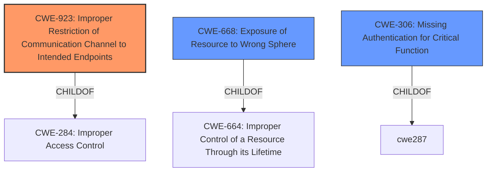

# Analysis for CVE-2021-20999

# Summary
| CWE ID | CWE Name | Confidence | CWE Abstraction Level | CWE Vulnerability Mapping Label | CWE-Vulnerability Mapping Notes |
|---|---|---|---|---|---|
| CWE-923 | Improper Restriction of Communication Channel to Intended Endpoints | 0.8 | Class | Allowed-with-Review | Primary CWE |
| CWE-668 | Exposure of Resource to Wrong Sphere | 0.6 | Class | Discouraged | Secondary Candidate |
| CWE-306 | Missing Authentication for Critical Function | 0.5 | Base | Allowed | Secondary Candidate |

## Evidence and Confidence

*   **Confidence Score:** 0.7
*   **Evidence Strength:** HIGH

## Relationship Analysis
The primary CWE identified is CWE-923 which is a Class-level CWE. It has a parent-child relationship with CWE-284 (Improper Access Control), indicating it's a specific type of access control issue. CWE-923 also has peer relationships with other CWEs related to communication channel restrictions.

The secondary CWE candidate CWE-668 (Exposure of Resource to Wrong Sphere) is also a Class and a child of CWE-664 (Improper Control of a Resource Through its Lifetime), indicating a resource management issue.

CWE-306 (Missing Authentication for Critical Function), which is a Base CWE, and is related to authentication failures.

## Vulnerability Chain
The vulnerability chain starts with the **accidental exposure** of an internal network port. This leads to a **missing restriction of the communication channel**, potentially because there's **missing authentication** on that channel, resulting in unauthorized access and device manipulation or stoppage.

## Summary of Analysis
Initially, the vulnerability description highlights that a network port intended for device-internal usage is **accidentally accessible** via external network interfaces. This **WEAKNESS** is the core of the problem. The "CVE Reference Links Content Summary" confirms this, stating the **root cause** is that "A network port intended for internal device usage was accidentally made accessible via external network interfaces." This exposure allows attackers with network access to potentially manipulate or stop the device's operation.

The "Retriever Results" identify CWE-923 (Improper Restriction of Communication Channel to Intended Endpoints) as the top candidate. This aligns well with the description, as the vulnerability involves a communication channel (the network port) not being properly restricted to its intended internal endpoints. CWE-923 is a Class-level CWE, and the mapping guidance suggests examining its children for a better fit. However, none of the children seem to fit better than CWE-923 itself.

CWE-668 (Exposure of Resource to Wrong Sphere) is also a relevant candidate, as the internal network port is being exposed to an unintended external sphere. However, CWE-923 is more specific to the communication channel aspect of the vulnerability. The MITRE mapping guidance discourages the use of CWE-668 because it is high-level.

CWE-306 (Missing Authentication for Critical Function) is another candidate, as the exposed network port might lack proper authentication, allowing unauthorized access. However, the primary issue is the **improper restriction** of the communication channel itself.

Therefore, CWE-923 is the most appropriate primary CWE, representing the **root cause** of the vulnerability. CWE-668 and CWE-306 are secondary candidates that contribute to the overall vulnerability but are not the primary **WEAKNESS**.

Relevant CWE Information:
The analysis considered the provided information about CWE-923, CWE-668, and CWE-306, as well as related CWEs like CWE-284 and CWE-664. The decision to prioritize CWE-923 was based on its direct relevance to the **improper restriction** of the communication channel, which is the core of the vulnerability described.