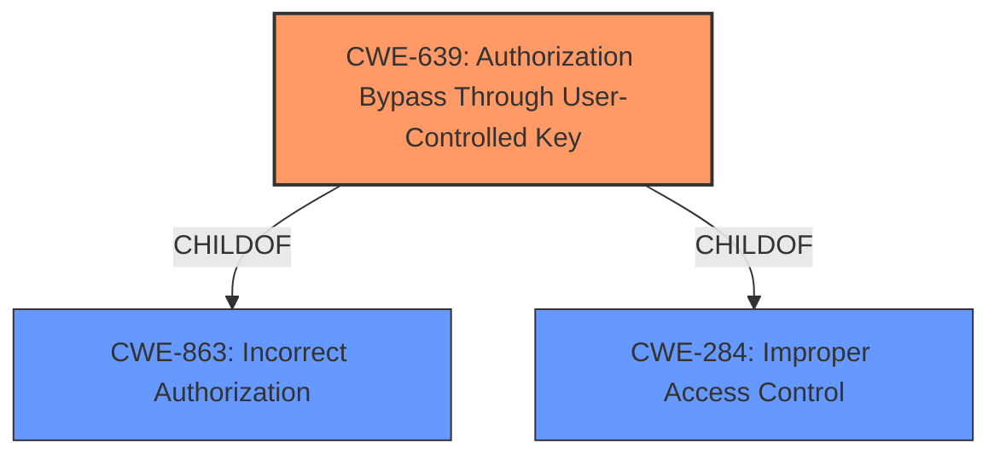

# Analysis for CVE-2021-21022

# Summary
| CWE ID  | CWE Name | Confidence | CWE Abstraction Level | CWE Vulnerability Mapping Label | CWE-Vulnerability Mapping Notes |
|----------------|----------------------------------------------------------------------------------------------------|----------------|-------------------------|-----------------------------------|-----------------------------------------------------------------------------------------------------------------------------------------------------------------------------------------------------------------------------------------------------------------------------------|
| CWE-639 | Authorization Bypass Through User-Controlled Key | 1.0 | Base | Allowed | This CWE entry is at the Base level of abstraction, which is a preferred level of abstraction for mapping to the root causes of vulnerabilities. |

## Evidence and Confidence

*   **Confidence Score:** 1.0
*   **Evidence Strength:** HIGH

## Relationship Analysis
The primary relationship that influenced the decision was the ChildOf relationship between CWE-639 and CWE-863 (Incorrect Authorization) and CWE-284 (Improper Access Control). While CWE-863 and CWE-284 are higher-level classes, CWE-639 provides the most specific representation of the **insecure direct object reference** (IDOR) vulnerability.

## Vulnerability Chain
The vulnerability chain starts with the **insecure direct object reference**, leading to the authorization bypass and ultimately resulting in unauthorized access to restricted resources.

## Summary of Analysis
The analysis is based on the provided evidence, specifically the vulnerability description mentioning an **insecure direct object reference** (IDOR) in the product module, which leads to unauthorized access to restricted resources. The CVE Reference Links Content Summary confirms the root cause as IDOR.

The selection of CWE-639 is justified because it accurately represents the **weakness** where the system's authorization **fails** to prevent one user from accessing another user's data by modifying the key value. This aligns with the CWE description: "The system's authorization functionality does not prevent one user from gaining access to another user's data or record by modifying the key value identifying the data."

The abstraction level is optimal because CWE-639 is a Base level CWE, which provides a more specific representation of the vulnerability compared to the Class level CWEs like CWE-863 and CWE-285.

CWEs considered but not used:

*   CWE-99 (Improper Control of Resource Identifiers ('Resource Injection')): While related, CWE-639 is a more specific fit for IDOR.
*   CWE-285 (Improper Authorization) and CWE-863 (Incorrect Authorization): These are too high-level and less descriptive of the specific IDOR **weakness**.
*   CWE-200 (Exposure of Sensitive Information to an Unauthorized Actor): This describes the impact, not the root cause.
*   CWE-79 (Improper Neutralization of Input During Web Page Generation ('Cross-site Scripting')): Not relevant as this vulnerability isn't related to XSS.

Relevant CWE Information:

# Enhanced Context (25 CWEs)
The following CWEs were identified as potentially relevant to this vulnerability:

## CWE-639: Authorization Bypass Through User-Controlled Key
**Abstraction Level**: Base
**Similarity Score**: 0.76
**Source**: dense

**Description**:
The system's authorization functionality does not prevent one user from gaining access to another user's data or record by modifying the key value identifying the data.

**Mapping Guidance**:
- Usage: Allowed
- Rationale: This CWE entry is at the Base level of abstraction, which is a preferred level of abstraction for mapping to the root causes of vulnerabilities.

## CWE-99: Improper Control of Resource Identifiers ('Resource Injection')
**Abstraction Level**: Class
**Similarity Score**: 0.76
**Source**: dense

**Description**:
The product receives input from an upstream component, but it does not restrict or incorrectly restricts the input before it is used as an identifier for a resource that may be outside the intended sphere of control.

**Mapping Guidance**:
- Usage: Allowed-with-Review
- Rationale: This CWE entry is a Class and might have Base-level children that would be more appropriate

## CWE-285: Improper Authorization
**Abstraction Level**: Class
**Similarity Score**: 0.75
**Source**: dense

**Description**:
The product does not perform or incorrectly performs an authorization check when an actor attempts to access a resource or perform an action.

**Mapping Guidance**:
- Usage: Discouraged
- Rationale: CWE-285 is high-level and lower-level CWEs can frequently be used instead. It is a level-1 Class (i.e., a child of a Pillar).

## CWE-200: Exposure of Sensitive Information to an Unauthorized Actor
**Abstraction Level**: Class
**Similarity Score**: 0.75
**Source**: dense

**Description**:
The product exposes sensitive information to an actor that is not explicitly authorized to have access to that information.

**Mapping Guidance**:
- Usage: Discouraged
- Rationale: CWE-200 is commonly misused to represent the loss of confidentiality in a vulnerability, but confidentiality loss is a technical impact - not a root cause error.

## CWE-863: Incorrect Authorization
**Abstraction Level**: Class
**Similarity Score**: 8357.82
**Source**: sparse

**Description**:
The product performs an authorization check when an actor attempts to access a resource or perform an action, but it does not correctly perform the check.

**Mapping Guidance**:
- Usage: Allowed-with-Review
- Rationale: This CWE entry is a Class and might have Base-level children that would be more appropriate

## CWE-79: Improper Neutralization of Input During Web Page Generation ('Cross-site Scripting')
**Abstraction Level**: Base
**Similarity Score**: 8288.28
**Source**: sparse

**Description**:
The product does not neutralize or incorrectly neutralizes user-controllable input before it is placed in output that is used as a web page that is served to other users.

**Mapping Guidance**:
- Usage: Allowed
- Rationale: This CWE entry is at the Base level of abstraction, which is a preferred level of abstraction for mapping to the root causes of vulnerabilities.