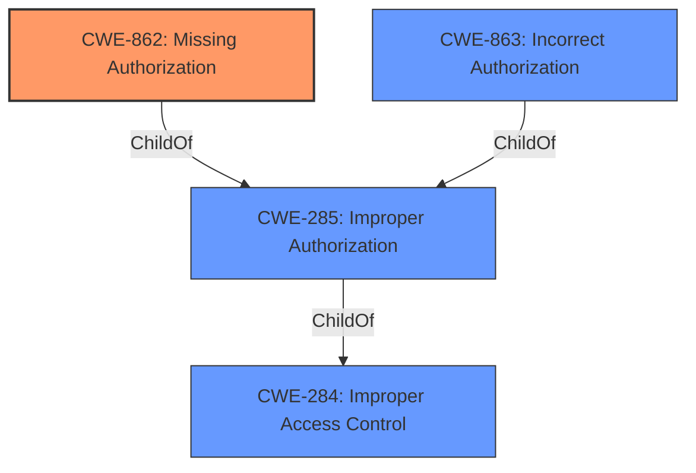

# Enhanced Analysis for CVE-2021-21026

# Summary
| CWE ID | CWE Name | Confidence | CWE Abstraction Level | CWE Vulnerability Mapping Label | CWE-Vulnerability Mapping Notes |
|---|---|---|---|---|---|
| CWE-862 | Missing Authorization | 0.85 | Class | Primary | Discouraged |
| CWE-863 | Incorrect Authorization | 0.75 | Class | Secondary | Allowed-with-Review |
| CWE-285 | Improper Authorization | 0.65 | Class | Secondary | Discouraged |
| CWE-284 | Improper Access Control | 0.50 | Pillar | Secondary | Discouraged |

## Evidence and Confidence

*   **Confidence Score:** 0.80
*   **Evidence Strength:** HIGH

## Relationship Analysis
The primary relationship that influenced the CWE selection is the hierarchical structure of authorization-related CWEs. CWE-284 (Improper Access Control) is a high-level Pillar, while CWE-285 (Improper Authorization) is a Class under it. CWE-862 (Missing Authorization) and CWE-863 (Incorrect Authorization) are children of CWE-285, representing more specific authorization flaws. The vulnerability description points to an **improper authorization** issue, making CWE-862 and CWE-863 strong candidates. CWE-862 is selected because the description mentions that exploitation leads to unauthorized access to restricted resources, implying a lack of authorization checks. If authorization checks were present but flawed, CWE-863 would be more appropriate.



## Vulnerability Chain
The vulnerability chain starts with an **improper authorization** issue, specifically a lack of authorization checks when accessing resources. This leads to unauthorized access to restricted resources.
  - Root Cause: **Missing Authorization** (CWE-862) - The system **does not perform** an authorization check.
  - Impact: Unauthorized access to restricted resources.

## Summary of Analysis
The initial assessment focused on identifying the root cause of the vulnerability based on the provided evidence. The vulnerability description explicitly mentions "**improper authorization**" as the root cause, along with the CVE Reference Links Content Summary stating the same.

The Retriever Results also highlighted CWE-284, CWE-285, CWE-862, and CWE-863 as potential candidates.

The hierarchical relationships between these CWEs helped refine the selection. CWE-284 is a high-level Pillar, while CWE-285 is a Class. CWE-862 and CWE-863 are more specific Classes under CWE-285. Given the description indicating unauthorized access due to the absence of authorization checks, CWE-862 (Missing Authorization) was selected as the primary CWE.

The official MITRE mapping guidance discourages the use of high-level CWEs like CWE-284 and CWE-285, recommending more specific alternatives. CWE-862 and CWE-863 were considered with "Allowed-with-Review" because they are classes. However, based on the vulnerability description, they are a better fit than their parents.

The evidence from the vulnerability description, combined with the relationship analysis and mapping guidance, supports the selection of CWE-862 as the primary CWE, representing the **lack of authorization** that leads to unauthorized access. CWE-863 and CWE-285 were also considered as secondary CWEs.

The selected CWEs are at the optimal level of specificity, accurately reflecting the **missing authorization** issue and its impact.

Relevant CWE Information:

# Enhanced Context (25 CWEs)
The following CWEs were identified as potentially relevant to this vulnerability:

## CWE-1289: Improper Validation of Unsafe Equivalence in Input
**Abstraction Level**: Base
**Similarity Score**: 0.78
**Source**: dense

**Description**:
The product receives an input value that is used as a resource identifier or other type of reference, but it does not validate or incorrectly validates that the input is equivalent to a potentially-unsafe value.

**Mapping Guidance**:
- Usage: Allowed
- Rationale: This CWE entry is at the Base level of abstraction, which is a preferred level of abstraction for mapping to the root causes of vulnerabilities.

## CWE-807: Reliance on Untrusted Inputs in a Security Decision
**Abstraction Level**: Base
**Similarity Score**: 0.76
**Source**: dense

**Description**:
The product uses a protection mechanism that relies on the existence or values of an input, but the input can be modified by an untrusted actor in a way that bypasses the protection mechanism.

**Mapping Guidance**:
- Usage: Allowed
- Rationale: This CWE entry is at the Base level of abstraction, which is a preferred level of abstraction for mapping to the root causes of vulnerabilities.

## CWE-184: Incomplete List of Disallowed Inputs
**Abstraction Level**: Base
**Similarity Score**: 0.75
**Source**: dense

**Description**:
The product implements a protection mechanism that relies on a list of inputs (or properties of inputs) that are not allowed by policy or otherwise require other action to neutralize before additional processing takes place, but the list is incomplete.

**Mapping Guidance**:
- Usage: Allowed
- Rationale: This CWE entry is at the Base level of abstraction, which is a preferred level of abstraction for mapping to the root causes of vulnerabilities.

## CWE-183: Permissive List of Allowed Inputs
**Abstraction Level**: Base
**Similarity Score**: 0.75
**Source**: dense

**Description**:
The product implements a protection mechanism that relies on a list of inputs (or properties of inputs) that are explicitly allowed by policy because the inputs are assumed to be safe, but the list is too permissive - that is, it allows an input that is unsafe, leading to resultant weaknesses.

**Mapping Guidance**:
- Usage: Allowed
- Rationale: This CWE entry is at the Base level of abstraction, which is a preferred level of abstraction for mapping to the root causes of vulnerabilities.

## CWE-74: Improper Neutralization of Special Elements in Output Used by a Downstream Component ('Injection')
**Abstraction Level**: Class
**Similarity Score**: 0.75
**Source**: dense

**Description**:
The product constructs all or part of a command, data structure, or record using externally-influenced input from an upstream component, but it does not neutralize or incorrectly neutralizes special elements that could modify how it is parsed or interpreted when it is sent to a downstream component.

**Mapping Guidance**:
- Usage: Discouraged
- Rationale: CWE-74 is high-level and often misused when lower-level weaknesses are more appropriate.

## CWE-138: Improper Neutralization of Special Elements
**Abstraction Level**: Class
**Similarity Score**: 0.74
**Source**: dense

**Description**:
The product receives input from an upstream component, but it does not neutralize or incorrectly neutralizes special elements that could be interpreted as control elements or syntactic markers when they are sent to a downstream component.

**Mapping Guidance**:
- Usage: Discouraged
- Rationale: This CWE entry is a level-1 Class (i.e., a child of a Pillar). It might have lower-level children that would be more appropriate

## CWE-472: External Control of Assumed-Immutable Web Parameter
**Abstraction Level**: Base
**Similarity Score**: 0.74
**Source**: dense

**Description**:
The web application does not sufficiently verify inputs that are assumed to be immutable but are actually externally controllable, such as hidden form fields.

**Mapping Guidance**:
- Usage: Allowed
- Rationale: This CWE entry is at the Base level of abstraction, which is a preferred level of abstraction for mapping to the root causes of vulnerabilities.

## CWE-115: Misinterpretation of Input
**Abstraction Level**: Base
**Similarity Score**: 0.74
**Source**: dense

**Description**:
The product misinterprets an input, whether from an attacker or another product, in a security-relevant fashion.

**Mapping Guidance**:
- Usage: Allowed
- Rationale: This CWE entry is at the Base level of abstraction, which is a preferred level of abstraction for mapping to the root causes of vulnerabilities.

## CWE-639: Authorization Bypass Through User-Controlled Key
**Abstraction Level**: Base
**Similarity Score**: 0.74
**Source**: dense

**Description**:
The system's authorization functionality does not prevent one user


## CWE Relationship Analysis

Current CWEs represent these abstraction levels: .


### Vulnerability Chain Analysis

**Chain starting from CWE-862:**
- 862 (Missing Authorization) - ROOT


**Chain starting from CWE-284:**
- 284 (Improper Access Control) - ROOT


### CWE Relationship Diagram

```mermaid
graph TD
    classDef primary fill:#f96,stroke:#333,stroke-width:2px
    classDef secondary fill:#69f,stroke:#333
    classDef tertiary fill:#9e9,stroke:#333
```