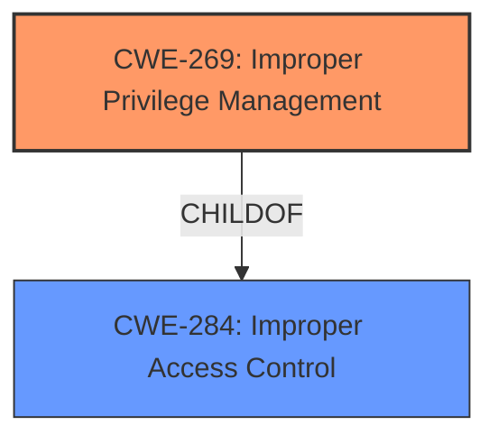

# Analysis for CVE-2021-21045

# Summary
| CWE ID | CWE Name | Confidence | CWE Abstraction Level | CWE Vulnerability Mapping Label | CWE-Vulnerability Mapping Notes |
|---|---|---|---|---|---|
| CWE-269 | Improper Privilege Management | 0.9 | Base | Primary | Allowed |
| CWE-284 | Improper Access Control | 0.5 | Pillar | Secondary | Discouraged |

## Evidence and Confidence

*   **Confidence Score:** 0.9
*   **Evidence Strength:** HIGH

## Relationship Analysis
The primary CWE is CWE-269, which is a base-level CWE, and more specific than the pillar-level CWE-284.
CWE-269 is related to the improper management of privileges which can lead to privilege escalation.
CWE-284, Improper Access Control, is a very general CWE.

## Vulnerability Chain
The vulnerability chain starts with **improper access control** leading to privilege escalation. The root cause is **improper access control**, and the impact is privilege escalation.

## Summary of Analysis
The initial assessment, based on the provided information, pointed to **improper access control** as the root cause. The "Vulnerability Description Key Phrases" section highlights "**improper access control**" as the root cause. The "CVE Reference Links Content Summary" section also explicitly states "**Root Cause of Vulnerability: Improper Access Control**".

However, based on the CWE specifications, CWE-284 is a very high-level, pillar-level CWE, and the mapping guidance discourages its use. The description indicates that there's an **improper access control** vulnerability that allows an attacker to elevate privileges. Given this context, CWE-269, Improper Privilege Management, is a more precise and suitable classification. It directly addresses the **improper management of privileges** that leads to privilege escalation.

CWE-269 is a base-level CWE, which is a preferred level of abstraction. Therefore, CWE-269 is chosen as the primary CWE. CWE-284 is kept as a secondary CWE because **improper access control** is in the original vulnerability description.

Relevant CWE Information:

# Enhanced Context (25 CWEs)
The following CWEs were identified as potentially relevant to this vulnerability:

## CWE-1289: Improper Validation of Unsafe Equivalence in Input
**Abstraction Level**: Base

## CWE-807: Reliance on Untrusted Inputs in a Security Decision
**Abstraction Level**: Base

## CWE-183: Permissive List of Allowed Inputs
**Abstraction Level**: Base

## CWE-657: Violation of Secure Design Principles
**Abstraction Level**: Class

## CWE-184: Incomplete List of Disallowed Inputs
**Abstraction Level**: Base

## CWE-691: Insufficient Control Flow Management
**Abstraction Level**: Pillar

## CWE-653: Improper Isolation or Compartmentalization
**Abstraction Level**: Class

## CWE-404: Improper Resource Shutdown or Release
**Abstraction Level**: Class

## CWE-274: Improper Handling of Insufficient Privileges
**Abstraction Level**: Base

## CWE-668: Exposure of Resource to Wrong Sphere
**Abstraction Level**: Class

## CWE-367: Time-of-check Time-of-use (TOCTOU) Race Condition
**Abstraction Level**: Base

## CWE-125: Out-of-bounds Read
**Abstraction Level**: Base

## CWE-200: Exposure of Sensitive Information to an Unauthorized Actor
**Abstraction Level**: Class

## CWE-639: Authorization Bypass Through User-Controlled Key
**Abstraction Level**: Base

## CWE-190: Integer Overflow or Wraparound
**Abstraction Level**: Base

## CWE-73: External Control of File Name or Path
**Abstraction Level**: base

## CWE-386: Symbolic Name not Mapping to Correct Object
**Abstraction Level**: base

## CWE-190: Integer Overflow or Wraparound
**Abstraction Level**: base

## CWE-22: Improper Limitation of a Pathname to a Restricted Directory ('Path Traversal')
**Abstraction Level**: base

## CWE-770: Allocation of Resources Without Limits or Throttling
**Abstraction Level**: base

## CWE-125: Out-of-bounds Read
**Abstraction Level**: base

## CWE-170: Improper Null Termination
**Abstraction Level**: base

## CWE-195: Signed to Unsigned Conversion Error
**Abstraction Level**: variant

## CWE-367: Time-of-check Time-of-use (TOCTOU) Race Condition
**Abstraction Level**: base

## CWE-41: Improper Resolution of Path Equivalence
**Abstraction Level**: Base

## CWE-269: Improper Privilege Management

**CWE-269 Improper Privilege Management:** The application **fails to** properly manage privilege, which could result in an attacker gaining privileges or influence that should not be possible. This aligns with the vulnerability description, where an unauthenticated attacker could leverage the **improper access control** vulnerability to elevate privileges. The security implication is privilege escalation, which is a direct result of **improper privilege management**.
## CWE-284: Improper Access Control

**CWE-284 Improper Access Control:** This is a high-level pillar that describes the product does not restrict or incorrectly restricts access to a resource from an unauthorized actor. This aligns with the vulnerability description of **improper access control**. The security implication is attackers can compromise the security of the product by gaining privileges, reading sensitive information, executing commands, evading detection, etc. which aligns with the result of privilege escalation.

## Other CWEs Considered:

*   **CWE-787, CWE-788, CWE-125, CWE-122:** These CWEs relate to memory corruption issues such as out-of-bounds write/read and buffer overflows. These are not relevant because the vulnerability is related to **improper access control** and privilege management, not memory corruption.
*   **CWE-200:** This CWE relates to the exposure of sensitive information. It is not relevant because the vulnerability is about privilege escalation, not information disclosure.
*   **CWE-367:** This CWE relates to Time-of-check Time-of-use (TOCTOU) Race Condition. This is not relevant as the vulnerability is not related to race conditions.
*   **CWE-657:** This CWE relates to Violation of Secure Design Principles. While this could be a contributing factor, it is too general and does not directly address the root cause of **improper privilege management**.
*   **CWE-285:** Improper Authorization: This is related to authorization issues, but it is not as specific as CWE-269, which directly addresses **improper privilege management**.
*   **CWE-386:** Symbolic Name not Mapping to Correct Object: This CWE is not related to the described vulnerability.
*   **CWE-20:** Improper Input Validation: This CWE is too general. The vulnerability is not directly related to input validation.