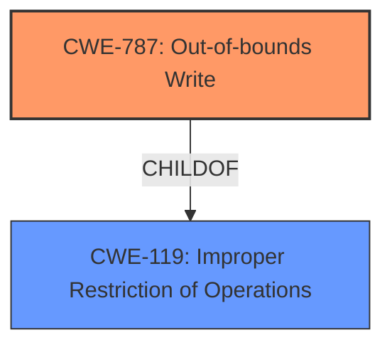

# Raw Analyzer Response for CVE-2021-21046

# Summary
| CWE ID  | CWE Name                     | Confidence | CWE Abstraction Level | CWE Vulnerability Mapping Label | CWE-Vulnerability Mapping Notes |
|---------|------------------------------|------------|-----------------------|---------------------------------|-----------------------------------|
| CWE-787 | Out-of-bounds Write          | 1.0        | Base                  | Allowed                         | Acceptable-Use                    |
| CWE-119 | Improper Restriction of Operations within the Bounds of a Memory Buffer | 0.6        | Class                  | Discouraged                         | Frequent Misuse                  |

## Evidence and Confidence

*   **Confidence Score:** 0.8
*   **Evidence Strength:** HIGH

## Relationship Analysis
The primary CWE selected is CWE-787 (**Out-of-bounds Write**), a base-level CWE that is a child of CWE-119 (**Improper Restriction of Operations within the Bounds of a Memory Buffer**), which is a class-level CWE. This parent-child relationship indicates that CWE-787 is a specific type of the more general CWE-119.

## Vulnerability Chain
The vulnerability chain starts with the **buffer overflow** leading to an **out-of-bounds write**, which results in **memory corruption** and ultimately a denial-of-service.

## Summary of Analysis
The initial assessment identified the **memory corruption** vulnerability in Adobe Acrobat Reader DC. The "CVE Reference Links Content Summary" provided strong evidence for a **buffer overflow** as the root cause, which directly leads to an **out-of-bounds write**.

The selection of CWE-787 is based on the "CVE Reference Links Content Summary" indicating a **buffer overflow**, which leads to the software writing data past the end of the intended buffer, thus aligning perfectly with the description of CWE-787. The relationship analysis confirms that CWE-787 is a specific case of CWE-119, but given the available evidence, CWE-787 is the more precise and appropriate classification.

The confidence in this assessment is high (0.8) due to the clear description of the root cause as a **buffer overflow** and the resulting **out-of-bounds write**.

Relevant CWE Information:

# Enhanced Context (25 CWEs)

## CWE-1289: Improper Validation of Unsafe Equivalence in Input
**Abstraction Level**: Base
**Similarity Score**: 0.80
This CWE was not selected. There's no evidence of input validation issues related to equivalence.

## CWE-807: Reliance on Untrusted Inputs in a Security Decision
**Abstraction Level**: Base
**Similarity Score**: 0.77
This CWE was not selected. The vulnerability is not directly related to reliance on untrusted inputs in security decisions.

## CWE-183: Permissive List of Allowed Inputs
**Abstraction Level**: Base
**Similarity Score**: 0.76
This CWE was not selected. There's no indication of a permissive list of allowed inputs causing the vulnerability.

## CWE-606: Unchecked Input for Loop Condition
**Abstraction Level**: Base
**Similarity Score**: 0.76
This CWE was not selected. The vulnerability is not related to unchecked input for loop conditions.

## CWE-226: Sensitive Information in Resource Not Removed Before Reuse
**Abstraction Level**: Base
**Similarity Score**: 0.76
This CWE was not selected. This CWE is not relevant as the vulnerability is related to memory corruption, not reuse of sensitive information.

## CWE-184: Incomplete List of Disallowed Inputs
**Abstraction Level**: Base
**Similarity Score**: 0.76
This CWE was not selected. There's no indication of an incomplete list of disallowed inputs causing the vulnerability.

## CWE-125: Out-of-bounds Read
**Abstraction Level**: Base
**Similarity Score**: 0.76, 7957.74
This CWE was not selected. While an out-of-bounds read could occur as a consequence, the root cause is the out-of-bounds write due to the buffer overflow.

## CWE-1288: Improper Validation of Consistency within Input
**Abstraction Level**: Base
**Similarity Score**: 0.76
This CWE was not selected. There's no indication of improper validation of consistency within input causing the vulnerability.

## CWE-252: Unchecked Return Value
**Abstraction Level**: Base
**Similarity Score**: 0.76
This CWE was not selected. There's no indication of an unchecked return value causing the vulnerability.

## CWE-131: Incorrect Calculation of Buffer Size
**Abstraction Level**: Base
**Similarity Score**: 0.75
This CWE was not selected. While an incorrect buffer size calculation could lead to a buffer overflow, the provided information does not explicitly state this.

## CWE-190: Integer Overflow or Wraparound
**Abstraction Level**: Base
**Similarity Score**: 7902.45, 4.33
This CWE was not selected. There's no evidence of integer overflow or wraparound in the description.

## CWE-119: Improper Restriction of Operations within the Bounds of a Memory Buffer
**Abstraction Level**: Class
**Similarity Score**: 7893.34
CWE-119 was considered as a possible classification because it generally describes the condition where operations are performed outside the intended boundaries of a memory buffer. However, given the specific details of the vulnerability involving a **buffer overflow** leading to an **out-of-bounds write**, CWE-787 is a more precise classification. CWE-119 is a parent of CWE-787. The mapping guidance for CWE-119 discourages its use when lower-level CWEs are available. This supports the decision to select CWE-787 instead.

## CWE-1284: Improper Validation of Specified Quantity in Input
**Abstraction Level**: Base
**Similarity Score**: 7678.96
This CWE was not selected. There's no indication of improper validation of specified quantity in input causing the vulnerability.

## CWE-367: Time-of-check Time-of-use (TOCTOU) Race Condition
**Abstraction Level**: Base
**Similarity Score**: 7589.62
This CWE was not selected. The vulnerability is not related to TOCTOU race conditions.

## CWE-41: Improper Resolution of Path Equivalence
**Abstraction Level**: base
**Similarity Score**: 5.03
This CWE was not selected. The vulnerability is not related to path equivalence issues.

## CWE-822: Untrusted Pointer Dereference
**Abstraction Level**: base
**Similarity Score**: 4.33
This CWE was not selected. The vulnerability doesn't explicitly involve untrusted pointer dereference.

## CWE-22: Improper Limitation of a Pathname to a Restricted Directory ('Path Traversal')
**Abstraction Level**: base
**Similarity Score**: 4.33
This CWE was not selected. The vulnerability is not related to path traversal issues.

## CWE-770: Allocation of Resources Without Limits or Throttling
**Abstraction Level**: base
**Similarity Score**: 4.33
This CWE was not selected. The vulnerability is not related to resource allocation limits or throttling.

## CWE-73: External Control of File Name or Path
**Abstraction Level**: base
**Similarity Score**: 4.33
This CWE was not selected. The vulnerability is not related to external control of file names or paths.

## CWE-201: Insertion of Sensitive Information Into Sent Data
**Abstraction Level**: base
**Similarity Score**: 4.33
This CWE was not selected. The vulnerability is not related to the insertion of sensitive information into sent data.

## CWE-170: Improper Null Termination
**Abstraction Level**: base
**Similarity Score**: 3.89
This CWE was not selected. The vulnerability is not related to improper null termination.

## CWE-781: Improper Address Validation in IOCTL with METHOD_NEITHER I/O Control Code
**Abstraction Level**: variant
**Similarity Score**: 3.88
This CWE was not selected. This CWE is specific to IOCTL and doesn't fit the general buffer overflow scenario.