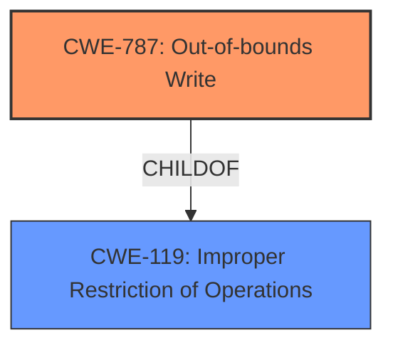

# Enhanced Analysis for CVE-2021-21063

# Summary
| CWE ID | CWE Name | Confidence | CWE Abstraction Level | CWE Vulnerability Mapping Label | CWE-Vulnerability Mapping Notes |
|---|---|---|---|---|---|
| CWE-787 | Out-of-bounds Write | 0.9 | Base | Allowed | Primary CWE |
| CWE-119 | Improper Restriction of Operations within the Bounds of a Memory Buffer | 0.6 | Class | Discouraged | Secondary Candidate |

## Evidence and Confidence

*   **Confidence Score:** 0.9
*   **Evidence Strength:** HIGH

## Relationship Analysis
The primary relationship is that CWE-787 is a ChildOf CWE-119. This means that CWE-787 is a more specific type of the more general CWE-119. Since the vulnerability description specifically mentions **memory corruption** due to writing past the end of a buffer, CWE-787 is the more appropriate choice.



## Vulnerability Chain
The chain of events is as follows:
1.  A specially crafted PDF file is parsed by Acrobat Reader DC.
2.  This leads to an **out-of-bounds write** (CWE-787).
3.  The **out-of-bounds write** causes **memory corruption**.
4.  The **memory corruption** allows an attacker to achieve arbitrary code execution.

## Summary of Analysis
Initially, the high-level description of "Memory corruption vulnerability" could point to several memory-related CWEs. However, the "CVE Reference Links Content Summary" section clarifies the root cause as a "Buffer overflow vulnerability". Given the nature of buffer overflows leading to writing beyond intended boundaries, CWE-787 (Out-of-bounds Write) becomes the most relevant.

The provided evidence states: "Root cause of vulnerability: Buffer overflow" and "Weaknesses/vulnerabilities present: A buffer overflow vulnerability is present.". These statements directly support the selection of CWE-787.

The relationship analysis further solidifies this choice, as CWE-787 is a more specific instance of the broader CWE-119 (Improper Restriction of Operations within the Bounds of a Memory Buffer). While CWE-119 could be a general mapping, CWE-787 provides the necessary granularity. The "Retriever Results" also list CWE-787 as the top candidate.

Therefore, based on the evidence and relationship analysis, CWE-787 is the optimal selection.

Other CWEs Considered and Rejected:

*   CWE-119: While related, it's a more general category. The vulnerability details clearly point to an out-of-bounds write, making CWE-787 a more precise fit. The MITRE mapping guidance discourages using CWE-119 when more specific CWEs are available.
*   CWE-416: Use After Free - While a common memory corruption issue, the root cause is a buffer overflow, which is an out-of-bounds write.
*   CWE-125: Out-of-bounds Read - The vulnerability specifically states "Memory corruption vulnerability" in the "Vulnerability Description Key Phrases", implying a write operation rather than a read.
*   CWE-41: Improper Resolution of Path Equivalence, CWE-22: Improper Limitation of a Pathname to a Restricted Directory ('Path Traversal'), CWE-73: External Control of File Name or Path: These CWEs are related to file path issues, which are not mentioned in the summary.
*   CWE-770: Allocation of Resources Without Limits or Throttling: This CWE is more related to denial of service attacks.
*   CWE-170: Improper Null Termination: This is not mentioned in the summary and the overflow appears to be related to the buffer size not the string inside it.
*   CWE-195: Signed to Unsigned Conversion Error: This type conversion is not described.
*   CWE-781: Improper Address Validation in IOCTL with METHOD_NEITHER I/O Control Code: This IOCTL method is only a variant.
*   CWE-190: Integer Overflow or Wraparound: There is no mention of integer overflow.
*   CWE-20: Improper Input Validation: This is too general.
*   CWE-367: Time-of-check Time-of-use (TOCTOU) Race Condition: There is no indication of a race condition.
*   CWE-665: Improper Initialization: There is no indication of improper initialization.
*   CWE-822: Untrusted Pointer Dereference: There is no indication of pointer use.
*   CWE-121: Stack-based Buffer Overflow, CWE-122: Heap-based Buffer Overflow: These are more specific variants of buffer overflows. Without more information, its best to use CWE-787.
*   CWE-457: Use of Uninitialized Variable: There is no indication of uninitialized variable use.
*   CWE-1284: Improper Validation of Specified Quantity in Input, CWE-1286: Improper Validation of Syntactic Correctness of Input, CWE-1288: Improper Validation of Consistency within Input, CWE-1289: Improper Validation of Unsafe Equivalence in Input: These improper validations are not mentioned.
*   CWE-138: Improper Neutralization of Special Elements: This is not mentioned.
*   CWE-252: Unchecked Return Value: There is no indication of an unchecked return value.
*   CWE-606: Unchecked Input for Loop Condition: There is no indication of an unchecked loop condition.
*   CWE-179: Incorrect Behavior Order: Early Validation, CWE-183: Permissive List of Allowed Inputs, CWE-184: Incomplete List of Disallowed Inputs, CWE-807: Reliance on Untrusted Inputs in a Security Decision: These all relate to validation of inputs which aren't directly called out.


## CWE Relationship Analysis

Current CWEs represent these abstraction levels: .


### Vulnerability Chain Analysis

**Chain starting from CWE-787:**
- 787 (Out-of-bounds Write) - ROOT


**Chain starting from CWE-179:**
- 179 (Incorrect Behavior Order: Early Validation) - ROOT


### CWE Relationship Diagram

```mermaid
graph TD
    classDef primary fill:#f96,stroke:#333,stroke-width:2px
    classDef secondary fill:#69f,stroke:#333
    classDef tertiary fill:#9e9,stroke:#333
```