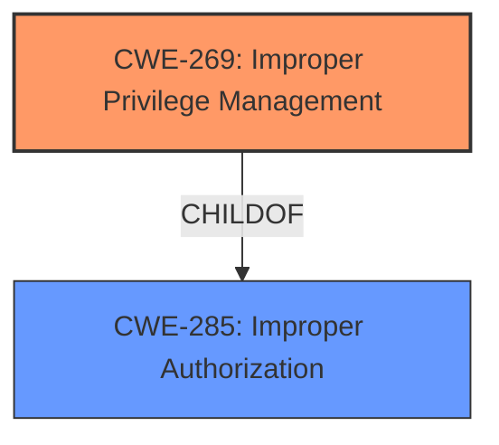

# Raw Analyzer Response for CVE-2021-21069

# Summary
| CWE ID  | CWE Name                                                                                                                                       | Confidence | CWE Abstraction Level | CWE Vulnerability Mapping Label | CWE-Vulnerability Mapping Notes |
| :-------- | :---------------------------------------------------------------------------------------------------------------------------------------------- | :---------- | :---------------------- | :-------------------------------- | :------------------------------ |
| CWE-269   | Improper Privilege Management                                                                                                                   | 1         | Base                    | Primary                           | Allowed                         |
| CWE-285   | Improper Authorization                                                                                                                          | 0.7         | Class                   | Secondary                         | Discouraged                     |

## Evidence and Confidence

*   **Confidence Score:** 0.85
*   **Evidence Strength:** HIGH

## Relationship Analysis
The primary relationship influencing my decision is the hierarchical structure between CWE-285 and CWE-269. CWE-269 is a child of CWE-285, providing a more specific description of the vulnerability. The vulnerability description focuses on the **improper management of privileges** within the Adobe privileged helper tool, aligning directly with the definition of CWE-269.

## Vulnerability Chain
The vulnerability chain starts with the **lack of proper validation of helper clients**, leading to **improper privilege management**, and culminating in **privilege escalation** and **arbitrary code execution**.
  - Lack of input validation (not explicitly mapped but present) -> Improper Privilege Management (CWE-269) -> Privilege Escalation -> Arbitrary Code Execution

## Summary of Analysis
My assessment is primarily based on the provided evidence, specifically the "CVE Reference Links Content Summary" section. This section highlights the root cause as a **lack of proper validation of helper clients** which leads to **improper privilege management**.

> **Evidence:** "The vulnerability stems from a lack of proper validation of helper clients within the Adobe privileged helper tool. This means the tool doesn't adequately verify the identity or legitimacy of the clients it interacts with."

The graph relationships influenced my selection by emphasizing the importance of choosing the most specific CWE available. While CWE-285 (Improper Authorization) is a broader category, CWE-269 (Improper Privilege Management) directly addresses the **improper management of privileges**, making it the optimal choice.

My selected CWEs are at the optimal level of specificity because they accurately represent the root cause of the vulnerability and are at the Base level of abstraction, as recommended by MITRE.

Relevant CWE Information:

# Enhanced Context (25 CWEs)

## Vulnerability Description

Adobe Creative Cloud Desktop Application version 5.3 (and earlier) is affected by a local privilege escalation vulnerability that could allow an attacker to call functions against the installer to perform high privileged actions. Exploitation of this issue does not require user interaction.

### Vulnerability Description Key Phrases

*   **impact:** perform high privileged actions
*   **attacker:** attacker
*   **product:** Adobe Creative Cloud Desktop Application
*   **version:** 5.3 (and earlier)

## CVE Reference Links Content Summary

Based on the provided information, here's a breakdown of the vulnerability:

**CVE ID:** CVE-2021-21069

**Root Cause:** The vulnerability stems from a **lack of proper validation of helper clients** within the Adobe privileged helper tool. This means the tool doesn't adequately verify the identity or legitimacy of the clients it interacts with.

**Weaknesses/Vulnerabilities Present:**

*   **Improper Privilege Management:** The core issue is that the privileged helper tool doesn't correctly manage the privileges of its clients.
*   **Lack of Input Validation:** Specifically, the lack of proper validation of the helper clients.

**Impact of Exploitation:**

*   **Privilege Escalation:** Successful exploitation allows an attacker to elevate their privileges to root.
*   **Arbitrary Code Execution:** With root privileges, the attacker can then execute arbitrary code on the target system.

**Attack Vectors:**

*   **Local Attack:** The attacker needs to have local access to the target machine.
*   **Low-Privileged Code Execution:** The attacker must first obtain the ability to execute low-privileged code on the system.
*   **Exploitation of Helper Tool:** The attacker then leverages the vulnerability in the Adobe privileged helper tool by interacting with it as a malicious client.

**Required Attacker Capabilities/Position:**

*   **Local Access:** The attacker must have a foothold on the target system, such as through malware or prior compromise.
*   **Low-Privileged Code Execution:** The attacker needs to be able to run code on the target machine, even if it's with limited privileges.
*   **Knowledge of Vulnerable Helper Tool:** The attacker needs to be aware of the specific weakness in the Adobe helper tool.

**Additional Details**

*   The vulnerability affects Adobe Creative Cloud on macOS.
*   Adobe has released an update to address this vulnerability.
*   The vulnerability is rated as "Critical".
*   The affected versions are Creative Cloud Desktop Application 5.3 and earlier
*   The vulnerability was reported by "rookuu" working with Trend Micro Zero Day Initiative.
*   The CVSS score is 7.8, with a vector of AV:L/AC:L/PR:L/UI:N/S:U/C:H/I:H/A:H

This information provides more detail than the basic CVE description which is "PLACEHOLDER - Implement CVE description retrieval"

## Detailed Analysis of Selected CWEs

### CWE-269: Improper Privilege Management

*   **Technical Explanation:** This CWE describes a situation where the software does not properly manage the privileges of its clients or components. In this case, the Adobe privileged helper tool does not adequately verify the identity or legitimacy of the clients it interacts with, allowing an attacker to call functions against the installer to perform high privileged actions.
*   **Security Implications:** This can lead to privilege escalation, allowing an attacker to gain higher-level access to the system and perform unauthorized actions.
*   **Relationship to Other CWEs:** This is a child of CWE-285 (Improper Authorization), which is a more general category.
*   **MITRE Mapping Guidance:** N/A
*   **Justification:** The vulnerability description clearly states that the core issue is that the privileged helper tool doesn't correctly manage the privileges of its clients. This aligns directly with the definition of CWE-269.

### CWE-285: Improper Authorization

*   **Technical Explanation:** This CWE describes a situation where the software does not perform or incorrectly performs an authorization check when an actor attempts to access a resource or perform an action. While this is applicable, it's less specific than CWE-269. The **lack of validation of helper clients** results in the helper tool not being able to properly authorize which client is requesting actions, which ends up resulting in privilege escalation.
*   **Security Implications:** This can lead to unauthorized access to resources and actions, potentially leading to information disclosure, data modification, or denial of service.
*   **Relationship to Other CWEs:** This is a parent of CWE-269 (Improper Privilege Management).
*   **MITRE Mapping Guidance:** Discouraged because it's a high-level class. The children of this CWE should be reviewed for a better fit.
*   **Justification:** This CWE is considered because the **lack of validation** can be interpretted as a missing authorization check, but CWE-269 more accurately represents the root cause.

## CWEs Considered but Not Used

*   **CWE-862 (Missing Authorization), CWE-863 (Incorrect Authorization):** These CWEs were considered but ultimately deemed less suitable than CWE-269 because the vulnerability is not simply a missing or incorrect authorization check, but rather a broader issue of improper management of privileges. The **lack of validation** is an underlying issue, but the direct result is **improper management of privileges**.
*   **CWE-20 (Improper Input Validation):** While the vulnerability stems from a **lack of proper validation of helper clients**, this is a prerequisite to the **improper privilege management**. CWE-20 describes that the software does not validate or incorrectly validates that the input has the properties that are required to process the data safely and correctly, but it doesn't directly cause the vulnerability.
*   **CWE-732 (Incorrect Permission Assignment for Critical Resource):** While seemingly applicable, this CWE is more related to the permission assignments that are incorrectly assigned, which is not the root cause in this vulnerability description.
*   **CWE-276 (Incorrect Default Permissions):** This CWE describes that the installed file permissions are set to allow anyone to modify those files, but this vulnerability doesn't stem from that cause.
*   **CWE-379 (Creation of Temporary File in Directory with Insecure Permissions):** This CWE describes that the product creates a temporary file in