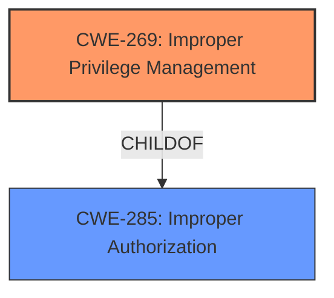

# Analysis for CVE-2021-21069

# Summary
| CWE ID  | CWE Name                                                                                                                                       | Confidence | CWE Abstraction Level | CWE Vulnerability Mapping Label | CWE-Vulnerability Mapping Notes |
| :-------- | :---------------------------------------------------------------------------------------------------------------------------------------------- | :---------- | :---------------------- | :-------------------------------- | :------------------------------ |
| CWE-269   | Improper Privilege Management                                                                                                                   | 1         | Base                    | Primary                           | Allowed                         |
| CWE-285   | Improper Authorization                                                                                                                          | 0.7         | Class                   | Secondary                         | Discouraged                     |

## Evidence and Confidence

*   **Confidence Score:** 0.85
*   **Evidence Strength:** HIGH

## Relationship Analysis
The primary relationship influencing my decision is the hierarchical structure between CWE-285 and CWE-269. CWE-269 is a child of CWE-285, providing a more specific description of the vulnerability. The vulnerability description focuses on the **improper management of privileges** within the Adobe privileged helper tool, aligning directly with the definition of CWE-269.



## Vulnerability Chain
The vulnerability chain starts with the **lack of proper validation of helper clients**, leading to **improper privilege management**, and culminating in **privilege escalation** and **arbitrary code execution**.
  - Lack of input validation (not explicitly mapped but present) -> Improper Privilege Management (CWE-269) -> Privilege Escalation -> Arbitrary Code Execution

## Summary of Analysis
My assessment is primarily based on the provided evidence, specifically the "CVE Reference Links Content Summary" section. This section highlights the root cause as a **lack of proper validation of helper clients** which leads to **improper privilege management**.

> **Evidence:** "The vulnerability stems from a lack of proper validation of helper clients within the Adobe privileged helper tool. This means the tool doesn't adequately verify the identity or legitimacy of the clients it interacts with."

The graph relationships influenced my selection by emphasizing the importance of choosing the most specific CWE available. While CWE-285 (Improper Authorization) is a broader category, CWE-269 (Improper Privilege Management) directly addresses the **improper management of privileges**, making it the optimal choice.

My selected CWEs are at the optimal level of specificity because they accurately represent the root cause of the vulnerability and are at the Base level of abstraction, as recommended by MITRE.

Relevant CWE Information:

# Enhanced Context (25 CWEs)

## Vulnerability Description

Adobe Creative Cloud Desktop Application version 5.3 (and earlier) is affected by a local privilege escalation vulnerability that could allow an attacker to call functions against the installer to perform high privileged actions. Exploitation of this issue does not require user interaction.

### Vulnerability Description Key Phrases

*   **impact:** perform high privileged actions
*   **attacker:** attacker
*   **product:** Adobe Creative Cloud Desktop Application
*   **version:** 5.3 (and earlier)

## CVE Reference Links Content Summary

Based on the provided information, here's a breakdown of the vulnerability:

**CVE ID:** CVE-2021-21069

**Root Cause:** The vulnerability stems from a **lack of proper validation of helper clients** within the Adobe privileged helper tool. This means the tool doesn't adequately verify the identity or legitimacy of the clients it interacts with.

**Weaknesses/Vulnerabilities Present:**

*   **Improper Privilege Management:** The core issue is that the privileged helper tool doesn't correctly manage the privileges of its clients.
*   **Lack of Input Validation:** Specifically, the lack of proper validation of the helper clients.

**Impact of Exploitation:**

*   **Privilege Escalation:** Successful exploitation allows an attacker to elevate their privileges to root.
*   **Arbitrary Code Execution:** With root privileges, the attacker can then execute arbitrary code on the target system.

**Attack Vectors:**

*   **Local Attack:** The attacker needs to have local access to the target machine.
*   **Low-Privileged Code Execution:** The attacker must first obtain the ability to execute low-privileged code on the system.
*   **Exploitation of Helper Tool:** The attacker then leverages the vulnerability in the Adobe privileged helper tool by interacting with it as a malicious client.

**Required Attacker Capabilities/Position:**

*   **Local Access:** The attacker must have a foothold on the target system, such as through malware or prior compromise.
*   **Low-Privileged Code Execution:** The attacker needs to be able to run code on the target machine, even if it's with limited privileges.
*   **Knowledge of Vulnerable Helper Tool:** The attacker needs to be aware of the specific weakness in the Adobe helper tool.

**Additional Details**

*   The vulnerability affects Adobe Creative Cloud on macOS.
*   Adobe has released an update to address this vulnerability.
*   The vulnerability is rated as "Critical".
*   The affected versions are Creative Cloud Desktop Application 5.3 and earlier
*   The vulnerability was reported by "rookuu" working with Trend Micro Zero Day Initiative.
*   The CVSS score is 7.8, with a vector of AV:L/AC:L/PR:L/UI:N/S:U/C:H/I:H/A:H

This information provides more detail than the basic CVE description which is "PLACEHOLDER - Implement CVE description retrieval"

## Detailed Analysis of Selected CWEs

### CWE-269: Improper Privilege Management

*   **Technical Explanation:** This CWE describes a situation where the software does not properly manage the privileges of its clients or components. In this case, the Adobe privileged helper tool does not adequately verify the identity or legitimacy of the clients it interacts with, allowing an attacker to call functions against the installer to perform high privileged actions.
*   **Security Implications:** This can lead to privilege escalation, allowing an attacker to gain higher-level access to the system and perform unauthorized actions.
*   **Relationship to Other CWEs:** This is a child of CWE-285 (Improper Authorization), which is a more general category.
*   **MITRE Mapping Guidance:** N/A
*   **Justification:** The vulnerability description clearly states that the core issue is that the privileged helper tool doesn't correctly manage the privileges of its clients. This aligns directly with the definition of CWE-269.

### CWE-285: Improper Authorization

*   **Technical Explanation:** This CWE describes a situation where the software does not perform or incorrectly performs an authorization check when an actor attempts to access a resource or perform an action. While this is applicable, it's less specific than CWE-269. The **lack of validation of helper clients** results in the helper tool not being able to properly authorize which client is requesting actions, which ends up resulting in privilege escalation.
*   **Security Implications:** This can lead to unauthorized access to resources and actions, potentially leading to information disclosure, data modification, or denial of service.
*   **Relationship to Other CWEs:** This is a parent of CWE-269 (Improper Privilege Management).
*   **MITRE Mapping Guidance:** Discouraged because it's a high-level class. The children of this CWE should be reviewed for a better fit.
*   **Justification:** This CWE is considered because the **lack of validation** can be interpretted as a missing authorization check, but CWE-269 more accurately represents the root cause.

## CWEs Considered but Not Used

*   **CWE-862 (Missing Authorization), CWE-863 (Incorrect Authorization):** These CWEs were considered but ultimately deemed less suitable than CWE-269 because the vulnerability is not simply a missing or incorrect authorization check, but rather a broader issue of improper management of privileges. The **lack of validation** is an underlying issue, but the direct result is **improper management of privileges**.
*   **CWE-20 (Improper Input Validation):** While the vulnerability stems from a **lack of proper validation of helper clients**, this is a prerequisite to the **improper privilege management**. CWE-20 describes that the software does not validate or incorrectly validates that the input has the properties that are required to process the data safely and correctly, but it doesn't directly cause the vulnerability.
*   **CWE-732 (Incorrect Permission Assignment for Critical Resource):** While seemingly applicable, this CWE is more related to the permission assignments that are incorrectly assigned, which is not the root cause in this vulnerability description.
*   **CWE-276 (Incorrect Default Permissions):** This CWE describes that the installed file permissions are set to allow anyone to modify those files, but this vulnerability doesn't stem from that cause.
*   **CWE-379 (Creation of Temporary File in Directory with Insecure Permissions):** This CWE describes that the product creates a temporary file in

# Enhanced Query for CVE-2021-21069

## Vulnerability Description
Adobe Creative Cloud Desktop Application version 5.3 (and earlier) is affected by a local privilege escalation vulnerability that could allow an attacker to call functions against the installer to perform high privileged actions. Exploitation of this issue does not require user interaction.

### Vulnerability Description Key Phrases
- **impact:** perform high privileged actions
- **attacker:** attacker
- **product:** Adobe Creative Cloud Desktop Application
- **version:** 5.3 (and earlier)

## CVE Reference Links Content Summary
Based on the provided information, here's a breakdown of the vulnerability:

**CVE ID:** CVE-2021-21069

**Root Cause:** The vulnerability stems from a lack of proper validation of helper clients within the Adobe privileged helper tool. This means the tool doesn't adequately verify the identity or legitimacy of the clients it interacts with.

**Weaknesses/Vulnerabilities Present:**
*   **Improper Privilege Management:** The core issue is that the privileged helper tool doesn't correctly manage the privileges of its clients.
*   **Lack of Input Validation:** Specifically, the lack of proper validation of the helper clients.

**Impact of Exploitation:**
*   **Privilege Escalation:** Successful exploitation allows an attacker to elevate their privileges to root.
*   **Arbitrary Code Execution:** With root privileges, the attacker can then execute arbitrary code on the target system.

**Attack Vectors:**
*   **Local Attack:** The attacker needs to have local access to the target machine.
*   **Low-Privileged Code Execution:** The attacker must first obtain the ability to execute low-privileged code on the system.
*   **Exploitation of Helper Tool:** The attacker then leverages the vulnerability in the Adobe privileged helper tool by interacting with it as a malicious client.

**Required Attacker Capabilities/Position:**
*   **Local Access:** The attacker must have a foothold on the target system, such as through malware or prior compromise.
*   **Low-Privileged Code Execution:** The attacker needs to be able to run code on the target machine, even if it's with limited privileges.
*   **Knowledge of Vulnerable Helper Tool:** The attacker needs to be aware of the specific weakness in the Adobe helper tool.

**Additional Details**
*   The vulnerability affects Adobe Creative Cloud on macOS.
*   Adobe has released an update to address this vulnerability.
*   The vulnerability is rated as "Critical".
*   The affected versions are Creative Cloud Desktop Application 5.3 and earlier
*   The vulnerability was reported by "rookuu" working with Trend Micro Zero Day Initiative.
*   The CVSS score is 7.8, with a vector of AV:L/AC:L/PR:L/UI:N/S:U/C:H/I:H/A:H

This information provides more detail than the basic CVE description which is "PLACEHOLDER - Implement CVE description retrieval"

## Retriever Results

### Top Combined Results

| Rank | CWE ID | Name | Abstraction | Usage  | Retrievers | Individual Scores |
|------|--------|------|-------------|-------|------------|-------------------|
| 1 | 379 | Creation of Temporary File in Directory with Insecure Permissions | Base | Allowed | sparse | 0.113 |
| 2 | 732 | Incorrect Permission Assignment for Critical Resource | Class | Allowed-with-Review | sparse | 0.086 |
| 3 | 862 | Missing Authorization | Class | Allowed-with-Review | sparse | 0.084 |
| 4 | 285 | Improper Authorization | Class | Discouraged | sparse | 0.083 |
| 5 | 20 | Improper Input Validation | Class | Discouraged | sparse | 0.081 |
| 6 | 276 | Incorrect Default Permissions | Base | Allowed | dense | 0.510 |
| 7 | 73 | External Control of File Name or Path | Base | Allowed | graph | 0.002 |
| 8 | 457 | Use of Uninitialized Variable | Variant | Allowed | sparse | 0.080 |
| 9 | 284 | Improper Access Control | Pillar | Discouraged | sparse | 0.080 |
| 10 | 863 | Incorrect Authorization | Class | Allowed-with-Review | sparse | 0.080 |


# Complete CWE Specifications


## CWE-379: Creation of Temporary File in Directory with Insecure Permissions
**Abstraction:** Base
**Status:** Incomplete

### Description
The product creates a temporary file in a directory whose permissions allow unintended actors to determine the file's existence or otherwise access that file.

### Extended Description
On some operating systems, the fact that the temporary file exists may be apparent to any user with sufficient privileges to access that directory. Since the file is visible, the application that is using the temporary file could be known. If one has access to list the processes on the system, the attacker has gained information about what the user is doing at that time. By correlating this with the applications the user is running, an attacker could potentially discover what a user's actions are. From this, higher levels of security could be breached.

### Alternative Terms
None

### Relationships
ChildOf -> CWE-377

### Mapping Guidance
**Usage:** Allowed
**Rationale:** This CWE entry is at the Base level of abstraction, which is a preferred level of abstraction for mapping to the root causes of vulnerabilities.
**Comments:** Carefully read both the name and description to ensure that this mapping is an appropriate fit. Do not try to 'force' a mapping to a lower-level Base/Variant simply to comply with this preferred level of abstraction.
**Reasons:**
- Acceptable-Use


### Observed Examples
- **CVE-2022-27818:** A hotkey daemon written in Rust creates a domain socket file underneath /tmp, which is accessible by any user.
- **CVE-2021-21290:** A Java-based application for a rapid-development framework uses File.createTempFile() to create a random temporary file with insecure default permissions.


## CWE-732: Incorrect Permission Assignment for Critical Resource
**Abstraction:** Class
**Status:** Draft

### Description
The product specifies permissions for a security-critical resource in a way that allows that resource to be read or modified by unintended actors.

### Extended Description
When a resource is given a permission setting that provides access to a wider range of actors than required, it could lead to the exposure of sensitive information, or the modification of that resource by unintended parties. This is especially dangerous when the resource is related to program configuration, execution, or sensitive user data. For example, consider a misconfigured storage account for the cloud that can be read or written by a public or anonymous user.

### Alternative Terms
None

### Relationships
ChildOf -> CWE-285
ChildOf -> CWE-668

### Mapping Guidance
**Usage:** Allowed-with-Review
**Rationale:** While the name itself indicates an assignment of permissions for resources, this is often misused for vulnerabilities in which "permissions" are not checked, which is an "authorization" weakness (CWE-285 or descendants) within CWE's model [REF-1287].
**Comments:** Closely analyze the specific mistake that is allowing the resource to be exposed, and perform a CWE mapping for that mistake.
**Reasons:**
- Frequent Misuse


### Additional Notes
**[Maintenance]** The relationships between privileges, permissions, and actors (e.g. users and groups) need further refinement within the Research view. One complication is that these concepts apply to two different pillars, related to control of resources (CWE-664) and protection mechanism failures (CWE-693).


### Observed Examples
- **CVE-2022-29527:** Go application for cloud management creates a world-writable sudoers file that allows local attackers to inject sudo rules and escalate privileges to root by winning a race condition.
- **CVE-2009-3482:** Anti-virus product sets insecure "Everyone: Full Control" permissions for files under the "Program Files" folder, allowing attackers to replace executables with Trojan horses.
- **CVE-2009-3897:** Product creates directories with 0777 permissions at installation, allowing users to gain privileges and access a socket used for authentication.


## CWE-862: Missing Authorization
**Abstraction:** Class
**Status:** Incomplete

### Description
The product does not perform an authorization check when an actor attempts to access a resource or perform an action.

### Extended Description
Not provided

### Alternative Terms
AuthZ: "AuthZ" is typically used as an abbreviation of "authorization" within the web application security community. It is distinct from "AuthN" (or, sometimes, "AuthC") which is an abbreviation of "authentication." The use of "Auth" as an abbreviation is discouraged, since it could be used for either authentication or authorization.

### Relationships
ChildOf -> CWE-285
ChildOf -> CWE-284

### Mapping Guidance
**Usage:** Allowed-with-Review
**Rationale:** This CWE entry is a Class and might have Base-level children that would be more appropriate
**Comments:** Examine children of this entry to see if there is a better fit
**Reasons:**
- Abstraction


### Additional Notes
**[Terminology]** Assuming a user with a given identity, authorization is the process of determining whether that user can access a given resource, based on the user's privileges and any permissions or other access-control specifications that apply to the resource.


### Observed Examples
- **CVE-2022-24730:** Go-based continuous deployment product does not check that a user has certain privileges to update or create an app, allowing adversaries to read sensitive repository information
- **CVE-2009-3168:** Web application does not restrict access to admin scripts, allowing authenticated users to reset administrative passwords.
- **CVE-2009-3597:** Web application stores database file under the web root with insufficient access control (CWE-219), allowing direct request.


## CWE-285: Improper Authorization
**Abstraction:** Class
**Status:** Draft

### Description
The product does not perform or incorrectly performs an authorization check when an actor attempts to access a resource or perform an action.

### Extended Description


Assuming a user with a given identity, authorization is the process of determining whether that user can access a given resource, based on the user's privileges and any permissions or other access-control specifications that apply to the resource.


When access control checks are not applied consistently - or not at all - users are able to access data or perform actions that they should not be allowed to perform. This can lead to a wide range of problems, including information exposures, denial of service, and arbitrary code execution.


### Alternative Terms
AuthZ: "AuthZ" is typically used as an abbreviation of "authorization" within the web application security community. It is distinct from "AuthN" (or, sometimes, "AuthC") which is an abbreviation of "authentication." The use of "Auth" as an abbreviation is discouraged, since it could be used for either authentication or authorization.

### Relationships
ChildOf -> CWE-284
ChildOf -> CWE-284

### Mapping Guidance
**Usage:** Discouraged
**Rationale:** CWE-285 is high-level and lower-level CWEs can frequently be used instead. It is a level-1 Class (i.e., a child of a Pillar).
**Comments:** Look at CWE-285's children and consider mapping to CWEs such as CWE-862: Missing Authorization, CWE-863: Incorrect Authorization, CWE-732: Incorrect Permission Assignment for Critical Resource, or others.
**Reasons:**
- Abstraction
**Suggested Alternatives:**
- CWE-862: Missing Authorization
- CWE-863: Incorrect Authorization
- CWE-732: Incorrect Permission Assignment for Critical Resource


### Observed Examples
- **CVE-2022-24730:** Go-based continuous deployment product does not check that a user has certain privileges to update or create an app, allowing adversaries to read sensitive repository information
- **CVE-2009-3168:** Web application does not restrict access to admin scripts, allowing authenticated users to reset administrative passwords.
- **CVE-2009-2960:** Web application does not restrict access to admin scripts, allowing authenticated users to modify passwords of other users.


## CWE-20: Improper Input Validation
**Abstraction:** Class
**Status:** Stable

### Description
The product receives input or data, but it does
        not validate or incorrectly validates that the input has the
        properties that are required to process the data safely and
        correctly.

### Extended Description


Input validation is a frequently-used technique for checking potentially dangerous inputs in order to ensure that the inputs are safe for processing within the code, or when communicating with other components. When software does not validate input properly, an attacker is able to craft the input in a form that is not expected by the rest of the application. This will lead to parts of the system receiving unintended input, which may result in altered control flow, arbitrary control of a resource, or arbitrary code execution.


Input validation is not the only technique for processing input, however. Other techniques attempt to transform potentially-dangerous input into something safe, such as filtering (CWE-790) - which attempts to remove dangerous inputs - or encoding/escaping (CWE-116), which attempts to ensure that the input is not misinterpreted when it is included in output to another component. Other techniques exist as well (see CWE-138 for more examples.)


Input validation can be applied to:


  - raw data - strings, numbers, parameters, file contents, etc.

  - metadata - information about the raw data, such as headers or size

Data can be simple or structured. Structured data can be composed of many nested layers, composed of combinations of metadata and raw data, with other simple or structured data.

Many properties of raw data or metadata may need to be validated upon entry into the code, such as:


  - specified quantities such as size, length, frequency, price, rate, number of operations, time, etc.

  - implied or derived quantities, such as the actual size of a file instead of a specified size

  - indexes, offsets, or positions into more complex data structures

  - symbolic keys or other elements into hash tables, associative arrays, etc.

  - well-formedness, i.e. syntactic correctness - compliance with expected syntax 

  - lexical token correctness - compliance with rules for what is treated as a token

  - specified or derived type - the actual type of the input (or what the input appears to be)

  - consistency - between individual data elements, between raw data and metadata, between references, etc.

  - conformance to domain-specific rules, e.g. business logic 

  - equivalence - ensuring that equivalent inputs are treated the same

  - authenticity, ownership, or other attestations about the input, e.g. a cryptographic signature to prove the source of the data

Implied or derived properties of data must often be calculated or inferred by the code itself. Errors in deriving properties may be considered a contributing factor to improper input validation. 

Note that "input validation" has very different meanings to different people, or within different classification schemes. Caution must be used when referencing this CWE entry or mapping to it. For example, some weaknesses might involve inadvertently giving control to an attacker over an input when they should not be able to provide an input at all, but sometimes this is referred to as input validation.


Finally, it is important to emphasize that the distinctions between input validation and output escaping are often blurred, and developers must be careful to understand the difference, including how input validation is not always sufficient to prevent vulnerabilities, especially when less stringent data types must be supported, such as free-form text. Consider a SQL injection scenario in which a person's last name is inserted into a query. The name "O'Reilly" would likely pass the validation step since it is a common last name in the English language. However, this valid name cannot be directly inserted into the database because it contains the "'" apostrophe character, which would need to be escaped or otherwise transformed. In this case, removing the apostrophe might reduce the risk of SQL injection, but it would produce incorrect behavior because the wrong name would be recorded.


### Alternative Terms
None

### Relationships
ChildOf -> CWE-707
PeerOf -> CWE-345
CanPrecede -> CWE-22
CanPrecede -> CWE-41
CanPrecede -> CWE-74
CanPrecede -> CWE-119
CanPrecede -> CWE-770

### Mapping Guidance
**Usage:** Discouraged
**Rationale:** CWE-20 is commonly misused in low-information vulnerability reports when lower-level CWEs could be used instead, or when more details about the vulnerability are available [REF-1287]. It is not useful for trend analysis. It is also a level-1 Class (i.e., a child of a Pillar).
**Comments:** Consider lower-level children such as Improper Use of Validation Framework (CWE-1173) or improper validation involving specific types or properties of input such as Specified Quantity (CWE-1284); Specified Index, Position, or Offset (CWE-1285); Syntactic Correctness (CWE-1286); Specified Type (CWE-1287); Consistency within Input (CWE-1288); or Unsafe Equivalence (CWE-1289).
**Reasons:**
- Frequent Misuse
**Suggested Alternatives:**
- CWE-1284: Specified Quantity
- CWE-1285: Specified Index, Position, or Offset
- CWE-1286: Syntactic Correctness
- CWE-1287: Specified Type
- CWE-1288: Consistency within Input
- CWE-1289: Unsafe Equivalence
- CWE-116: Improper Encoding or Escaping of Output


### Additional Notes
**[Relationship]** 

CWE-116 and CWE-20 have a close association because, depending on the nature of the structured message, proper input validation can indirectly prevent special characters from changing the meaning of a structured message. For example, by validating that a numeric ID field should only contain the 0-9 characters, the programmer effectively prevents injection attacks.


**[Maintenance]** As of 2020, this entry is used more often than preferred, and it is a source of frequent confusion. It is being actively modified for CWE 4.1 and subsequent versions.

**[Maintenance]** Concepts such as validation, data transformation, and neutralization are being refined, so relationships between CWE-20 and other entries such as CWE-707 may change in future versions, along with an update to the Vulnerability Theory document.

**[Maintenance]** Input validation - whether missing or incorrect - is such an essential and widespread part of secure development that it is implicit in many different weaknesses. Traditionally, problems such as buffer overflows and XSS have been classified as input validation problems by many security professionals. However, input validation is not necessarily the only protection mechanism available for avoiding such problems, and in some cases it is not even sufficient. The CWE team has begun capturing these subtleties in chains within the Research Concepts view (CWE-1000), but more work is needed.

**[Terminology]** 

The "input validation" term is extremely common, but it is used in many different ways. In some cases its usage can obscure the real underlying weakness or otherwise hide chaining and composite relationships.


Some people use "input validation" as a general term that covers many different neutralization techniques for ensuring that input is appropriate, such as filtering, canonicalization, and escaping. Others use the term in a more narrow context to simply mean "checking if an input conforms to expectations without changing it." CWE uses this more narrow interpretation.


### Observed Examples
- **CVE-2024-37032:** Large language model (LLM) management tool does not validate the format of a digest value (CWE-1287) from a private, untrusted model registry, enabling relative path traversal (CWE-23), a.k.a. Probllama
- **CVE-2022-45918:** Chain: a learning management tool debugger uses external input to locate previous session logs (CWE-73) and does not properly validate the given path (CWE-20), allowing for filesystem path traversal using "../" sequences (CWE-24)
- **CVE-2021-30860:** Chain: improper input validation (CWE-20) leads to integer overflow (CWE-190) in mobile OS, as exploited in the wild per CISA KEV.


## CWE-276: Incorrect Default Permissions
**Abstraction:** Base
**Status:** Draft

### Description
During installation, installed file permissions are set to allow anyone to modify those files.

### Extended Description
Not provided

### Alternative Terms
None

### Relationships
ChildOf -> CWE-732
ChildOf -> CWE-732

### Mapping Guidance
**Usage:** Allowed
**Rationale:** This CWE entry is at the Base level of abstraction, which is a preferred level of abstraction for mapping to the root causes of vulnerabilities.
**Comments:** Carefully read both the name and description to ensure that this mapping is an appropriate fit. Do not try to 'force' a mapping to a lower-level Base/Variant simply to comply with this preferred level of abstraction.
**Reasons:**
- Acceptable-Use


### Observed Examples
- **CVE-2005-1941:** Executables installed world-writable.
- **CVE-2002-1713:** Home directories installed world-readable.
- **CVE-2001-1550:** World-writable log files allow information loss; world-readable file has cleartext passwords.


## CWE-73: External Control of File Name or Path
**Abstraction:** Base
**Status:** Draft

### Description
The product allows user input to control or influence paths or file names that are used in filesystem operations.

### Extended Description


This could allow an attacker to access or modify system files or other files that are critical to the application.


Path manipulation errors occur when the following two conditions are met:

```
		1. An attacker can specify a path used in an operation on the filesystem.
		2. By specifying the resource, the attacker gains a capability that would not otherwise be permitted.
```
For example, the program may give the attacker the ability to overwrite the specified file or run with a configuration controlled by the attacker.

### Alternative Terms
None

### Relationships
ChildOf -> CWE-642
ChildOf -> CWE-610
ChildOf -> CWE-20
CanPrecede -> CWE-22
CanPrecede -> CWE-41
CanPrecede -> CWE-98
CanPrecede -> CWE-434
CanPrecede -> CWE-59

### Mapping Guidance
**Usage:** Allowed
**Rationale:** This CWE entry is at the Base level of abstraction, which is a preferred level of abstraction for mapping to the root causes of vulnerabilities.
**Comments:** Carefully read both the name and description to ensure that this mapping is an appropriate fit. Do not try to 'force' a mapping to a lower-level Base/Variant simply to comply with this preferred level of abstraction.
**Reasons:**
- Acceptable-Use


### Additional Notes
**[Maintenance]** CWE-114 is a Class, but it is listed a child of CWE-73 in view 1000. This suggests some abstraction problems that should be resolved in future versions.

**[Relationship]** 

The external control of filenames can be the primary link in chains with other file-related weaknesses, as seen in the CanPrecede relationships. This is because software systems use files for many different purposes: to execute programs, load code libraries, to store application data, to store configuration settings, record temporary data, act as signals or semaphores to other processes, etc.


However, those weaknesses do not always require external control. For example, link-following weaknesses (CWE-59) often involve pathnames that are not controllable by the attacker at all.


The external control can be resultant from other issues. For example, in PHP applications, the register_globals setting can allow an attacker to modify variables that the programmer thought were immutable, enabling file inclusion (CWE-98) and path traversal (CWE-22). Operating with excessive privileges (CWE-250) might allow an attacker to specify an input filename that is not directly readable by the attacker, but is accessible to the privileged program. A buffer overflow (CWE-119) might give an attacker control over nearby memory locations that are related to pathnames, but were not directly modifiable by the attacker.


### Observed Examples
- **CVE-2022-45918:** Chain: a learning management tool debugger uses external input to locate previous session logs (CWE-73) and does not properly validate the given path (CWE-20), allowing for filesystem path traversal using "../" sequences (CWE-24)
- **CVE-2008-5748:** Chain: external control of values for user's desired language and theme enables path traversal.
- **CVE-2008-5764:** Chain: external control of user's target language enables remote file inclusion.


## CWE-457: Use of Uninitialized Variable
**Abstraction:** Variant
**Status:** Draft

### Description
The code uses a variable that has not been initialized, leading to unpredictable or unintended results.

### Extended Description
In some languages such as C and C++, stack variables are not initialized by default. They generally contain junk data with the contents of stack memory before the function was invoked. An attacker can sometimes control or read these contents. In other languages or conditions, a variable that is not explicitly initialized can be given a default value that has security implications, depending on the logic of the program. The presence of an uninitialized variable can sometimes indicate a typographic error in the code.

### Alternative Terms
None

### Relationships
ChildOf -> CWE-908
ChildOf -> CWE-665
ChildOf -> CWE-665

### Mapping Guidance
**Usage:** Allowed
**Rationale:** This CWE entry is at the Variant level of abstraction, which is a preferred level of abstraction for mapping to the root causes of vulnerabilities.
**Comments:** Carefully read both the name and description to ensure that this mapping is an appropriate fit. Do not try to 'force' a mapping to a lower-level Base/Variant simply to comply with this preferred level of abstraction.
**Reasons:**
- Acceptable-Use


### Observed Examples
- **CVE-2019-15900:** Chain: sscanf() call is used to check if a username and group exists, but the return value of sscanf() call is not checked (CWE-252), causing an uninitialized variable to be checked (CWE-457), returning success to allow authorization bypass for executing a privileged (CWE-863).
- **CVE-2008-3688:** Chain: A denial of service may be caused by an uninitialized variable (CWE-457) allowing an infinite loop (CWE-835) resulting from a connection to an unresponsive server.
- **CVE-2008-0081:** Uninitialized variable leads to code execution in popular desktop application.


## CWE-284: Improper Access Control
**Abstraction:** Pillar
**Status:** Incomplete

### Description
The product does not restrict or incorrectly restricts access to a resource from an unauthorized actor.

### Extended Description


Access control involves the use of several protection mechanisms such as:


  - Authentication (proving the identity of an actor)

  - Authorization (ensuring that a given actor can access a resource), and

  - Accountability (tracking of activities that were performed)

When any mechanism is not applied or otherwise fails, attackers can compromise the security of the product by gaining privileges, reading sensitive information, executing commands, evading detection, etc.

There are two distinct behaviors that can introduce access control weaknesses:


  - Specification: incorrect privileges, permissions, ownership, etc. are explicitly specified for either the user or the resource (for example, setting a password file to be world-writable, or giving administrator capabilities to a guest user). This action could be performed by the program or the administrator.

  - Enforcement: the mechanism contains errors that prevent it from properly enforcing the specified access control requirements (e.g., allowing the user to specify their own privileges, or allowing a syntactically-incorrect ACL to produce insecure settings). This problem occurs within the program itself, in that it does not actually enforce the intended security policy that the administrator specifies.


### Alternative Terms
Authorization: The terms "access control" and "authorization" are often used interchangeably, although many people have distinct definitions. The CWE usage of "access control" is intended as a general term for the various mechanisms that restrict which users can access which resources, and "authorization" is more narrowly defined. It is unlikely that there will be community consensus on the use of these terms.

### Relationships
None

### Mapping Guidance
**Usage:** Discouraged
**Rationale:** CWE-284 is extremely high-level, a Pillar. Its name, "Improper Access Control," is often misused in low-information vulnerability reports [REF-1287] or by active use of the OWASP Top Ten, such as "A01:2021-Broken Access Control". It is not useful for trend analysis.
**Comments:** Consider using descendants of CWE-284 that are more specific to the kind of access control involved, such as those involving authorization (Missing Authorization (CWE-862), Incorrect Authorization (CWE-863), Incorrect Permission Assignment for Critical Resource (CWE-732), etc.); authentication (Missing Authentication (CWE-306) or Weak Authentication (CWE-1390)); Incorrect User Management (CWE-286); Improper Restriction of Communication Channel to Intended Endpoints (CWE-923); etc.
**Reasons:**
- Frequent Misuse
- Abstraction
**Suggested Alternatives:**
- CWE-862: Missing Authorization
- CWE-863: Incorrect Authorization
- CWE-732: Incorrect Permission Assignment for Critical Resource
- CWE-306: Missing Authentication
- CWE-1390: Weak Authentication
- CWE-923: Improper Restriction of Communication Channel to Intended Endpoints


### Additional Notes
**[Maintenance]** 

This entry needs more work. Possible sub-categories include:


  - Trusted group includes undesired entities (partially covered by CWE-286)

  - Group can perform undesired actions

  - ACL parse error does not fail closed


### Observed Examples
- **CVE-2022-24985:** A form hosting website only checks the session authentication status for a single form, making it possible to bypass authentication when there are multiple forms
- **CVE-2022-29238:** Access-control setting in web-based document collaboration tool is not properly implemented by the code, which prevents listing hidden directories but does not prevent direct requests to files in those directories.
- **CVE-2022-23607:** Python-based HTTP library did not scope cookies to a particular domain such that "supercookies" could be sent to any domain on redirect


## CWE-863: Incorrect Authorization
**Abstraction:** Class
**Status:** Incomplete

### Description
The product performs an authorization check when an actor attempts to access a resource or perform an action, but it does not correctly perform the check.

### Extended Description
Not provided

### Alternative Terms
AuthZ: "AuthZ" is typically used as an abbreviation of "authorization" within the web application security community. It is distinct from "AuthN" (or, sometimes, "AuthC") which is an abbreviation of "authentication." The use of "Auth" as an abbreviation is discouraged, since it could be used for either authentication or authorization.

### Relationships
ChildOf -> CWE-285
ChildOf -> CWE-284

### Mapping Guidance
**Usage:** Allowed-with-Review
**Rationale:** This CWE entry is a Class and might have Base-level children that would be more appropriate
**Comments:** Examine children of this entry to see if there is a better fit
**Reasons:**
- Abstraction


### Additional Notes
**[Terminology]** 

Assuming a user with a given identity, authorization is the process of determining whether that user can access a given resource, based on the user's privileges and any permissions or other access-control specifications that apply to the resource.


### Observed Examples
- **CVE-2021-39155:** Chain: A microservice integration and management platform compares the hostname in the HTTP Host header in a case-sensitive way (CWE-178, CWE-1289), allowing bypass of the authorization policy (CWE-863) using a hostname with mixed case or other variations.
- **CVE-2019-15900:** Chain: sscanf() call is used to check if a username and group exists, but the return value of sscanf() call is not checked (CWE-252), causing an uninitialized variable to be checked (CWE-457), returning success to allow authorization bypass for executing a privileged (CWE-863).
- **CVE-2009-2213:** Gateway uses default "Allow" configuration for its authorization settings.

