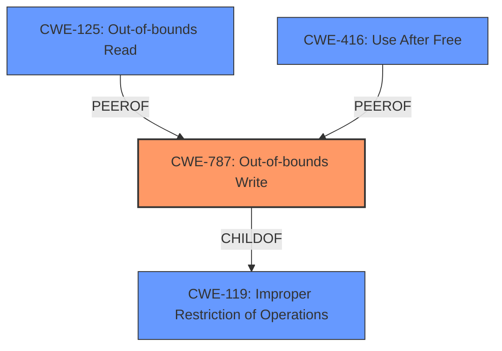

# Analysis Report for CVE-2021-21071

# Vulnerability Analysis Report: CVE-2021-21071

## Description


## Analysis (with Relationship Data)

# Summary
| CWE ID | CWE Name | Confidence | CWE Abstraction Level | CWE Vulnerability Mapping Label | CWE-Vulnerability Mapping Notes |
|---|---|---|---|---|---|
| CWE-787 | Out-of-bounds Write | 1.0 | Base | Allowed | Primary CWE |

## Evidence and Confidence

*   **Confidence Score:** 1.0
*   **Evidence Strength:** HIGH

## Relationship Analysis
The primary CWE selected is CWE-787 (**Out-of-bounds Write**). This CWE is a base-level weakness, indicating a specific type of vulnerability. It is a child of CWE-119 (**Improper Restriction of Operations within the Bounds of a Memory Buffer**), indicating that it's a specific instance of a more general class of buffer-related errors. While other CWEs such as CWE-125 (**Out-of-bounds Read**) and CWE-416 (**Use After Free**) were considered, CWE-787 was selected due to the vulnerability description explicitly referencing **memory corruption** due to writing past the end of the buffer which aligns perfectly with the definition of CWE-787.



## Vulnerability Chain
The vulnerability chain begins with a malicious file being opened by a user, leading to a buffer overflow. This **buffer overflow** results in **memory corruption** (CWE-787), which allows for arbitrary code execution.

## Summary of Analysis
The primary weakness identified is CWE-787 (**Out-of-bounds Write**), due to the **memory corruption** arising from a **buffer overflow**. This aligns with the provided description, **Vulnerability Description Key Phrases**, and CVE Reference Links Content Summary, indicating that a **buffer overflow** allows writing beyond the buffer's boundaries, leading to arbitrary code execution.

The selection of CWE-787 is based on direct evidence from the vulnerability description and related information, pointing to an out-of-bounds write as the root cause of the vulnerability. The retriever results also suggest CWE-787 as the top match, further supporting this decision.

CWE-125 (**Out-of-bounds Read**) and CWE-416 (**Use After Free**) were considered, but they do not accurately represent the vulnerability because the core issue is writing outside of the allocated buffer, not reading or using freed memory.


## CWE Relationship Analysis

Current CWEs represent these abstraction levels: .


### Vulnerability Chain Analysis

**Chain starting from CWE-787:**
- 787 (Out-of-bounds Write) - ROOT


**Chain starting from CWE-119:**
- 119 (Improper Restriction of Operations within the Bounds of a Memory Buffer) - ROOT


### CWE Relationship Diagram

```mermaid
graph TD
    classDef primary fill:#f96,stroke:#333,stroke-width:2px
    classDef secondary fill:#69f,stroke:#333
    classDef tertiary fill:#9e9,stroke:#333
```


*Report generated on 2025-04-01 21:44:57*
