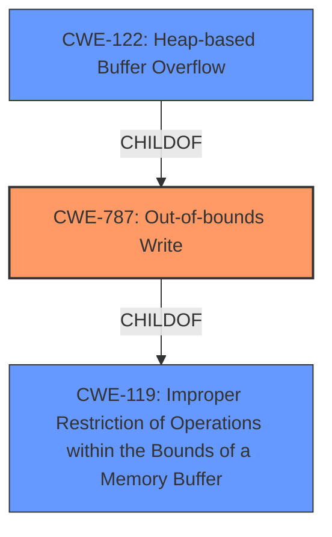

# Raw Analyzer Response for CVE-2021-21077

# Summary
| CWE ID | CWE Name | Confidence | CWE Abstraction Level | CWE Vulnerability Mapping Label | CWE-Vulnerability Mapping Notes |
|---|---|---|---|---|---|
| CWE-787 | Out-of-bounds Write | 1.0 | Base | Primary | Allowed |
| CWE-122 | Heap-based Buffer Overflow | 0.7 | Variant | Secondary | Allowed |
| CWE-119 | Improper Restriction of Operations within the Bounds of a Memory Buffer | 0.5 | Class | Secondary | Discouraged |

## Evidence and Confidence

*   **Confidence Score:** 0.9
*   **Evidence Strength:** HIGH

## Relationship Analysis
The primary CWE selected is CWE-787 (**Out-of-bounds Write**), which is a **Base** level CWE.
CWE-122 (**Heap-based Buffer Overflow**) is a **Variant** of CWE-787.
CWE-119 (**Improper Restriction of Operations within the Bounds of a Memory Buffer**) is a **Class** level CWE and a parent of CWE-787. The relationships indicate a hierarchical structure where CWE-787 is a specific type of CWE-119, and CWE-122 is a specific case of CWE-787 occurring in the heap.

## Vulnerability Chain
The vulnerability chain starts with a **Heap-based Buffer Overflow** (CWE-122), which is a specific type of **Out-of-bounds Write** (CWE-787). This leads to arbitrary code execution.

## Summary of Analysis
The initial analysis strongly points to a **Heap-based Buffer Overflow** vulnerability, as explicitly stated in the vulnerability description. The "Vulnerability Description Key Phrases" section highlights "**Heap-based Buffer Overflow**" as the **weakness**.
The "CVE Reference Links Content Summary" confirms the presence of a buffer overflow.

CWE-787 (**Out-of-bounds Write**) is selected as the primary CWE because it accurately describes the root cause of the vulnerability: writing data outside the intended buffer boundaries. It is also the primary CWE match from the "CWE for similar CVE Descriptions" section. The CWE entry is at the **Base** level of abstraction, which is preferred. The evidence supports this selection with high confidence.

CWE-122 (**Heap-based Buffer Overflow**) is considered as a secondary CWE because it specifies the location of the buffer overflow, which is in the heap. This is more specific than a general out-of-bounds write. The confidence level is slightly lower because CWE-787 already captures the core weakness. The retriever results also listed this CWE with a good match score.

CWE-119 (**Improper Restriction of Operations within the Bounds of a Memory Buffer**) was considered because it's a parent of CWE-787. However, it's a **Class** level CWE, and the description is too general. The mapping guidance discourages its use when lower-level CWEs are available.

The selection of CWE-787 is at the optimal level of specificity as it accurately captures the **root cause** of the vulnerability.
The retriever scores, vulnerability description, and hierarchical relationships all support this decision.

Relevant CWE Information:

# Enhanced Context (25 CWEs)
The following CWEs were identified as potentially relevant to this vulnerability:

## CWE-1289: Improper Validation of Unsafe Equivalence in Input
**Abstraction Level**: Base
**Similarity Score**: 0.76
**Source**: dense

**Description**:
The product receives an input value that is used as a resource identifier or other type of reference, but it does not validate or incorrectly validates that the input is equivalent to a potentially-unsafe value.

**Mapping Guidance**:
- Usage: Allowed
- Rationale: This CWE entry is at the Base level of abstraction, which is a preferred level of abstraction for mapping to the root causes of vulnerabilities.

**Why it was not selected**: The vulnerability description doesn't provide evidence of improper validation of input.

## CWE-1288: Improper Validation of Consistency within Input
**Abstraction Level**: Base
**Similarity Score**: 0.75
**Source**: dense

**Description**:
The product receives a complex input with multiple elements or fields that must be consistent with each other, but it does not validate or incorrectly validates that the input is actually consistent.

**Mapping Guidance**:
- Usage: Allowed
- Rationale: This CWE entry is at the Base level of abstraction, which is a preferred level of abstraction for mapping to the root causes of vulnerabilities.

**Why it was not selected**: The vulnerability description doesn't provide evidence of improper validation of input.

## CWE-606: Unchecked Input for Loop Condition
**Abstraction Level**: Base
**Similarity Score**: 0.73
**Source**: dense

**Description**:
The product does not properly check inputs that are used for loop conditions, potentially leading to a denial of service or other consequences because of excessive looping.

**Mapping Guidance**:
- Usage: Allowed
- Rationale: This CWE entry is at the Base level of abstraction, which is a preferred level of abstraction for mapping to the root causes of vulnerabilities.

**Why it was not selected**: There is no evidence of unchecked input for a loop condition in the description.

## CWE-191: Integer Underflow (Wrap or Wraparound)
**Abstraction Level**: Base
**Similarity Score**: 0.73
**Source**: dense

**Description**:
The product subtracts one value from another, such that the result is less than the minimum allowable integer value, which produces a value that is not equal to the correct result.

**Mapping Guidance**:
- Usage: Allowed
- Rationale: This CWE entry is at the Base level of abstraction, which is a preferred level of abstraction for mapping to the root causes of vulnerabilities.

**Why it was not selected**: The description doesn't suggest integer underflow.

## CWE-131: Incorrect Calculation of Buffer Size
**Abstraction Level**: Base
**Similarity Score**: 0.73
**Source**: dense

**Description**:
The product does not correctly calculate the size to be used when allocating a buffer, which could lead to a buffer overflow.

**Mapping Guidance**:
- Usage: Allowed
- Rationale: This CWE entry is at the Base level of abstraction, which is a preferred level of abstraction for mapping to the root causes of vulnerabilities.

**Why it was not selected**: Although incorrect buffer calculation *could* lead to a buffer overflow, the description does not suggest this.

## CWE-681: Incorrect Conversion between Numeric Types
**Abstraction Level**: Base
**Similarity Score**: 0.73
**Source**: dense

**Description**:
When converting from one data type to another, such as long to integer, data can be omitted or translated in a way that produces unexpected values. If the resulting values are used in a sensitive context, then dangerous behaviors may occur.

**Mapping Guidance**:
- Usage: Allowed
- Rationale: This CWE entry is at the Base level of abstraction, which is a preferred level of abstraction for mapping to the root causes of vulnerabilities.

**Why it was not selected**: The description doesn't suggest incorrect conversion between numeric types.

## CWE-197: Numeric Truncation Error
**Abstraction Level**: Base
**Similarity Score**: 0.72
**Source**: dense

**Description**:
Truncation errors occur when a primitive is cast to a primitive of a smaller size and data is lost in the conversion.

**Mapping Guidance**:
- Usage: Allowed
- Rationale: This CWE entry is at the Base level of abstraction, which is a preferred level of abstraction for mapping to the root causes of vulnerabilities.

**Why it was not selected**: There is no evidence of truncation errors in the description.

## CWE-125: Out-of-bounds Read
**Abstraction Level**: Base
**Similarity Score**: 0.72
**Source**: dense

**Description**:
The product reads data past the end, or before the beginning, of the intended buffer.

**Mapping Guidance**:
- Usage: Allowed
- Rationale: This CWE entry is at the Base level of abstraction, which is a preferred level of abstraction for mapping to the root causes of vulnerabilities.

**Why it was not selected**: The description specifically mentions a write, not a read.

## CWE-183: Permissive List of Allowed Inputs
**Abstraction Level**: Base
**Similarity Score**: 0.72
**Source**: dense

**Description**:
The product implements a protection