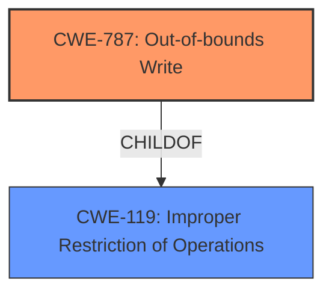

# Enhanced Analysis for CVE-2021-21082

# Summary
| CWE ID | CWE Name | Confidence | CWE Abstraction Level | CWE Vulnerability Mapping Label | CWE-Vulnerability Mapping Notes |
|---|---|---|---|---|---|
| CWE-787 | Out-of-bounds Write | 1.0 | Base | Allowed | Primary CWE: The product writes data past the end, or before the beginning, of the intended buffer. |
| CWE-119 | Improper Restriction of Operations within the Bounds of a Memory Buffer | 0.7 | Class | Discouraged | Secondary CWE: The product performs operations on a memory buffer, but it reads from or writes to a memory location outside the buffer's intended boundary. |

## Evidence and Confidence

*   **Confidence Score:** 1.0
*   **Evidence Strength:** HIGH

## Relationship Analysis
The primary CWE is CWE-787, which is a base-level CWE and a child of CWE-119. CWE-119 is a class-level CWE that is often misused when lower-level CWEs are available. The relationship between CWE-787 and CWE-119 confirms that CWE-787 is a more specific and appropriate classification for this vulnerability.



## Vulnerability Chain
The vulnerability chain starts with the parsing of a specially crafted file, leading to a buffer overflow (**Out-of-bounds Write - CWE-787**), which results in memory corruption and ultimately allows for arbitrary code execution.

## Summary of Analysis
The initial analysis correctly identified CWE-787 as the primary weakness. The evidence from the vulnerability description and CVE Reference Links Content Summary strongly supports this classification. The vulnerability involves a **Memory Corruption** due to a **Buffer Overflow** when parsing a specially crafted file. The impact is arbitrary code execution.

The selection of CWE-787 is further supported by the "CWE for similar CVE Descriptions," which lists CWE-787 as the primary CWE match. The Retriever Results also list CWE-787 as the top combined result with a score of 1.0.

The relationship analysis confirms that CWE-787 is a more specific and appropriate classification than its parent CWE-119.

The final selection of CWE-787 is based on direct evidence from the vulnerability description, supporting evidence from the CVE Reference Links Content Summary, and the relationship analysis, which confirms that CWE-787 is the most specific and appropriate classification.

Relevant CWE Information:

# Enhanced Context (25 CWEs)
The following CWEs were identified as potentially relevant to this vulnerability:

## CWE-131: Incorrect Calculation of Buffer Size
**Abstraction Level**: Base
**Similarity Score**: 0.77

**Description**:
The product does not correctly calculate the size to be used when allocating a buffer, which could lead to a buffer overflow.

## CWE-125: Out-of-bounds Read
**Abstraction Level**: Base
**Similarity Score**: 0.76

**Description**:
The product reads data past the end, or before the beginning, of the intended buffer.

## CWE-788: Access of Memory Location After End of Buffer
**Abstraction Level**: Base
**Similarity Score**: 0.76

**Description**:
The product reads or writes to a buffer using an index or pointer that references a memory location after the end of the buffer.

## CWE-129: Improper Validation of Array Index
**Abstraction Level**: Variant
**Similarity Score**: 0.75

**Description**:
The product uses untrusted input when calculating or using an array index, but the product does not validate or incorrectly validates the index to ensure the index references a valid position within the array.

## CWE-789: Memory Allocation with Excessive Size Value
**Abstraction Level**: Variant
**Similarity Score**: 0.75

**Description**:
The product allocates memory based on an untrusted, large size value, but it does not ensure that the size is within expected limits, allowing arbitrary amounts of memory to be allocated.

## CWE-1289: Improper Validation of Unsafe Equivalence in Input
**Abstraction Level**: Base
**Similarity Score**: 0.75

**Description**:
The product receives an input value that is used as a resource identifier or other type of reference, but it does not validate or incorrectly validates that the input is equivalent to a potentially-unsafe value.

## CWE-667: Improper Locking
**Abstraction Level**: Class
**Similarity Score**: 0.75

**Description**:
The product does not properly acquire or release a lock on a resource, leading to unexpected resource state changes and behaviors.

## CWE-191: Integer Underflow (Wrap or Wraparound)
**Abstraction Level**: Base
**Similarity Score**: 0.75

**Description**:
The product subtracts one value from another, such that the result is less than the minimum allowable integer value, which produces a value that is not equal to the correct result.

## CWE-193: Off-by-one Error
**Abstraction Level**: Base
**Similarity Score**: 0.75

**Description**:
A product calculates or uses an incorrect maximum or minimum value that is 1 more, or 1 less, than the correct value.

## CWE-404: Improper Resource Shutdown or Release
**Abstraction Level**: Class
**Similarity Score**: 0.75

**Description**:
The product does not release or incorrectly releases a resource before it is made available for re-use.

## CWE-190: Integer Overflow or Wraparound
**Abstraction Level**: Base
**Similarity Score**: 6740.90

**Description**:
The product performs a calculation that can
         produce an integer overflow or wraparound when the logic
         assumes that the resulting value will always be larger than
         the original value. This occurs when an integer value is
         incremented to a value that is too large to store in the
         associated representation. When this occurs, the value may
         become a very small or negative number.

## CWE-125: Out-of-bounds Read
**Abstraction Level**: Base
**Similarity Score**: 6689.91

**Description**:
The product reads data past the end, or before the beginning, of the intended buffer.

## CWE-1284: Improper Validation of Specified Quantity in Input
**Abstraction Level**: Base
**Similarity Score**: 6647.71

**Description**:
The product receives input that is expected to specify a quantity (such as size or length), but it does not validate or incorrectly validates that the quantity has the required properties.

## CWE-119: Improper Restriction of Operations within the Bounds of a Memory Buffer
**Abstraction Level**: Class
**Similarity Score**: 6590.47

**Description**:
The product performs operations on a memory buffer, but it reads from or writes to a memory location outside the buffer's intended boundary. This may result in read or write operations on unexpected memory locations that could be linked to other variables, data structures, or internal program data.

## CWE-787: Out-of-bounds Write
**Abstraction Level**: Base
**Similarity Score**: 6312.70

**Description**:
The product writes data past the end, or before the beginning, of the intended buffer.

## CWE-41: Improper Resolution of Path Equivalence
**Abstraction Level**: base
**Similarity Score**: 5.03

**Description**:
CWE-41: Improper Resolution of Path Equivalence

## CWE-190: Integer Overflow or Wraparound
**Abstraction Level**: base
**Similarity Score**: 4.33

**Description**:
CWE-190: Integer Overflow or Wraparound

## CWE-22: Improper Limitation of a Pathname to a Restricted Directory ('Path Traversal')
**Abstraction Level**: base
**Similarity Score**: 4.33

**Description**:
CWE-22: Improper Limitation of a Pathname to a Restricted Directory ('Path Traversal')

## CWE-770: Allocation of Resources Without Limits or Throttling
**Abstraction Level**: base
**Similarity Score**: 4.33

**Description**:
CWE-770: Allocation of Resources Without Limits or Throttling

## CWE-73: External Control of File Name or Path
**Abstraction Level**: base
**Similarity Score**: 4.33

**Description**:
CWE-73: External Control of File Name or Path

## CWE-1284: Improper Validation of Specified Quantity in Input
**Abstraction Level**: base
**Similarity Score**: 4.33

**Description**:
CWE-1284: Improper Validation of Specified Quantity in Input

## CWE-476: NULL Pointer Dereference
**Abstraction Level**: base
**Similarity Score**: 4.3


## CWE Relationship Analysis

Current CWEs represent these abstraction levels: .


### Vulnerability Chain Analysis

**Chain starting from CWE-787:**
- 787 (Out-of-bounds Write) - ROOT


**Chain starting from CWE-404:**
- 404 (Improper Resource Shutdown or Release) - ROOT


### CWE Relationship Diagram

```mermaid
graph TD
    classDef primary fill:#f96,stroke:#333,stroke-width:2px
    classDef secondary fill:#69f,stroke:#333
    classDef tertiary fill:#9e9,stroke:#333
```