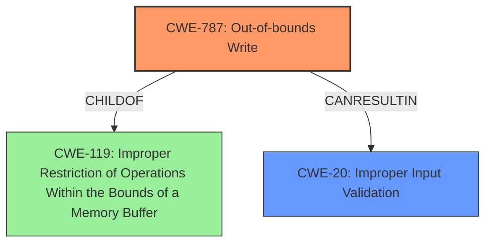

# Analysis Report for CVE-2021-21093

# Vulnerability Analysis Report: CVE-2021-21093

## Description


## Analysis (with Relationship Data)

# Summary
| CWE ID | CWE Name | Confidence | CWE Abstraction Level | CWE Vulnerability Mapping Label | CWE-Vulnerability Mapping Notes |
|---|---|---|---|---|---|
| CWE-787 | Out-of-bounds Write | 1.0 | Base | Allowed | Primary CWE |
| CWE-20 | Improper Input Validation | 0.6 | Class | Discouraged | Secondary CWE |

## Evidence and Confidence

*   **Confidence Score:** 0.8
*   **Evidence Strength:** HIGH

## Relationship Analysis
The primary relationship that influenced my decision was the parent-child relationship between CWE-787 (Out-of-bounds Write) and CWE-119 (Improper Restriction of Operations Within the Bounds of a Memory Buffer). CWE-787 is a more specific case of CWE-119, and since the vulnerability description clearly indicates a write occurring outside the intended buffer, CWE-787 is the more appropriate choice.

CWE-20 (Improper Input Validation) was also considered due to the "Lack of Input Validation" identified in the CVE Reference Links Content Summary, which can lead to the memory corruption.



## Vulnerability Chain
The vulnerability chain starts with a **Lack of Input Validation**, which allows a specially crafted file to be parsed. This leads to **Memory Corruption** due to an **Out-of-bounds Write (CWE-787)**, ultimately resulting in **arbitrary code execution**.

## Summary of Analysis
The initial analysis strongly pointed towards CWE-787 (Out-of-bounds Write) due to the explicit mention of "**memory corruption**" in the vulnerability description and the "lack of proper validation of user-supplied data" from the CVE Reference Links Content Summary. The primary CWE match in the "CWE for similar CVE Descriptions" section was also CWE-787, further solidifying this choice. The retriever results also listed CWE-787 as the top combined result with a score of 1.0.

While other CWEs like CWE-125 (Out-of-bounds Read) and CWE-416 (Use After Free) were present in the "Top CWEs" and "Retriever Results", the description specifically mentioned "writing" past the end of the buffer, making CWE-787 the most accurate fit.

I considered the MITRE mapping guidance for CWE-787, which states that it is at the Base level of abstraction and its usage is "Allowed." The guidance also mentions that "Memory Corruption" is often used to describe the consequences of writing to memory outside the bounds of a buffer, further supporting my selection.

The evidence supporting CWE-787 includes:
*   "Adobe Bridge versions 10.1.1 (and earlier) and 11.0.1 (and earlier) are affected by a **memory corruption** vulnerability when parsing a specially crafted file."
*   "The vulnerability stems from a memory corruption issue within the processing of SGI files in Adobe Bridge. This is caused by a lack of proper validation of user-supplied data."

CWE-20 was considered because the root cause includes "lack of proper validation of user-supplied data". Although this is a possible root cause, it is less specific than CWE-787, which describes the direct result of the missing validation. Also, the MITRE guidance says that CWE-20 is commonly misused in low-information vulnerability reports when lower-level CWEs could be used instead.

Therefore, CWE-787 is the optimal choice as it accurately represents the **root cause** of the vulnerability with a high level of specificity and is supported by strong evidence from the vulnerability description and related information.

Relevant CWE Information:

# Enhanced Context (25 CWEs)
The following CWEs were identified as potentially relevant to this vulnerability:

## CWE-191: Integer Underflow (Wrap or Wraparound)
**Abstraction Level**: Base
**Similarity Score**: 0.78
**Source**: dense

**Description**:
The product subtracts one value from another, such that the result is less than the minimum allowable integer value, which produces a value that is not equal to the correct result.

**Mapping Guidance**:
- Usage: Allowed
- Rationale: This CWE entry is at the Base level of abstraction, which is a preferred level of abstraction for mapping to the root causes of vulnerabilities.


## CWE-197: Numeric Truncation Error
**Abstraction Level**: Base
**Similarity Score**: 0.77
**Source**: dense

**Description**:
Truncation errors occur when a primitive is cast to a primitive of a smaller size and data is lost in the conversion.

**Mapping Guidance**:
- Usage: Allowed
- Rationale: This CWE entry is at the Base level of abstraction, which is a preferred level of abstraction for mapping to the root causes of vulnerabilities.


## CWE-681: Incorrect Conversion between Numeric Types
**Abstraction Level**: Base
**Similarity Score**: 0.77
**Source**: dense

**Description**:
When converting from one data type to another, such as long to integer, data can be omitted or translated in a way that produces unexpected values. If the resulting values are used in a sensitive context, then dangerous behaviors may occur.

**Mapping Guidance**:
- Usage: Allowed
- Rationale: This CWE entry is at the Base level of abstraction, which is a preferred level of abstraction for mapping to the root causes of vulnerabilities.


## CWE-190: Integer Overflow or Wraparound
**Abstraction Level**: Base
**Similarity Score**: 0.76
**Source**: dense

**Description**:
The product performs a calculation that can
         produce an integer overflow or wraparound when the logic
         assumes that the resulting value will always be larger than
         the original value. This occurs when an integer value is
         incremented to a value that is too large to store in the
         associated representation. When this occurs, the value may
         become a very small or negative number.

**Mapping Guidance**:
- Usage: Allowed
- Rationale: This CWE entry is at the Base level of abstraction, which is a preferred level of abstraction for mapping to the root causes of vulnerabilities.


## CWE-680: Integer Overflow to Buffer Overflow
**Abstraction Level**: Compound
**Similarity Score**: 0.75
**Source**: dense

**Description**:
The product performs a calculation to determine how much memory to allocate, but an integer overflow can occur that causes less memory to be allocated than expected, leading to a buffer overflow.

**Mapping Guidance**:
- Usage: Discouraged
- Rationale: This CWE entry is a named chain, which combines multiple weaknesses.


## CWE-131: Incorrect Calculation of Buffer Size
**Abstraction Level**: Base
**Similarity Score**: 0.75
**Source**: dense

**Description**:
The product does not correctly calculate the size to be used when allocating a buffer, which could lead to a buffer overflow.

**Mapping Guidance**:
- Usage: Allowed
- Rationale: This CWE entry is at the Base level of abstraction, which is a preferred level of abstraction for mapping to the root causes of vulnerabilities.


## CWE-125: Out-of-bounds Read
**Abstraction Level**: Base
**Similarity Score**: 0.75
**Source**: dense

**Description**:
The product reads data past the end, or before the beginning, of the intended buffer.

**Mapping Guidance**:
- Usage: Allowed
- Rationale: This CWE entry is at the Base level of abstraction, which is a preferred level of abstraction for mapping to the root causes of vulnerabilities.


## CWE-789: Memory Allocation with Excessive Size Value
**Abstraction Level**: Variant
**Similarity Score**: 0.75
**Source**: dense

**Description**:
The product allocates memory based on an untrusted, large size value, but it does not ensure that the size is within expected limits, allowing arbitrary amounts of memory to be allocated.

**Mapping Guidance**:
- Usage: Allowed
- Rationale: This CWE entry is at the Variant level of abstraction, which is a preferred level of abstraction for mapping to the root causes of vulnerabilities.


## CWE-1325: Improperly Controlled Sequential Memory Allocation
**Abstraction Level**: Base
**Similarity Score**: 0.74
**Source**: dense

**Description**:
The product manages a group of objects or resources and performs a separate memory allocation for each object, but it does not properly limit the total amount of memory that is consumed by all of the combined objects.

**Mapping Guidance**:
- Usage: Allowed
- Rationale: This CWE entry


## CWE Relationship Analysis

Current CWEs represent these abstraction levels: .


### Vulnerability Chain Analysis

**Chain starting from CWE-787:**
- 787 (Out-of-bounds Write) - ROOT


**Chain starting from CWE-680:**
- 680 (Integer Overflow to Buffer Overflow) - ROOT


### CWE Relationship Diagram

```mermaid
graph TD
    classDef primary fill:#f96,stroke:#333,stroke-width:2px
    classDef secondary fill:#69f,stroke:#333
    classDef tertiary fill:#9e9,stroke:#333
```


*Report generated on 2025-04-01 20:26:50*
