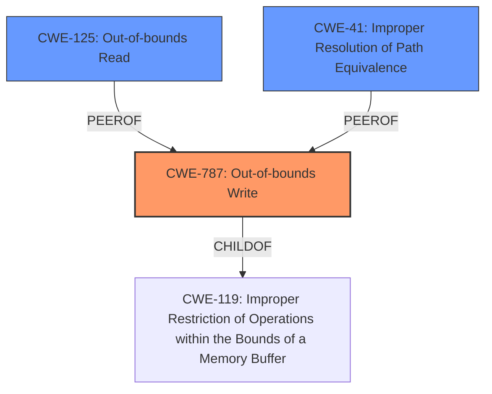

# Raw Analyzer Response for CVE-2021-21105

# Summary
| CWE ID  | CWE Name                      | Confidence | CWE Abstraction Level | CWE Vulnerability Mapping Label | CWE-Vulnerability Mapping Notes |
|---------|-------------------------------|------------|-----------------------|---------------------------------|-----------------------------------|
| CWE-787 | Out-of-bounds Write           | 1.0        | Base                  | Primary                         | Allowed                           |
| CWE-125 | Out-of-bounds Read            | 0.7        | Base                  | Secondary                       | Allowed                           |
| CWE-41  | Improper Resolution of Path Equivalence | 0.6        | Base                  | Secondary                       | Allowed                           |

## Evidence and Confidence

*   **Confidence Score:** 0.9
*   **Evidence Strength:** HIGH

## Relationship Analysis
The primary relationship influencing the selection is that CWE-787 **Out-of-bounds Write** is a base CWE, which is a child of CWE-119 **Improper Restriction of Operations within the Bounds of a Memory Buffer**. The vulnerability involves writing data past the end of a buffer, leading to memory corruption. Other relationships considered included the possibility of an out-of-bounds read (CWE-125) or path equivalence issues (CWE-41) due to the file parsing nature of the vulnerability.

## Vulnerability Chain
The vulnerability chain starts with parsing a specially crafted file, leading to **memory corruption** due to an out-of-bounds write, which can result in remote code execution.
  - Crafted File --> **Memory Corruption** (CWE-787) --> Remote Code Execution

## Summary of Analysis
The initial analysis pointed to **CWE-787 (Out-of-bounds Write)** as the primary weakness, supported by the description indicating **memory corruption** when parsing a specially crafted file. The CVE reference link content summary also highlights a **"Memory Corruption"** issue. The retriever results ranked CWE-787 as the top candidate. This assessment is based on the provided evidence, which strongly suggests that writing beyond buffer boundaries is the root cause.

The relationships in the graph influenced the final selection by confirming the hierarchical structure (CWE-787 being a child of CWE-119) and considering peer relationships like CWE-125 and CWE-41, which might also be relevant given the nature of file parsing and potential read/write operations.

The selected CWEs are at the optimal level of specificity because CWE-787 directly describes the **out-of-bounds write** condition leading to memory corruption, which aligns with the vulnerability description. While higher-level CWEs like CWE-119 could be considered, CWE-787 provides a more precise characterization of the weakness.

Relevant CWE Information:

# Enhanced Context (25 CWEs)
The following CWEs were identified as potentially relevant to this vulnerability:

## Vulnerability Description
Adobe Illustrator version 25.2 (and earlier) is affected by a **memory corruption** vulnerability when parsing a specially crafted file. An unauthenticated attacker could leverage this vulnerability to achieve remote code execution in the context of the current user. Exploitation of this issue requires user interaction in that a victim must open a malicious file.

### Vulnerability Description Key Phrases
- **weakness:** **memory corruption**
- **impact:** remote code execution
- **vector:** specially crafted file
- **attacker:** unauthenticated attacker
- **product:** Adobe Illustrator
- **version:** 25.2 (and earlier)

### CWE for similar CVE Descriptions
### Primary CWE Match
CWE-787

#### Top CWEs
- CWE-787 (Count: 113)
- CWE-125 (Count: 102)
- CWE-476 (Count: 24)

## CVE Reference Links Content Summary
The provided content is related to CVE-2021-21105.

**Summary:**

This document describes a security update for Adobe Illustrator 2021 that addresses multiple critical vulnerabilities.

**Root cause of vulnerability:**

The vulnerability is categorized as a "Memory Corruption" issue.

**Weaknesses/vulnerabilities present:**

The document indicates the presence of a memory corruption vulnerability.

**Impact of exploitation:**

Successful exploitation of the vulnerability could lead to arbitrary code execution in the context of the current user.

**Attack vectors:**

The document does not specify the specific attack vectors, but it implies that the vulnerability can be exploited by opening a malicious file or performing a specific action within the application.

**Required attacker capabilities/position:**

The attacker needs to be able to get a user to open a malicious file or otherwise trigger the vulnerability through a specific action within the application.
The attacker would need to be able to execute code within the context of the logged-in user on a system running a vulnerable version of Adobe Illustrator.

**Additional details:**

The document lists multiple CVEs fixed in the same update, including an out-of-bounds write and a path traversal vulnerability. The document also mentions that this vulnerability was reported by Kushal Arvind Shah of Fortinet's FortiGuard Labs.

## Retriever Results

### Top Combined Results

| Rank | CWE ID | Name | Abstraction | Usage  | Retrievers | Individual Scores |
|------|--------|------|-------------|-------|------------|-------------------|
| 1 | 787 | Out-of-bounds Write | Base | Allowed | alternate_terms | 1.000 |
| 2 | 788 | Access of Memory Location After End of Buffer | Base | Discouraged | sparse | 0.469 |
| 3 | 457 | Use of Uninitialized Variable | Variant | Allowed | sparse | 0.399 |
| 4 | 665 | Improper Initialization | Class | Discouraged | sparse | 0.382 |
| 5 | 122 | Heap-based Buffer Overflow | Variant | Allowed | sparse | 0.372 |
| 6 | 789 | Memory Allocation with Excessive Size Value | Variant | Allowed | dense | 0.490 |
| 7 | 1284 | Improper Validation of Specified Quantity in Input | Base | Allowed | graph | 0.003 |
| 8 | 121 | Stack-based Buffer Overflow | Variant | Allowed | sparse | 0.348 |
| 9 | 20 | Improper Input Validation | Class | Discouraged | sparse | 0.346 |
| 10 | 379 | Creation of Temporary File in Directory with Insecure Permissions | Base | Allowed | sparse | 0.339 |

**CWE-787: Out-of-bounds Write**

*   **How the vulnerability's details match the CWE's characteristics:** The vulnerability description explicitly mentions **memory corruption** due to parsing a specially crafted file. The reference link confirms this as a "Memory Corruption" issue. This aligns directly with CWE-787's description: "The product writes data past the end, or before the beginning, of the intended buffer."
*   **The security implications and potential impact:** The impact is remote code execution, which is a severe consequence of memory corruption vulnerabilities.
*   **Any parent-child relationships or chain patterns that influenced your mapping:** CWE-787 is a child of CWE-119 (Improper Restriction of Operations within the Bounds of a Memory Buffer).
*   **Whether the weakness is primary or secondary in the vulnerability:** This is the primary weakness.
*   **How the official MITRE mapping guidance influenced your decision:** The MITRE mapping guidance allows the use of CWE-787 because it is a Base level of abstraction and directly relates to the **root cause** of the vulnerability.

**CWE-125: Out-of-bounds Read**

*   **How the vulnerability's details match the CWE's characteristics:** While the primary issue is writing out of bounds (CWE-787), the parsing of a specially crafted file could also involve reading data past the end of a buffer. The Top CWEs suggested CWE-125 as a possible match.
*   **The security implications and potential impact:** Out-of-bounds reads can lead to information disclosure or denial-of-service.
*   **Any parent-child relationships or chain patterns that influenced