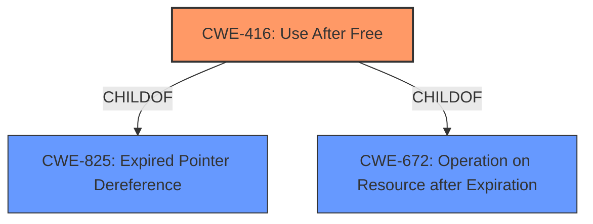

# Analysis for CVE-2021-21112

# Summary
| CWE ID | CWE Name | Confidence | CWE Abstraction Level | CWE Vulnerability Mapping Label | CWE-Vulnerability Mapping Notes |
|---|---|---|---|---|---|
| CWE-416 | Use After Free | 1.0 | Variant | Allowed | Primary CWE |

## Evidence and Confidence

*   **Confidence Score:** 1.0
*   **Evidence Strength:** HIGH

## Relationship Analysis
The primary identified CWE is CWE-416, which is a variant-level weakness. It is a child of CWE-825 (Expired Pointer Dereference) and CWE-672 (Operation on Resource after Expiration). The retriever results and the vulnerability description both strongly suggest this CWE.

## Vulnerability Chain
The vulnerability chain starts with the **Use-after-free** condition (CWE-416). This leads to potential heap corruption.

## Summary of Analysis
The vulnerability description clearly states a "**Use after free**" condition. The "Vulnerability Description Key Phrases" section confirms this as the **rootcause**. The CVE Reference Links Content Summary also explicitly mentions "**Use-after-free vulnerability**". The primary CWE match from similar CVE descriptions is CWE-416. The retriever results also list CWE-416 as the top candidate. Therefore, CWE-416 is the most appropriate CWE.

Relevant CWE Information:

# Enhanced Context (25 CWEs)
The following CWEs were identified as potentially relevant to this vulnerability:

## CWE-404: Improper Resource Shutdown or Release
**Abstraction Level**: Class
**Similarity Score**: 0.82
**Source**: dense

**Description**:
The product does not release or incorrectly releases a resource before it is made available for re-use.
**Not Used:** This is a class-level CWE, and CWE-416 provides a more specific variant.

## CWE-226: Sensitive Information in Resource Not Removed Before Reuse
**Abstraction Level**: Base
**Similarity Score**: 0.79
**Source**: dense

**Description**:
The product releases a resource such as memory or a file so that it can be made available for reuse, but it does not clear or "zeroize" the information contained in the resource before the product performs a critical state transition or makes the resource available for reuse by other entities.
**Not Used:** While resource reuse is involved, the core issue is using memory after it's freed, not necessarily exposing sensitive information.

## CWE-366: Race Condition within a Thread
**Abstraction Level**: Base
**Similarity Score**: 0.79
**Source**: dense

**Description**:
If two threads of execution use a resource simultaneously, there exists the possibility that resources may be used while invalid, in turn making the state of execution undefined.
**Not Used:** A race condition is not explicitly mentioned or strongly implied in the description.

## CWE-667: Improper Locking
**Abstraction Level**: Class
**Similarity Score**: 0.78
**Source**: dense

**Description**:
The product does not properly acquire or release a lock on a resource, leading to unexpected resource state changes and behaviors.
**Not Used:** Locking issues are not explicitly mentioned.

## CWE-362: Concurrent Execution using Shared Resource with Improper Synchronization ('Race Condition')
**Abstraction Level**: Class
**Similarity Score**: 0.76
**Source**: dense

**Description**:
The product contains a concurrent code sequence that requires temporary, exclusive access to a shared resource, but a timing window exists in which the shared resource can be modified by another code sequence operating concurrently.
**Not Used:** A race condition is not explicitly mentioned or strongly implied in the description.

## CWE-662: Improper Synchronization
**Abstraction Level**: Class
**Similarity Score**: 0.76
**Source**: dense

**Description**:
The product utilizes multiple threads or processes to allow temporary access to a shared resource that can only be exclusive to one process at a time, but it does not properly synchronize these actions, which might cause simultaneous accesses of this resource by multiple threads or processes.
**Not Used:** Synchronization issues are not explicitly mentioned.

## CWE-772: Missing Release of Resource after Effective Lifetime
**Abstraction Level**: Base
**Similarity Score**: 0.76
**Source**: dense

**Description**:
The product does not release a resource after its effective lifetime has ended, i.e., after the resource is no longer needed.
**Not Used:** The issue is not a missing release but using it *after* release.

## CWE-911: Improper Update of Reference Count
**Abstraction Level**: Base
**Similarity Score**: 0.75
**Source**: dense

**Description**:
The product uses a reference count to manage a resource, but it does not update or incorrectly updates the reference count.
**Not Used:** Reference counting is not mentioned.

## CWE-664: Improper Control of a Resource Through its Lifetime
**Abstraction Level**: Pillar
**Similarity Score**: 0.75
**Source**: dense

**Description**:
The product does not maintain or incorrectly maintains control over a resource throughout its lifetime of creation, use, and release.
**Not Used:** Too broad; CWE-416 is more specific.

## CWE-367: Time-of-check Time-of-use (TOCTOU) Race Condition
**Abstraction Level**: Base
**Similarity Score**: 0.75
**Source**: dense

**Description**:
The product checks the state of a resource before using that resource, but the resource's state can change between the check and the use in a way that invalidates the results of the check. This can cause the product to perform invalid actions when the resource is in an unexpected state.
**Not Used:** TOCTOU is not explicitly mentioned or strongly implied in the description.

## CWE-362: Concurrent Execution using Shared Resource with Improper Synchronization ('Race Condition')
**Abstraction Level**: Class
**Similarity Score**: 5535.24
**Source**: sparse

**Description**:
The product contains a concurrent code sequence that requires temporary, exclusive access to a shared resource, but a timing window exists in which the shared resource can be modified by another code sequence operating concurrently.
**Not Used:** A race condition is not explicitly mentioned or strongly implied in the description.

## CWE-415: Double Free
**Abstraction Level**: Variant
**Similarity Score**: 5521.20
**Source**: sparse

**Description**:
The product calls free() twice on the same memory address, potentially leading to modification of unexpected memory locations.
**Not Used:** Double free is a different issue than use-after-free.

## CWE-911: Improper Update of Reference Count
**Abstraction Level**: Base
**Similarity Score**: 5408.82
**Source**: sparse

**Description**:
The product uses a reference count to manage a resource, but it does not update or incorrectly updates the reference count.
**Not Used:** Reference counting is not mentioned.

## CWE-667: Improper Locking
**Abstraction Level**: Class
**Similarity Score**: 5274.47
**Source**: sparse

**Description**:
The product does not properly acquire or release a lock on a resource, leading to unexpected resource state changes and behaviors.
**Not Used:** Locking issues are not explicitly mentioned.

## CWE-367: Time-of-check Time-of-use (TOCTOU) Race Condition
**Abstraction Level**: Base
**Similarity Score**: 5256.79
**Source**: sparse

**Description**:
The product checks the state of a resource before using that resource, but the resource's state can change between the check and the use in a way that invalidates the results of the check. This can cause the product to perform invalid actions when the resource is in an unexpected state.
**Not Used:** TOCTOU is not explicitly mentioned or strongly implied in the description.

## CWE-123: Write-what-where Condition
**Abstraction Level**: base
**Similarity Score**: 5.03
**Source**: graph

**Description**:
CWE-123: Write-what-where Condition
**Not Used:** While heap corruption is a potential impact, it's not the root cause.

## CWE-120: Buffer Copy without Checking Size of Input ('Classic Buffer Overflow')
**Abstraction Level**: base
**Similarity Score**: 4.33
**Source**: graph

**Description**:
CWE-120: Buffer Copy without Checking Size of Input ('Classic Buffer Overflow')
**Not Used:** Buffer overflow is not explicitly mentioned, and the root cause