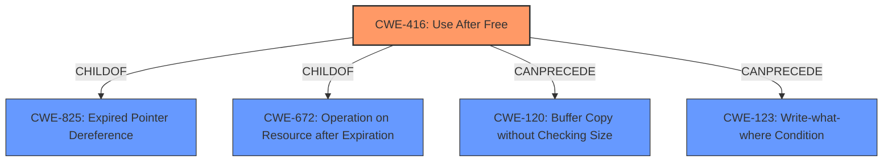

# Raw Analyzer Response for CVE-2021-21114

# Summary
| CWE ID | CWE Name | Confidence | CWE Abstraction Level | CWE Vulnerability Mapping Label | CWE-Vulnerability Mapping Notes |
|---|---|---|---|---|---|
| CWE-416 | Use After Free | 1.0 | Variant | Allowed | Primary CWE |

## Evidence and Confidence

*   **Confidence Score:** 1.0
*   **Evidence Strength:** HIGH

## Relationship Analysis
The primary relationship that influenced the selection of CWE-416 is its Variant level of abstraction, which is preferred. There are also ChildOf relationships to CWE-825 (Expired Pointer Dereference), CWE-672 (Operation on Resource after Expiration), and chain relationships such as CanPrecede -> CWE-120 (Buffer Copy without Checking Size) and CWE-123 (Write-what-where Condition). The evidence clearly indicates a **use after free** condition, making CWE-416 a direct and accurate fit.

## Vulnerability Chain
The vulnerability chain starts with a **use after free** condition, which can lead to heap corruption and potentially arbitrary code execution, denial of service, or information disclosure.
  - **Root Cause:** **Use After Free** (CWE-416)
  - **Impact:** Heap corruption, arbitrary code execution, denial of service, or information disclosure.

## Summary of Analysis
The analysis is based on the provided vulnerability description, key phrases, and CVE reference content summary. The description clearly states a "**Use after free**" vulnerability in the audio component of Google Chrome.

The vulnerability description key phrases include "**rootcause: Use after free**" and "**impact: heap corruption**". The CVE Reference Links Content Summary also explicitly mentions a "**Use-after-free vulnerability**" as the root cause.

The retriever results listed CWE-416 as the top combined result.

Given the strong evidence and the nature of the vulnerability, CWE-416 is the most appropriate and specific classification. This aligns with the MITRE mapping guidance that prefers a Variant level of abstraction when it accurately represents the weakness.

Other CWEs Considered:

*   CWE-366: Race Condition within a Thread - Considered but not selected, as the primary issue is the **use after free** and not a race condition, though race conditions can lead to use-after-free.
*   CWE-843: Access of Resource Using Incompatible Type ('Type Confusion') - Considered but not selected as there is no evidence of type confusion.
*   CWE-122: Heap-based Buffer Overflow - Considered but not selected as the root cause is use after free, which can lead to heap corruption, but is not a buffer overflow in itself.
*   CWE-415: Double Free - Considered but not selected because the vulnerability is a **use after free** not a double free.
*   CWE-911: Improper Update of Reference Count - Considered but not selected as there's no evidence of reference count issues.
*   CWE-404: Improper Resource Shutdown or Release - Considered but not selected as this is not the primary weakness, though a use after free can occur because of improper resource shutdown.
*   CWE-123: Write-what-where Condition - Considered but not selected as this is a potential impact of use after free, not the root cause.