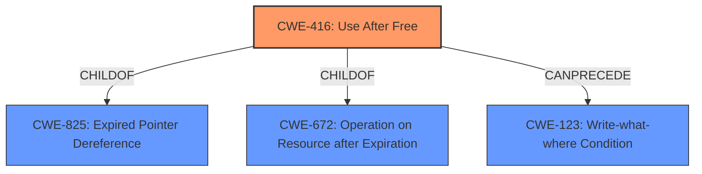

# Raw Analyzer Response for CVE-2021-21122

# Summary
| CWE ID | CWE Name | Confidence | CWE Abstraction Level | CWE Vulnerability Mapping Label | CWE-Vulnerability Mapping Notes |
|---|---|---|---|---|---|
| CWE-416 | Use After Free | 1.0 | Variant | Allowed | Primary CWE |

## Evidence and Confidence

*   **Confidence Score:** 1.0
*   **Evidence Strength:** HIGH

## Relationship Analysis
The primary CWE, CWE-416, is a Variant of both CWE-825 (Expired Pointer Dereference) and CWE-672 (Operation on Resource after Expiration). The vulnerability description explicitly mentions "Use after free," which directly aligns with the description of CWE-416. The high retriever score and the explicit mention in the CVE description solidify this classification. Other CWEs were considered but deemed less relevant as they address related but distinct weaknesses (e.g., race conditions, buffer overflows).



## Vulnerability Chain
The vulnerability chain for this description is straightforward:
1.  **Root Cause:** **Use after free** (CWE-416) occurs in the Blink component of Google Chrome.
2.  **Impact:** This **Use after free** can lead to heap corruption, potentially allowing for arbitrary code execution.

## Summary of Analysis
The analysis is strongly based on the provided evidence, specifically the **rootcause** "**Use after free**" and the corresponding summary from the CVE reference links.

> CVE Reference Links Content Summary:
> ```
> {
>   "CVE-2021-21122": {
>     "description": "Use after free in Blink.",
>     "root_cause": "Use after free",
>     "vulnerabilities": [
>       "Use after free"
>     ],
>     "impact": "Likely arbitrary code execution due to memory corruption.",
>     "attack_vectors": "Through crafted web content.",
>     "attacker_capabilities": "The attacker needs to be able to get the user to load a malicious website or have the user open a malicious file."
>   }
> }
> ```

The graph relationships confirm that CWE-416 is a specific type of resource management error, making it more appropriate than its parent classes. The selection of CWE-416 is at the optimal level of specificity, as it directly represents the weakness described in the vulnerability.

Relevant CWE Information:

# Enhanced Context (25 CWEs)

## CWE-59: Improper Link Resolution Before File Access ('Link Following')
**Abstraction Level**: Base
**Similarity Score**: 0.80
**Source**: dense

**Description**:
The product attempts to access a file based on the filename, but it does not properly prevent that filename from identifying a link or shortcut that resolves to an unintended resource.

**Mapping Guidance**:
- Usage: Allowed
- Rationale: This CWE entry is at the Base level of abstraction, which is a preferred level of abstraction for mapping to the root causes of vulnerabilities.

*   **Rationale for Not Using:** This CWE is related to improper handling of links, which is not directly relevant to the "**Use after free**" vulnerability described.

## CWE-64: Windows Shortcut Following (.LNK)
**Abstraction Level**: Variant
**Similarity Score**: 0.77
**Source**: dense

**Description**:
The product, when opening a file or directory, does not sufficiently handle when the file is a Windows shortcut (.LNK) whose target is outside of the intended control sphere. This could allow an attacker to cause the product to operate on unauthorized files.

**Mapping Guidance**:
- Usage: Allowed
- Rationale: This CWE entry is at the Variant level of abstraction, which is a preferred level of abstraction for mapping to the root causes of vulnerabilities.

*   **Rationale for Not Using:** Similar to CWE-59, this CWE is specific to Windows shortcuts and not directly related to the "**Use after free**" issue.

## CWE-61: UNIX Symbolic Link (Symlink) Following
**Abstraction Level**: Compound
**Similarity Score**: 0.76
**Source**: dense

**Description**:
The product, when opening a file or directory, does not sufficiently account for when the file is a symbolic link that resolves to a target outside of the intended control sphere. This could allow an attacker to cause the product to operate on unauthorized files.

**Mapping Guidance**:
- Usage: Allowed
- Rationale: This is a well-known Composite of multiple weaknesses that must all occur simultaneously, although it is attack-oriented in nature.

*   **Rationale for Not Using:** This CWE focuses on symbolic link handling, which is not the root cause of the described vulnerability.

## CWE-451: User Interface (UI) Misrepresentation of Critical Information
**Abstraction Level**: Class
**Similarity Score**: 0.76
**Source**: dense

**Description**:
The user interface (UI) does not properly represent critical information to the user, allowing the information - or its source - to be obscured or spoofed. This is often a component in phishing attacks.

**Mapping Guidance**:
- Usage: Allowed-with-Review
- Rationale: This CWE entry is a Class and might have Base-level children that would be more appropriate

*   **Rationale for Not Using:** This CWE relates to UI misrepresentation, which is not relevant to the memory management issue described.

## CWE-362: Concurrent Execution using Shared Resource with Improper Synchronization ('Race Condition')
**Abstraction Level**: Class
**Similarity Score**: 0.75
**Source**: dense

**Description**:
The product contains a concurrent code sequence that requires temporary, exclusive access to a shared resource, but a timing window exists in which the shared resource can be modified by another code sequence operating concurrently.

**Mapping Guidance**:
- Usage: Allowed-with-Review
- Rationale: This CWE entry is a Class and might have Base-level children that would be more appropriate

*   **Rationale for Not Using:** While race conditions can sometimes lead to **Use after free** vulnerabilities, the description doesn't explicitly mention concurrency or synchronization issues. Thus, CWE-416 is a more direct and accurate classification.

## CWE-41: Improper Resolution of Path Equivalence
**Abstraction Level**: Base
**Similarity Score**: 0.75
**Source**: dense

**Description**:
The product is vulnerable to file system contents disclosure through path equivalence. Path equivalence involves the use of special characters in file and directory names. The associated manipulations are intended to generate multiple names for the same object.

**Mapping Guidance**:
- Usage: Allowed
- Rationale: This CWE entry is at the Base level of abstraction, which is a preferred level of abstraction for mapping to the root causes of vulnerabilities.

*   **Rationale for Not Using:** This CWE focuses on path equivalence issues, which are not related to the "**Use after free**" vulnerability.

## CWE-366: Race Condition within a Thread
**Abstraction Level**: Base
**Similarity Score**: 0.75
**Source**: dense

**Description**:
If two threads of execution use a resource simultaneously, there exists the possibility that resources may be used while invalid, in turn making the state of execution undefined.

**Mapping Guidance**:
- Usage: Allowed
- Rationale: This CWE entry is at the Base level of abstraction, which is a preferred level of abstraction for mapping to the root causes of vulnerabilities.

*   **Rationale for Not Using:** Similar to CWE-362, this CWE describes a race condition, but the provided description does not indicate a concurrency issue.

## CWE-367: Time-of-check Time-of-use (TOCTOU) Race Condition
**Abstraction Level**: Base
**Similarity Score**: 0.75
**Source**: dense

**Description**:
The product checks the state of a resource before using that resource, but the resource's state can change between the check and the use in a way that invalidates the results of the check. This can cause the product to perform invalid actions when the resource is in an unexpected state.

**Mapping Guidance**:
- Usage: Allowed
- Rationale: This CWE entry is at the Base level of abstraction, which is a preferred level of abstraction for mapping to the root causes of vulnerabilities.

*   **Rationale for Not Using:** This CWE focuses on TOCTOU race conditions, which are not mentioned in the vulnerability description.

## CWE-427: Uncontrolled Search Path Element
**Abstraction Level**: Base
**Similarity Score**: