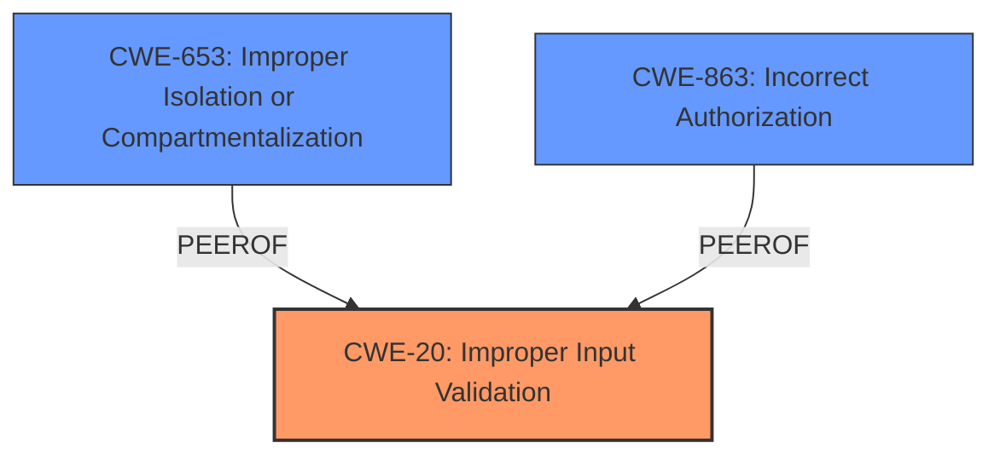

# Analysis Report for CVE-2021-21125

# Vulnerability Analysis Report: CVE-2021-21125

## Description


## Analysis (with Relationship Data)

# Summary
| CWE ID | CWE Name | Confidence | CWE Abstraction Level | CWE Vulnerability Mapping Label | CWE-Vulnerability Mapping Notes |
|---|---|---|---|---|---|
| CWE-20 | Improper Input Validation | 0.7 | Class | Primary | Allowed-with-Review |
| CWE-653 | Improper Isolation or Compartmentalization | 0.6 | Class | Secondary | Allowed |
| CWE-863 | Incorrect Authorization | 0.5 | Class | Secondary | Allowed-with-Review |

## Evidence and Confidence

*   **Confidence Score:** 0.7
*   **Evidence Strength:** MEDIUM

## Relationship Analysis
The primary relationship considered was that CWE-20 is a high-level class that often manifests as more specific weaknesses. The retriever results also indicate potential relationships with other CWEs like CWE-653 and CWE-863. The decision favored CWE-20 initially due to the lack of specific details in the description, but also acknowledged the potential for more specific mappings.



## Vulnerability Chain
The vulnerability chain starts with the **insufficient policy enforcement** in the File System API, leading to the ability to bypass filesystem restrictions. The exact mechanism is not detailed, but the chain is as follows:

1.  **Insufficient Policy Enforcement** (Root Cause)
2.  Bypass of Filesystem Restrictions (Impact)

## Summary of Analysis
The initial analysis focused on the **insufficient policy enforcement** aspect of the vulnerability. The provided evidence strongly points to a failure in validating or enforcing the intended security policies within the File System API.

The analysis considered the following factors:

*   **Vulnerability Description:** The description clearly states "**Insufficient policy enforcement** in File System API...allowed a remote attacker to bypass filesystem restrictions..."
*   **CVE Reference Links Content Summary:** This section reinforces the root cause, stating "**Root cause of vulnerability**: Insufficient policy enforcement in File System API."
*   **Retriever Results:** The retriever results suggested CWEs such as "Improper Restriction of Rendered UI Layers or Frames", "Incorrect Authorization", and "Access of Resource Using Incompatible Type ('Type Confusion')". While these could potentially be related, they don't directly address the core issue of **insufficient policy enforcement**.

Based on this analysis, CWE-20 was selected as the primary CWE. This choice is justified because the vulnerability stems from a failure to properly validate or enforce the intended policies, which falls under the umbrella of improper input validation.

CWE-653 and CWE-863 are considered as secondary candidates because they represent potential more specific weaknesses related to policy enforcement, such as improper isolation or incorrect authorization checks.

The selection of CWE-20 is at a higher level of abstraction (Class) due to the limited details available in the vulnerability description. If more specific information were available, a more detailed CWE (Base or Variant) could be selected.

Relevant CWE Information:

# Enhanced Context (25 CWEs)

## CWE-843: Access of Resource Using Incompatible Type ('Type Confusion')
**Abstraction Level**: Base
**Similarity Score**: 0.80
**Source**: dense

**Description**:
The product allocates or initializes a resource such as a pointer, object, or variable using one type, but it later accesses that resource using a type that is incompatible with the original type.

**Mapping Guidance**:
- Usage: Allowed
- Rationale: This CWE entry is at the Base level of abstraction, which is a preferred level of abstraction for mapping to the root causes of vulnerabilities.

*   **Why Not Used:** While type confusion could potentially play a role, the provided information focuses on policy enforcement rather than type-related issues.

## CWE-1289: Improper Validation of Unsafe Equivalence in Input
**Abstraction Level**: Base
**Similarity Score**: 0.79
**Source**: dense

**Description**:
The product receives an input value that is used as a resource identifier or other type of reference, but it does not validate or incorrectly validates that the input is equivalent to a potentially-unsafe value.

**Mapping Guidance**:
- Usage: Allowed
- Rationale: This CWE entry is at the Base level of abstraction, which is a preferred level of abstraction for mapping to the root causes of vulnerabilities.

*   **Why Not Used:** This CWE is more specific to resource identifiers, which is not directly mentioned in the provided description.

## CWE-451: User Interface (UI) Misrepresentation of Critical Information
**Abstraction Level**: Class
**Similarity Score**: 0.78
**Source**: dense

**Description**:
The user interface (UI) does not properly represent critical information to the user, allowing the information - or its source - to be obscured or spoofed. This is often a component in phishing attacks.

**Mapping Guidance**:
- Usage: Allowed-with-Review
- Rationale: This CWE entry is a Class and might have Base-level children that would be more appropriate

*   **Why Not Used:** This CWE relates to UI misrepresentation, which is not relevant to the described vulnerability.

## CWE-404: Improper Resource Shutdown or Release
**Abstraction Level**: Class
**Similarity Score**: 0.78
**Source**: dense

**Description**:
The product does not release or incorrectly releases a resource before it is made available for re-use.

**Mapping Guidance**:
- Usage: Allowed-with-Review
- Rationale: This CWE entry is a Class and might have Base-level children that would be more appropriate

*   **Why Not Used:** This CWE is not related to the core issue of insufficient policy enforcement.

## CWE-41: Improper Resolution of Path Equivalence
**Abstraction Level**: Base
**Similarity Score**: 0.77
**Source**: dense

**Description**:
The product is vulnerable to file system contents disclosure through path equivalence. Path equivalence involves the use of special characters in file and directory names. The associated manipulations are intended to generate multiple names for the same object.

**Mapping Guidance**:
- Usage: Allowed
- Rationale: This CWE entry is at the Base level of abstraction, which is a preferred level of abstraction for mapping to the root causes of vulnerabilities.

*   **Why Not Used:** While this could be a specific type of bypass, it is not the primary weakness described.

## CWE-754: Improper Check for Unusual or Exceptional Conditions
**Abstraction Level**: Class
**Similarity Score**: 0.77
**Source**: dense

**Description**:
The product does not check or incorrectly checks for unusual or exceptional conditions that are not expected to occur frequently during day to day operation of the product.

**Mapping Guidance**:
- Usage: Allowed-with-Review
- Rationale: This CWE entry is a Class and might have Base-level children that would be more appropriate

*   **Why Not Used:** This CWE is too general and doesn't directly address the policy enforcement issue.

## CWE-653: Improper Isolation or Compartmentalization
**Abstraction Level**: Class
**Similarity Score**: 0.77
**Source**: dense

**Description**:
The product does not properly compartmentalize or isolate functionality, processes, or resources that require different privilege levels, rights, or permissions.

**Mapping Guidance**:
- Usage: Allowed
- Rationale: This CWE entry is at the Base level of abstraction, which is a preferred level of abstraction for mapping to the root causes of vulnerabilities.

*   **Why Considered:** The File System API's policy enforcement might involve isolation/compartmentalization. This could be a contributing factor, making it a secondary candidate.

## CWE-226: Sensitive Information in Resource Not Removed Before Reuse
**Abstraction Level**: Base
**Similarity Score**: 0.76
**Source**: dense

**Description**:
The product releases a resource such as memory or a file so that it can be made available for reuse, but it does not clear or "zeroize" the information contained in the resource before the product performs a critical state transition or makes the resource available for reuse by other entities.

**Mapping Guidance**:
- Usage: Allowed
- Rationale: This CWE entry is at the Base level of abstraction, which is a preferred level of abstraction for mapping to the root causes of vulnerabilities.

*   **Why Not Used:** This CWE is not related to the core issue of insufficient policy enforcement.

## CWE-703: Improper Check or Handling of Exceptional Conditions
**Abstraction Level**: Pillar
**Similarity Score**: 0.76
**Source**: dense

**Description**:
The product does not properly anticipate or handle exceptional conditions that rarely occur during normal operation of the product.

**Mapping Guidance**:
- Usage: Discouraged
- Rationale: This CWE entry is extremely high-level, a Pillar.

*   **Why Not


## CWE Relationship Analysis

Current CWEs represent these abstraction levels: .


### Vulnerability Chain Analysis

**Chain starting from CWE-754:**
- 754 (Improper Check for Unusual or Exceptional Conditions) - ROOT


**Chain starting from CWE-843:**
- 843 (Access of Resource Using Incompatible Type ('Type Confusion')) - ROOT


### CWE Relationship Diagram

```mermaid
graph TD
    classDef primary fill:#f96,stroke:#333,stroke-width:2px
    classDef secondary fill:#69f,stroke:#333
    classDef tertiary fill:#9e9,stroke:#333
```


*Report generated on 2025-04-01 23:58:51*
