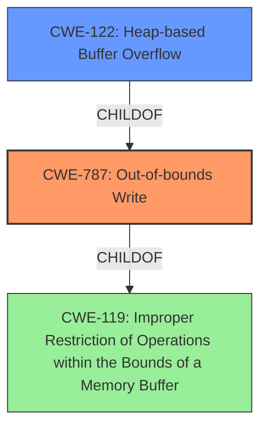

# Analysis Report for CVE-2021-21128

# Vulnerability Analysis Report: CVE-2021-21128

## Description


## Analysis (with Relationship Data)

# Summary
| CWE ID | CWE Name | Confidence | CWE Abstraction Level | CWE Vulnerability Mapping Label | CWE-Vulnerability Mapping Notes |
|---|---|---|---|---|---|
| CWE-787 | Out-of-bounds Write | 1.0 | Base | Allowed | Primary CWE |
| CWE-122 | Heap-based Buffer Overflow | 0.7 | Variant | Allowed | Secondary Candidate |
| CWE-119 | Improper Restriction of Operations within the Bounds of a Memory Buffer | 0.5 | Class | Discouraged | Secondary Candidate |

## Evidence and Confidence

*   **Confidence Score:** 0.9
*   **Evidence Strength:** HIGH

## Relationship Analysis
The primary CWE is CWE-787 **Out-of-bounds Write**, which is a base-level CWE. CWE-787 is a child of CWE-119 **Improper Restriction of Operations within the Bounds of a Memory Buffer**. CWE-122 **Heap-based Buffer Overflow** is a variant of CWE-787, providing more specific information that the overflow occurs in the heap. The hierarchical relationship between these CWEs helps in choosing the most specific and appropriate CWE. CWE-120 **Buffer Copy without Checking Size of Input ('Classic Buffer Overflow')** could also be a possible CWE, but the description specifically mentions a heap buffer overflow, making CWE-122 and CWE-787 more suitable.



## Vulnerability Chain
The vulnerability chain involves a **heap buffer overflow** due to a **missing** or **improper** bounds check when writing data to a heap-allocated buffer, potentially leading to heap corruption.
  - Root Cause: **Heap buffer overflow** (CWE-787)
  - Impact: Heap corruption

## Summary of Analysis
The initial assessment identified CWE-787 **Out-of-bounds Write** as the primary candidate, supported by the vulnerability description explicitly mentioning a **heap buffer overflow** and the "CWE for similar CVE Descriptions" section. The retriever results also listed CWE-119 **Improper Restriction of Operations within the Bounds of a Memory Buffer**, CWE-190 **Integer Overflow or Wraparound**, and CWE-122 **Heap-based Buffer Overflow**.

The final decision was to select CWE-787 **Out-of-bounds Write** as the primary CWE, as it directly reflects the **heap buffer overflow**. CWE-122 **Heap-based Buffer Overflow** was also considered as a secondary candidate to provide more specific information about the location of the overflow. CWE-119 **Improper Restriction of Operations within the Bounds of a Memory Buffer** is a more general class, and while related, CWE-787 provides a more accurate representation of the **weakness**.

The selection is based on the provided evidence, including the vulnerability description, key phrases, and CVE reference links content summary:

"**Heap buffer overflow** in Blink in Google Chrome prior to 88.0.4324.96 allowed a remote attacker to potentially exploit heap corruption via a crafted HTML page."

"Heap buffer overflow in Blink."

The graph relationships influenced the selection by highlighting the hierarchical connections between CWEs, ensuring that the chosen CWE is the most specific and relevant to the vulnerability. CWE-787 is at the optimal level of specificity, as it directly describes the **out-of-bounds write** condition, while CWE-122 provides additional context about the heap location.

Relevant CWE Information:

# Enhanced Context (25 CWEs)
The following CWEs were identified as potentially relevant to this vulnerability:

## CWE-787: Out-of-bounds Write
**Abstraction Level**: Base
**Similarity Score**: 4.33
**Source**: graph

**Description**:
CWE-787: Out-of-bounds Write

**Mapping Guidance**:
- Usage: Allowed
- Rationale: This CWE entry is at the Base level of abstraction, which is a preferred level of abstraction for mapping to the root causes of vulnerabilities.

**Relationships**:
- CANFOLLOW -> CWE-825
- CANFOLLOW -> CWE-824
- CANFOLLOW -> CWE-823
- CANFOLLOW -> CWE-822
- PARENTOF -> CWE-124

**Technical Explanation:**

CWE-787 **Out-of-bounds Write** describes a condition where the software writes data beyond the intended boundaries of a buffer. This can lead to memory corruption, potentially overwriting critical data or executable code. The vulnerability's description explicitly states a "**Heap buffer overflow**", which directly aligns with this CWE.

**Security Implications:**

An **out-of-bounds write** can have severe security implications, including arbitrary code execution, denial of service, and information disclosure. In this case, the vulnerability can be exploited by a remote attacker through a crafted HTML page, potentially leading to heap corruption.

**Parent-Child Relationships:**

CWE-787 is a child of CWE-119 **Improper Restriction of Operations within the Bounds of a Memory Buffer**, indicating that it is a specific type of memory buffer access violation.

**MITRE Mapping Guidance:**

The MITRE mapping guidance for CWE-787 states that its usage is "Allowed" and that it is at the Base level of abstraction, which is a preferred level for mapping root causes.

**Why Other CWEs Were Not Used:**

CWE-119 **Improper Restriction of Operations within the Bounds of a Memory Buffer**: While related, this is a more general class. CWE-787 provides a more accurate and specific description of the **out-of-bounds write** condition. The mapping guidance discourages using CWE-119 when more specific CWEs are available.
CWE-120 **Buffer Copy without Checking Size of Input ('Classic Buffer Overflow')**: This CWE is specific to buffer copy operations where the size of the input is not checked. The vulnerability description doesn't provide enough information to determine if a buffer copy operation is involved.
CWE-416 **Use After Free**: This CWE describes a different type of vulnerability where memory is accessed after it has been freed. This does not align with the **heap buffer overflow** described in the vulnerability.
CWE-122 **Heap-based Buffer Overflow**: This is a variant of CWE-787, providing more specific information that the overflow occurs in the heap. Since the provided text is explicit, it is a good secondary match.


## CWE Relationship Analysis

Current CWEs represent these abstraction levels: .


### Vulnerability Chain Analysis

**Chain starting from CWE-823:**
- 823 (Use of Out-of-range Pointer Offset) - ROOT


**Chain starting from CWE-787:**
- 787 (Out-of-bounds Write) - ROOT


### CWE Relationship Diagram

```mermaid
graph TD
    classDef primary fill:#f96,stroke:#333,stroke-width:2px
    classDef secondary fill:#69f,stroke:#333
    classDef tertiary fill:#9e9,stroke:#333
```


*Report generated on 2025-04-01 18:49:43*
