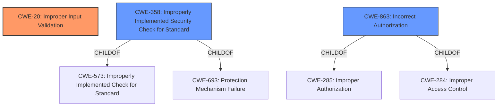

# Raw Analyzer Response for CVE-2021-21129

# Summary
| CWE ID | CWE Name | Confidence | CWE Abstraction Level | CWE Vulnerability Mapping Label | CWE-Vulnerability Mapping Notes |
|---|---|---|---|---|---|
| CWE-20 | Improper Input Validation | 0.75 | Class | Primary | Allowed-with-Review |
| CWE-358 | Improperly Implemented Security Check for Standard | 0.5 | Base | Secondary | Allowed |
| CWE-863 | Incorrect Authorization | 0.4 | Class | Secondary | Allowed-with-Review |

## Evidence and Confidence

*   **Confidence Score:** 0.7
*   **Evidence Strength:** MEDIUM

## Relationship Analysis
The primary CWE identified is CWE-20, **Improper Input Validation**. This is a high-level class. CWE-358, **Improperly Implemented Security Check for Standard**, and CWE-863, **Incorrect Authorization** are possible related CWEs, but the evidence is insufficient to confirm them.

## Vulnerability Chain
The chain starts with **insufficient policy enforcement** (root cause), leading to a bypass of filesystem restrictions (impact). The specific mechanism of **insufficient policy enforcement** is not detailed enough in the description.

## Summary of Analysis
The vulnerability description indicates **insufficient policy enforcement** within the File System API of Google Chrome, leading to a bypass of filesystem restrictions via a crafted HTML page.

The primary challenge is the lack of specificity in the vulnerability description. The key phrase "**Insufficient policy enforcement**" suggests a failure in validating or enforcing security policies, but the exact nature of the failure is unclear. This makes it difficult to pinpoint a precise CWE.

Given the limited information, CWE-20, **Improper Input Validation**, is the most appropriate primary CWE. While broad, it captures the essence of the vulnerability: the system is not adequately validating input or requests, leading to a security breach. The "**Insufficient policy enforcement**" implicitly means that the system is not validating inputs against the expected policies.

CWE-358, **Improperly Implemented Security Check for Standard**, is a possible secondary CWE because the File System API likely has security checks defined by standards. However, there is no direct evidence that a specific standard was improperly implemented.

CWE-863, **Incorrect Authorization**, could also be considered if the **insufficient policy enforcement** is related to authorization controls. However, the description does not explicitly mention authorization.

The final decision is based on the available evidence, favoring a broader classification (CWE-20) due to the lack of specific details. The confidence level is moderate (0.7) due to the limited information.

Other CWEs Considered and Rejected:

*   CWE-NVD-noinfo: This is a placeholder when no information is available. The vulnerability description provides some information, making this inappropriate.
*   CWE-NVD-Other: Similar to CWE-NVD-noinfo, this is too generic.
*   CWE-64, Windows Shortcut Following (.LNK): This CWE is specific to Windows shortcuts, which is not mentioned in the vulnerability description.
*   CWE-451, User Interface (UI) Misrepresentation of Critical Information: This CWE relates to misrepresentation in the UI, which is not applicable here.
*   CWE-156, Improper Neutralization of Whitespace: This CWE is about whitespace handling, which is irrelevant to the vulnerability.
*   CWE-416, Use After Free: This CWE describes memory management issues, which are not mentioned in the vulnerability description.
*   CWE-356, Product UI does not Warn User of Unsafe Actions: This CWE is about user interface warnings, which is not applicable here.
*   CWE-123, Write-what-where Condition: This CWE refers to an arbitrary write condition, which is not directly implied by the vulnerability description.
*   CWE-843, Access of Resource Using Incompatible Type ('Type Confusion'): This CWE relates to type confusion, which is not mentioned in the vulnerability description.
*   CWE-696, Incorrect Behavior Order: This CWE is about the order of operations, which is not evident in the vulnerability description.