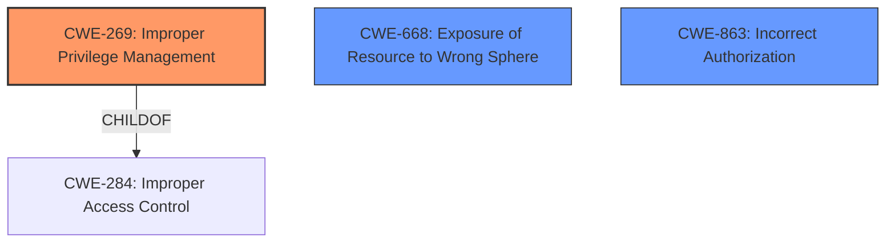

# Analysis for CVE-2021-21130

# Summary
| CWE ID | CWE Name | Confidence | CWE Abstraction Level | CWE Vulnerability Mapping Label | CWE-Vulnerability Mapping Notes |
|---|---|---|---|---|---|
| CWE-269 | Improper Privilege Management | 0.9 | Base | Primary | Allowed |
| CWE-668 | Exposure of Resource to Wrong Sphere | 0.6 | Class | Secondary | Discouraged |
| CWE-863 | Incorrect Authorization | 0.6 | Class | Secondary | Allowed-with-Review |

## Evidence and Confidence

*   **Confidence Score:** 0.8
*   **Evidence Strength:** HIGH

## Relationship Analysis
The primary relationship influencing the selection was the parent-child relationship between CWE-269 and its parent CWE-284 (Improper Access Control). While CWE-284 is broader, the description specifically points to privilege management issues, making CWE-269 a more accurate and specific representation of the vulnerability.

The Class CWE-668 and CWE-863 were also considered, but deemed less precise than CWE-269 due to the focus on privilege **management** rather than general authorization or resource exposure.

## Vulnerability Chain
The vulnerability chain starts with **insufficient policy enforcement** (root cause) leading to a bypass of filesystem restrictions (impact). The chain is:

1.  **Insufficient policy enforcement** in File System API (CWE-noinfo, refined to CWE-269)
2.  Bypass of filesystem restrictions (impact)

## Summary of Analysis
The initial analysis focused on the provided "Vulnerability Description Key Phrases" and "CVE Reference Links Content Summary". The key phrase "**Insufficient policy enforcement**" immediately suggests a problem with access control or privilege management. The content summary further solidifies this by explicitly stating "**Insufficient policy enforcement** in the File System API."

The primary CWE match suggested was CWE-NVD-noinfo. Given the available information, it's possible to provide a more specific classification.

The retriever results suggested several CWEs, including CWE-451 (User Interface (UI) Misrepresentation of Critical Information), CWE-356 (Product UI does not Warn User of Unsafe Actions) , CWE-416 (Use After Free) and CWE-863 (Incorrect Authorization). However, these don't directly address the root cause of **insufficient policy enforcement**.

CWE-269 (Improper Privilege Management) is the most appropriate because it directly addresses the **root cause** of the vulnerability: **insufficient policy enforcement** in the File System API, which is a privilege management issue. The vulnerability allows a remote attacker to bypass filesystem restrictions, indicating that the API is not properly managing the privileges required to access or modify files.

CWE-668 (Exposure of Resource to Wrong Sphere) could be considered, but it's a higher-level class and less specific than CWE-269. While the filesystem could be considered a resource exposed to the wrong sphere, the core issue is the **insufficient policy enforcement** governing access to that resource, which falls under privilege management. CWE-668 is also discouraged.

CWE-863 (Incorrect Authorization) is another potential candidate, as policy enforcement can be seen as part of the authorization process. However, the description emphasizes the **management** aspect of privileges, making CWE-269 a more precise fit.

Therefore, CWE-269 is the optimal choice because it's a base-level CWE that specifically addresses the **root cause** of the vulnerability.

Relevant CWE Information:

# Enhanced Context (25 CWEs)

## CWE-1289: Improper Validation of Unsafe Equivalence in Input
**Abstraction Level**: Base
**Similarity Score**: 0.78
**Source**: dense

**Description**:
The product receives an input value that is used as a resource identifier or other type of reference, but it does not validate or incorrectly validates that the input is equivalent to a potentially-unsafe value.

**Mapping Guidance**:
- Usage: Allowed
- Rationale: This CWE entry is at the Base level of abstraction, which is a preferred level of abstraction for mapping to the root causes of vulnerabilities.

*This CWE was not selected because the vulnerability is less about validating equivalance and more about enforcing policies.*

## CWE-653: Improper Isolation or Compartmentalization
**Abstraction Level**: Class
**Similarity Score**: 0.77
**Source**: dense

**Description**:
The product does not properly compartmentalize or isolate functionality, processes, or resources that require different privilege levels, rights, or permissions.

**Mapping Guidance**:
- Usage: Allowed
- Rationale: This CWE entry is at the Base level of abstraction, which is a preferred level of abstraction for mapping to the root causes of vulnerabilities.

*This CWE was not selected because the vulnerability is less about isolation and more about enforcing policies.*

## CWE-451: User Interface (UI) Misrepresentation of Critical Information
**Abstraction Level**: Class
**Similarity Score**: 0.76
**Source**: dense

**Description**:
The user interface (UI) does not properly represent critical information to the user, allowing the information - or its source - to be obscured or spoofed. This is often a component in phishing attacks.

**Mapping Guidance**:
- Usage: Allowed-with-Review
- Rationale: This CWE entry is a Class and might have Base-level children that would be more appropriate

*This CWE was not selected because the vulnerability is not about UI misrepresentation.*

## CWE-754: Improper Check for Unusual or Exceptional Conditions
**Abstraction Level**: Class
**Similarity Score**: 0.76
**Source**: dense

**Description**:
The product does not check or incorrectly checks for unusual or exceptional conditions that are not expected to occur frequently during day to day operation of the product.

**Mapping Guidance**:
- Usage: Allowed-with-Review
- Rationale: This CWE entry is a Class and might have Base-level children that would be more appropriate

*This CWE was not selected because the vulnerability is not about unusual or exceptional conditions.*

## CWE-404: Improper Resource Shutdown or Release
**Abstraction Level**: Class
**Similarity Score**: 0.76
**Source**: dense

**Description**:
The product does not release or incorrectly releases a resource before it is made available for re-use.

**Mapping Guidance**:
- Usage: Allowed-with-Review
- Rationale: This CWE entry is a Class and might have Base-level children that would be more appropriate

*This CWE was not selected because the vulnerability is not about resource shutdown or release.*

## CWE-184: Incomplete List of Disallowed Inputs
**Abstraction Level**: Base
**Similarity Score**: 0.76
**Source**: dense

**Description**:
The product implements a protection mechanism that relies on a list of inputs (or properties of inputs) that are not allowed by policy or otherwise require other action to neutralize before additional processing takes place, but the list is incomplete.

**Mapping Guidance**:
- Usage: Allowed
- Rationale: This CWE entry is at the Base level of abstraction, which is a preferred level of abstraction for mapping to the root causes of vulnerabilities.

*This CWE was not selected because the vulnerability is less about an incomplete list of disallowed inputs and more about the general enforcement of policies.*

## CWE-843: Access of Resource Using Incompatible Type ('Type Confusion')
**Abstraction Level**: Base
**Similarity Score**: 0.76
**Source**: dense

**Description**:
The product allocates or initializes a resource such as a pointer, object, or variable using one type, but it later accesses that resource using a type that is incompatible with the original type.

**Mapping Guidance**:
- Usage: Allowed
- Rationale: This CWE entry is at the Base level of abstraction, which is a preferred level of abstraction for mapping to the root causes of vulnerabilities.

*This CWE was not selected because the vulnerability is not about accessing a resource using incompatible type.*

## CWE-41: Improper Resolution of Path Equivalence
**Abstraction Level**: Base
**Similarity Score**: 0.76
**Source**: dense

**Description**:
The product is vulnerable to file system contents disclosure through path equivalence. Path equivalence involves the use of special characters in file and directory names. The associated manipulations are intended to generate multiple names for the same object.

**Mapping Guidance**:
- Usage: Allowed
- Rationale: This CWE entry is at the Base level of abstraction, which is a preferred level of abstraction for mapping to the root causes of vulnerabilities.

*This CWE was not selected because the vulnerability is not about