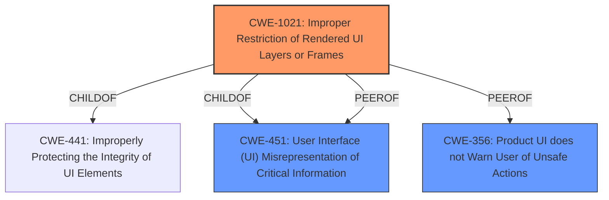

# Raw Analyzer Response for CVE-2021-21133

# Summary
| CWE ID | CWE Name | Confidence | CWE Abstraction Level | CWE Vulnerability Mapping Label | CWE-Vulnerability Mapping Notes |
|---|---|---|---|---|---|
| CWE-1021 | Improper Restriction of Rendered UI Layers or Frames | 0.8 | Base | Allowed | Primary CWE |
| CWE-451 | User Interface (UI) Misrepresentation of Critical Information | 0.6 | Class | Allowed-with-Review | Secondary Candidate |
| CWE-356 | Product UI does not Warn User of Unsafe Actions | 0.5 | Base | Allowed | Secondary Candidate |

## Evidence and Confidence

*   **Confidence Score:** 0.8
*   **Evidence Strength:** HIGH

## Relationship Analysis
The primary CWE, CWE-1021, is a child of CWE-441 (Improperly Protecting the Integrity of UI Elements) and CWE-451 (User Interface (UI) Misrepresentation of Critical Information). This parent-child relationship indicates that CWE-1021 is a more specific type of UI misrepresentation. The relationships between CWE-1021, CWE-451 and CWE-356 are siblings, which represent alternative classifications of the UI-related vulnerabilities. The base abstraction level of CWE-1021 makes it a more appropriate choice than the Class level CWE-451.

## Vulnerability Chain
The vulnerability chain starts with **insufficient policy enforcement** in the Downloads component of Google Chrome. This leads to a bypass of navigation restrictions via a crafted HTML page. The root cause is the **insufficient policy enforcement**, which is the primary weakness.

## Summary of Analysis
The initial analysis focused on identifying the root cause of the vulnerability, which is **insufficient policy enforcement** in the Downloads component of Google Chrome. This leads to bypassing navigation restrictions via a crafted HTML page. The evidence supporting this assessment is primarily derived from the "Vulnerability Description Key Phrases" and "CVE Reference Links Content Summary," which explicitly mention the **insufficient policy enforcement** as the root cause.

The Retriever results suggested several potential CWEs, including CWE-451, CWE-356 and CWE-1021.

CWE-1021 (Improper Restriction of Rendered UI Layers or Frames) was selected as the primary CWE because it aligns well with the vulnerability description, which involves bypassing navigation restrictions via a crafted HTML page. This suggests that the application is not properly restricting the rendering of UI layers or frames, allowing an attacker to trick the user into interacting with a malicious interface.

CWE-451 (User Interface (UI) Misrepresentation of Critical Information) was considered as a secondary CWE because the vulnerability involves misleading the user through a crafted HTML page. However, CWE-1021 is more specific to the improper restriction of UI layers or frames, making it a better fit for the vulnerability.

CWE-356 (Product UI does not Warn User of Unsafe Actions) was also considered, but it is less relevant to the vulnerability described, as the issue is not necessarily a lack of warning but rather the ability to bypass navigation restrictions.

The selection of CWE-1021 is based on the evidence from the vulnerability description and the relationship analysis, which indicates that it is the most specific and relevant CWE for the identified weakness. The retriever scores and MITRE mapping guidance further support this decision.

Relevant CWE Information:

# Enhanced Context (25 CWEs)

## CWE-131: Incorrect Calculation of Buffer Size
**Abstraction Level**: Base
**Similarity Score**: 0.77
**Source**: dense

**Description**:
The product does not correctly calculate the size to be used when allocating a buffer, which could lead to a buffer overflow.

**Mapping Guidance**:
- Usage: Allowed
- Rationale: This CWE entry is at the Base level of abstraction, which is a preferred level of abstraction for mapping to the root causes of vulnerabilities.

*This CWE is not applicable as the vulnerability description does not mention anything about buffer size calculations or buffer overflows.*

## CWE-404: Improper Resource Shutdown or Release
**Abstraction Level**: Class
**Similarity Score**: 0.77
**Source**: dense

**Description**:
The product does not release or incorrectly releases a resource before it is made available for re-use.

**Mapping Guidance**:
- Usage: Allowed-with-Review
- Rationale: This CWE entry is a Class and might have Base-level children that would be more appropriate

*This CWE is not applicable as the vulnerability description does not mention anything about resource shutdown or release.*

## CWE-191: Integer Underflow (Wrap or Wraparound)
**Abstraction Level**: Base
**Similarity Score**: 0.76
**Source**: dense

**Description**:
The product subtracts one value from another, such that the result is less than the minimum allowable integer value, which produces a value that is not equal to the correct result.

**Mapping Guidance**:
- Usage: Allowed
- Rationale: This CWE entry is at the Base level of abstraction, which is a preferred level of abstraction for mapping to the root causes of vulnerabilities.

*This CWE is not applicable as the vulnerability description does not mention anything about integer underflows.*

## CWE-667: Improper Locking
**Abstraction Level**: Class
**Similarity Score**: 0.76
**Source**: dense

**Description**:
The product does not properly acquire or release a lock on a resource, leading to unexpected resource state changes and behaviors.

**Mapping Guidance**:
- Usage: Allowed-with-Review
- Rationale: This CWE entry is a Class and might have Base-level children that would be more appropriate

*This CWE is not applicable as the vulnerability description does not mention anything about improper locking.*

## CWE-1289: Improper Validation of Unsafe Equivalence in Input
**Abstraction Level**: Base
**Similarity Score**: 0.76
**Source**: dense

**Description**:
The product receives an input value that is used as a resource identifier or other type of reference, but it does not validate or incorrectly validates that the input is equivalent to a potentially-unsafe value.

**Mapping Guidance**:
- Usage: Allowed
- Rationale: This CWE entry is at the Base level of abstraction, which is a preferred level of abstraction for mapping to the root causes of vulnerabilities.

*This CWE is not directly applicable. While the crafted HTML page is an input, the core issue is the enforcement of policy, not validation of equivalence.*

## CWE-125: Out-of-bounds Read
**Abstraction Level**: Base
**Similarity Score**: 0.76
**Source**: dense

**Description**:
The product reads data past the end, or before the beginning, of the intended buffer.

**Mapping Guidance**:
- Usage: Allowed
- Rationale: This CWE entry is at the Base level of abstraction, which is a preferred level of abstraction for mapping to the root causes of vulnerabilities.

*This CWE is not applicable as the vulnerability description does not mention anything about out-of-bounds reads.*

## CWE-754: Improper Check for Unusual or Exceptional Conditions
**Abstraction Level**: Class
**Similarity Score**: 0.76
**Source**: dense

**Description**:
The product does not check or incorrectly checks for unusual or exceptional conditions that are not expected to occur frequently during day to day operation of the product.

**Mapping Guidance**:
- Usage: Allowed-with-Review
- Rationale: This CWE entry is a Class and might have Base-level children that would be more appropriate

*This CWE is not applicable as the vulnerability description does not mention anything about checking for unusual or exceptional conditions.*

## CWE-653: Improper Isolation or Compartmentalization
**Abstraction Level**: Class
**Similarity Score**: 0.75
**Source**: dense

**Description**:
The product does not properly compartmentalize or isolate functionality, processes, or resources that require different privilege levels, rights, or permissions.

**Mapping Guidance**:
- Usage: Allowed
- Rationale: This CWE entry is at the Base level of abstraction, which is a preferred level of abstraction for mapping to the root causes of vulnerabilities.

*This CWE is not directly applicable. While it relates to security boundaries, the core issue is policy enforcement.*

## CWE-703: Improper Check or Handling of Exceptional Conditions
**Abstraction Level**: Pillar