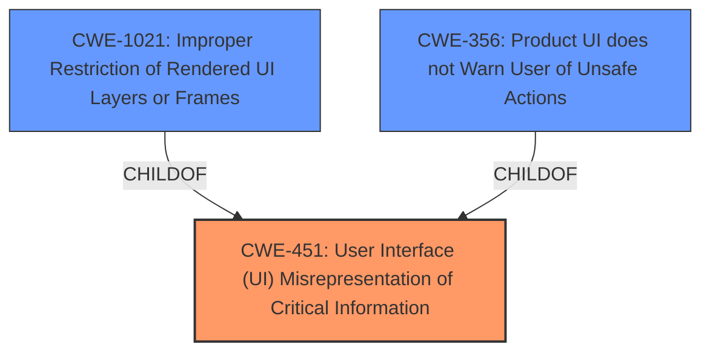

# Analysis for CVE-2021-21137

# Summary
| CWE ID | CWE Name | Confidence | CWE Abstraction Level | CWE Vulnerability Mapping Label | CWE-Vulnerability Mapping Notes |
|---|---|---|---|---|---|
| CWE-451 | User Interface (UI) Misrepresentation of Critical Information | 0.7 | Class | Allowed-with-Review | Primary CWE |

## Evidence and Confidence

*   **Confidence Score:** 0.7
*   **Evidence Strength:** MEDIUM

## Relationship Analysis
The primary identified CWE is CWE-451. This CWE is a class-level weakness and is related to UI misrepresentation, which can lead to phishing attacks and other deceptive practices. The retriever results also include other relevant CWEs, such as CWE-1021 (Improper Restriction of Rendered UI Layers or Frames) and CWE-356 (Product UI does not Warn User of Unsafe Actions). These CWEs represent related aspects of UI-related vulnerabilities, where an attacker can manipulate the UI to trick the user into performing unintended actions.

## Vulnerability Chain
The vulnerability chain starts with an **inappropriate implementation** in DevTools, which allows a remote attacker to obtain potentially sensitive information from the disk via a crafted HTML page. The vulnerability chain could be:
1. **Inappropriate implementation** in DevTools (Root Cause)
2. Crafted HTML page (Attack Vector)
3. Potential sensitive information from disk (Impact)

## Summary of Analysis
The initial analysis focuses on the **inappropriate implementation** in DevTools that allows a remote attacker to obtain potentially sensitive information from disk via a crafted HTML page.

The vulnerability description key phrases highlight:
- **rootcause:** **inappropriate implementation**
- **impact:** obtain potentially sensitive information from disk
- **vector:** crafted HTML page

The CVE Reference Links Content Summary provides:
- **root_cause:** "Inappropriate implementation in DevTools."
- **weaknesses:** ["Inappropriate implementation"]
- **impact:** "Low"
- **attack_vectors:** ["DevTools"]

Based on the evidence, CWE-451 seems like a reasonable fit. CWE-451 (User Interface (UI) Misrepresentation of Critical Information) is a Class-level CWE that addresses situations where the UI does not properly represent critical information to the user, potentially leading to phishing attacks. While the vulnerability description doesn't explicitly mention UI misrepresentation, the fact that it involves a crafted HTML page and potentially sensitive information being obtained suggests that the UI might be used to trick the user into performing an unintended action.

The retriever results show that CWE-451 is the top combined result, but its Usage is "Allowed-with-Review" because it is a Class-level CWE and might have Base-level children that would be more appropriate. However, none of the children of CWE-451 seem to be a better fit than CWE-451 itself.

Other CWEs considered:
- CWE-1021 (Improper Restriction of Rendered UI Layers or Frames): This CWE is related to clickjacking and UI redress attacks. While it might be related to the vulnerability, it doesn't seem to be the primary weakness.
- CWE-356 (Product UI does not Warn User of Unsafe Actions): This CWE is related to situations where the UI doesn't warn the user before undertaking an unsafe action. It could be a secondary weakness, but it doesn't seem to be the primary root cause.

Therefore, the selected CWE, CWE-451, is at the optimal level of specificity given the available evidence.