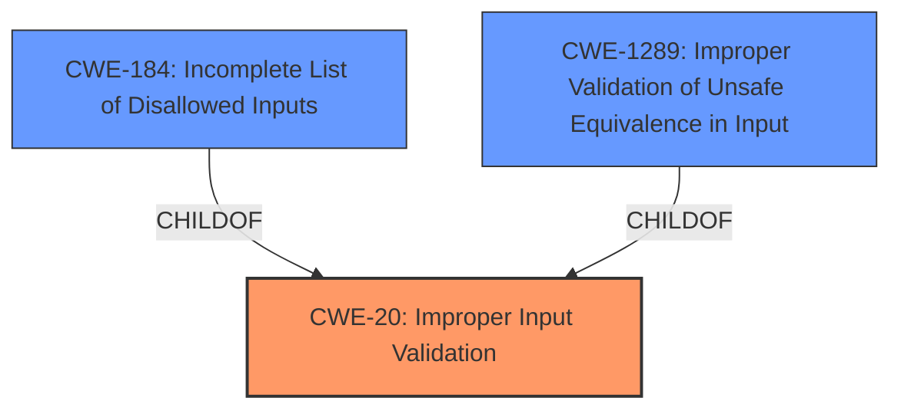

# Raw Analyzer Response for CVE-2021-21141

# Summary
| CWE ID | CWE Name | Confidence | CWE Abstraction Level | CWE Vulnerability Mapping Label | CWE-Vulnerability Mapping Notes |
|---|---|---|---|---|---|
| CWE-20 | Improper Input Validation | 0.9 | Class | Primary | Allowed-with-Review |
| CWE-184 | Incomplete List of Disallowed Inputs | 0.7 | Base | Secondary | Allowed |
| CWE-1289 | Improper Validation of Unsafe Equivalence in Input | 0.7 | Base | Secondary | Allowed |

## Evidence and Confidence

*   **Confidence Score:** 0.8
*   **Evidence Strength:** MEDIUM

## Relationship Analysis
The primary CWE is CWE-20 which is a high-level class. The description of the vulnerability indicated **insufficient policy enforcement**. Thus, it would be reasonable to assume that the vulnerability stems from improper validation of input in File System API.

## Vulnerability Chain
The chain of events is:
1.  **Insufficient policy enforcement** in File System API (CWE-20)
2.  Bypass file extension policy due to **improper input validation**.

## Summary of Analysis
The analysis is based on the vulnerability description that states that the root cause is **insufficient policy enforcement**. From the retriever results, several CWEs were considered, but the most applicable one is CWE-20, Improper Input Validation. The description mentions that the file extension policy is bypassed, indicating that the input is not properly validated. This aligns with CWE-20. While other CWEs like CWE-451 (User Interface (UI) Misrepresentation of Critical Information) and CWE-356 (Product UI does not Warn User of Unsafe Actions) are related to user interaction, they do not directly address the root cause of the vulnerability, which is the lack of proper input validation.

The relationship context also supports this decision. CWE-20 is a parent of several more specific CWEs, such as CWE-184 (Incomplete List of Disallowed Inputs) and CWE-1289 (Improper Validation of Unsafe Equivalence in Input). Since the vulnerability involves bypassing a file extension policy, it is possible that the list of disallowed file extensions is incomplete (CWE-184) or that the validation of the file extension is not properly implemented (CWE-1289).

The selection of CWE-20 is also influenced by the mapping guidance. While it is a Class-level CWE, it accurately represents the high-level weakness. More specific CWEs could be considered if more information about the specific validation mechanism was available.

Relevant CWE Information:

# Enhanced Context (25 CWEs)
The following CWEs were identified as potentially relevant to this vulnerability:

## CWE-1289: Improper Validation of Unsafe Equivalence in Input
**Abstraction Level**: Base
**Similarity Score**: 0.78
**Source**: dense

**Description**:
The product receives an input value that is used as a resource identifier or other type of reference, but it does not validate or incorrectly validates that the input is equivalent to a potentially-unsafe value.

**Mapping Guidance**:
- Usage: Allowed
- Rationale: This CWE entry is at the Base level of abstraction, which is a preferred level of abstraction for mapping to the root causes of vulnerabilities.

**Justification:** The vulnerability could be related to how the File System API validates the equivalence of a provided input with expected safe values. If this validation is improper, it could lead to a bypass of the file extension policy.

## CWE-184: Incomplete List of Disallowed Inputs
**Abstraction Level**: Base
**Similarity Score**: 0.78
**Source**: dense

**Description**:
The product implements a protection mechanism that relies on a list of inputs (or properties of inputs) that are not allowed by policy or otherwise require other action to neutralize before additional processing takes place, but the list is incomplete.

**Mapping Guidance**:
- Usage: Allowed
- Rationale: This CWE entry is at the Base level of abstraction, which is a preferred level of abstraction for mapping to the root causes of vulnerabilities.

**Justification**: The vulnerability description mentions a bypass of the file extension policy. This suggests that the list of disallowed file extensions might be incomplete, allowing an attacker to use a file extension that is not on the list.

## CWE-451: User Interface (UI) Misrepresentation of Critical Information
**Abstraction Level**: Class
**Similarity Score**: 0.78
**Source**: dense

**Description**:
The user interface (UI) does not properly represent critical information to the user, allowing the information - or its source - to be obscured or spoofed. This is often a component in phishing attacks.

**Mapping Guidance**:
- Usage: Allowed-with-Review
- Rationale: This CWE entry is a Class and might have Base-level children that would be more appropriate

**Justification**: This is less likely, as the problem is at the file system API level.

## CWE-280: Improper Handling of Insufficient Permissions or Privileges 
**Abstraction Level**: Base
**Similarity Score**: 0.77
**Source**: dense

**Description**:
The product does not handle or incorrectly handles when it has insufficient privileges to access resources or functionality as specified by their permissions. This may cause it to follow unexpected code paths that may leave the product in an invalid state.

**Mapping Guidance**:
- Usage: Allowed
- Rationale: This CWE entry is at the Base level of abstraction, which is a preferred level of abstraction for mapping to the root causes of vulnerabilities.

**Justification**: This is less likely, as the problem is at the file system API level.

## CWE-274: Improper Handling of Insufficient Privileges
**Abstraction Level**: Base
**Similarity Score**: 0.77
**Source**: dense

**Description**:
The product does not handle or incorrectly handles when it has insufficient privileges to perform an operation, leading to resultant weaknesses.

**Mapping Guidance**:
- Usage: Discouraged
- Rationale: This CWE entry could be deprecated in a future version of CWE.

**Justification**: This is less likely, as the problem is at the file system API level.

## CWE-754: Improper Check for Unusual or Exceptional Conditions
**Abstraction Level**: Class
**Similarity Score**: 0.77
**Source**: dense

**Description**:
The product does not check or incorrectly checks for unusual or exceptional conditions that are not expected to occur frequently during day to day operation of the product.

**Mapping Guidance**:
- Usage: Allowed-with-Review
- Rationale: This CWE entry is a Class and might have Base-level children that would be more appropriate

**Justification**: This is a less likely candidate.

## CWE-183: Permissive List of Allowed Inputs
**Abstraction Level**: Base
**Similarity Score**: 0.77
**Source**: dense

**Description**:
The product implements a protection mechanism that relies on a list of inputs (or properties of inputs) that are explicitly allowed by policy because the inputs are assumed to be safe, but the list is too permissive - that is, it allows an input that is unsafe, leading to resultant weaknesses.

**Mapping Guidance**:
- Usage: Allowed
- Rationale: This CWE entry is at the Base level of abstraction, which is a preferred level of abstraction for mapping to the root causes of vulnerabilities.

**Justification**: This is less likely as the problem is at the file system API level.

## CWE-668: Exposure of Resource to Wrong Sphere
**Abstraction Level**: Class
**Similarity Score**: 0.77
**Source**: dense

**Description**:
The product exposes a resource to the wrong control sphere, providing unintended actors with inappropriate access to the resource.

**Mapping Guidance**:
- Usage: Discouraged
- Rationale: CWE-668 is high-level and is often misused as a catch-all when lower-level CWE IDs might be applicable. It is sometimes used for low-information vulnerability reports [REF-1287]. It is a level-1 Class (i.e., a child of a Pillar). It is not useful for trend analysis.

**Justification**: This is less likely as the problem is at the file system API level.

## CWE-41: Improper Resolution of Path Equivalence
**Abstraction Level**: Base
**Similarity Score**: 0.76
**Source**: dense

**Description**:
The product is vulnerable to file system contents disclosure through path equivalence. Path equivalence involves the use of special characters in file and directory names. The associated manipulations are