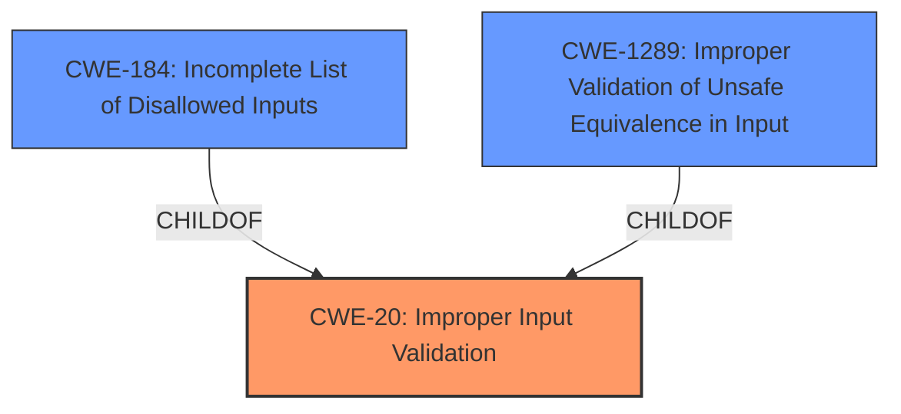

# Analysis for CVE-2021-21141

# Summary
| CWE ID | CWE Name | Confidence | CWE Abstraction Level | CWE Vulnerability Mapping Label | CWE-Vulnerability Mapping Notes |
|---|---|---|---|---|---|
| CWE-20 | Improper Input Validation | 0.9 | Class | Primary | Allowed-with-Review |
| CWE-184 | Incomplete List of Disallowed Inputs | 0.7 | Base | Secondary | Allowed |
| CWE-1289 | Improper Validation of Unsafe Equivalence in Input | 0.7 | Base | Secondary | Allowed |

## Evidence and Confidence

*   **Confidence Score:** 0.8
*   **Evidence Strength:** MEDIUM

## Relationship Analysis
The primary CWE is CWE-20 which is a high-level class. The description of the vulnerability indicated **insufficient policy enforcement**. Thus, it would be reasonable to assume that the vulnerability stems from improper validation of input in File System API.

## Vulnerability Chain
The chain of events is:
1.  **Insufficient policy enforcement** in File System API (CWE-20)
2.  Bypass file extension policy due to **improper input validation**.

## Summary of Analysis
The analysis is based on the vulnerability description that states that the root cause is **insufficient policy enforcement**. From the retriever results, several CWEs were considered, but the most applicable one is CWE-20, Improper Input Validation. The description mentions that the file extension policy is bypassed, indicating that the input is not properly validated. This aligns with CWE-20. While other CWEs like CWE-451 (User Interface (UI) Misrepresentation of Critical Information) and CWE-356 (Product UI does not Warn User of Unsafe Actions) are related to user interaction, they do not directly address the root cause of the vulnerability, which is the lack of proper input validation.

The relationship context also supports this decision. CWE-20 is a parent of several more specific CWEs, such as CWE-184 (Incomplete List of Disallowed Inputs) and CWE-1289 (Improper Validation of Unsafe Equivalence in Input). Since the vulnerability involves bypassing a file extension policy, it is possible that the list of disallowed file extensions is incomplete (CWE-184) or that the validation of the file extension is not properly implemented (CWE-1289).

The selection of CWE-20 is also influenced by the mapping guidance. While it is a Class-level CWE, it accurately represents the high-level weakness. More specific CWEs could be considered if more information about the specific validation mechanism was available.

Relevant CWE Information:

# Enhanced Context (25 CWEs)
The following CWEs were identified as potentially relevant to this vulnerability:

## CWE-1289: Improper Validation of Unsafe Equivalence in Input
**Abstraction Level**: Base
**Similarity Score**: 0.78
**Source**: dense

**Description**:
The product receives an input value that is used as a resource identifier or other type of reference, but it does not validate or incorrectly validates that the input is equivalent to a potentially-unsafe value.

**Mapping Guidance**:
- Usage: Allowed
- Rationale: This CWE entry is at the Base level of abstraction, which is a preferred level of abstraction for mapping to the root causes of vulnerabilities.

**Justification:** The vulnerability could be related to how the File System API validates the equivalence of a provided input with expected safe values. If this validation is improper, it could lead to a bypass of the file extension policy.

## CWE-184: Incomplete List of Disallowed Inputs
**Abstraction Level**: Base
**Similarity Score**: 0.78
**Source**: dense

**Description**:
The product implements a protection mechanism that relies on a list of inputs (or properties of inputs) that are not allowed by policy or otherwise require other action to neutralize before additional processing takes place, but the list is incomplete.

**Mapping Guidance**:
- Usage: Allowed
- Rationale: This CWE entry is at the Base level of abstraction, which is a preferred level of abstraction for mapping to the root causes of vulnerabilities.

**Justification**: The vulnerability description mentions a bypass of the file extension policy. This suggests that the list of disallowed file extensions might be incomplete, allowing an attacker to use a file extension that is not on the list.

## CWE-451: User Interface (UI) Misrepresentation of Critical Information
**Abstraction Level**: Class
**Similarity Score**: 0.78
**Source**: dense

**Description**:
The user interface (UI) does not properly represent critical information to the user, allowing the information - or its source - to be obscured or spoofed. This is often a component in phishing attacks.

**Mapping Guidance**:
- Usage: Allowed-with-Review
- Rationale: This CWE entry is a Class and might have Base-level children that would be more appropriate

**Justification**: This is less likely, as the problem is at the file system API level.

## CWE-280: Improper Handling of Insufficient Permissions or Privileges 
**Abstraction Level**: Base
**Similarity Score**: 0.77
**Source**: dense

**Description**:
The product does not handle or incorrectly handles when it has insufficient privileges to access resources or functionality as specified by their permissions. This may cause it to follow unexpected code paths that may leave the product in an invalid state.

**Mapping Guidance**:
- Usage: Allowed
- Rationale: This CWE entry is at the Base level of abstraction, which is a preferred level of abstraction for mapping to the root causes of vulnerabilities.

**Justification**: This is less likely, as the problem is at the file system API level.

## CWE-274: Improper Handling of Insufficient Privileges
**Abstraction Level**: Base
**Similarity Score**: 0.77
**Source**: dense

**Description**:
The product does not handle or incorrectly handles when it has insufficient privileges to perform an operation, leading to resultant weaknesses.

**Mapping Guidance**:
- Usage: Discouraged
- Rationale: This CWE entry could be deprecated in a future version of CWE.

**Justification**: This is less likely, as the problem is at the file system API level.

## CWE-754: Improper Check for Unusual or Exceptional Conditions
**Abstraction Level**: Class
**Similarity Score**: 0.77
**Source**: dense

**Description**:
The product does not check or incorrectly checks for unusual or exceptional conditions that are not expected to occur frequently during day to day operation of the product.

**Mapping Guidance**:
- Usage: Allowed-with-Review
- Rationale: This CWE entry is a Class and might have Base-level children that would be more appropriate

**Justification**: This is a less likely candidate.

## CWE-183: Permissive List of Allowed Inputs
**Abstraction Level**: Base
**Similarity Score**: 0.77
**Source**: dense

**Description**:
The product implements a protection mechanism that relies on a list of inputs (or properties of inputs) that are explicitly allowed by policy because the inputs are assumed to be safe, but the list is too permissive - that is, it allows an input that is unsafe, leading to resultant weaknesses.

**Mapping Guidance**:
- Usage: Allowed
- Rationale: This CWE entry is at the Base level of abstraction, which is a preferred level of abstraction for mapping to the root causes of vulnerabilities.

**Justification**: This is less likely as the problem is at the file system API level.

## CWE-668: Exposure of Resource to Wrong Sphere
**Abstraction Level**: Class
**Similarity Score**: 0.77
**Source**: dense

**Description**:
The product exposes a resource to the wrong control sphere, providing unintended actors with inappropriate access to the resource.

**Mapping Guidance**:
- Usage: Discouraged
- Rationale: CWE-668 is high-level and is often misused as a catch-all when lower-level CWE IDs might be applicable. It is sometimes used for low-information vulnerability reports [REF-1287]. It is a level-1 Class (i.e., a child of a Pillar). It is not useful for trend analysis.

**Justification**: This is less likely as the problem is at the file system API level.

## CWE-41: Improper Resolution of Path Equivalence
**Abstraction Level**: Base
**Similarity Score**: 0.76
**Source**: dense

**Description**:
The product is vulnerable to file system contents disclosure through path equivalence. Path equivalence involves the use of special characters in file and directory names. The associated manipulations are

# Enhanced Query for CVE-2021-21141

## Vulnerability Description
Insufficient policy enforcement in File System API in Google Chrome prior to 88.0.4324.96 allowed a remote attacker to bypass file extension policy via a crafted HTML page.

### Vulnerability Description Key Phrases
- **rootcause:** **insufficient policy enforcement**
- **impact:** bypass file extension policy
- **vector:** crafted HTML page
- **attacker:** remote attacker
- **product:** Google Chrome
- **version:** prior to 88.0.4324.96
- **component:** File System API

## CVE Reference Links Content Summary
The provided content includes information about CVE-2021-21141.

**Root cause of vulnerability:** Insufficient policy enforcement in File System API.

**Weaknesses/vulnerabilities present:** The vulnerability lies in the lack of proper policy enforcement within the File System API.

**Impact of exploitation:** The specific impact is not detailed in the provided text, but the general nature of insufficient policy enforcement could lead to unauthorized access, data manipulation, or other security breaches related to file system operations.

**Attack vectors:** The vulnerability is present in the File System API, suggesting that an attacker could exploit it through mechanisms that interact with this API, likely through web-based attacks.

**Required attacker capabilities/position:** An attacker would need to be able to interact with the File System API, most likely through a crafted web page or a malicious application utilizing the browser's features.

## Retriever Results

### Top Combined Results

| Rank | CWE ID | Name | Abstraction | Usage  | Retrievers | Individual Scores |
|------|--------|------|-------------|-------|------------|-------------------|
| 1 | 64 | Windows Shortcut Following (.LNK) | Variant | Allowed | sparse | 0.333 |
| 2 | 451 | User Interface (UI) Misrepresentation of Critical Information | Class | Allowed-with-Review | sparse | 0.303 |
| 3 | 156 | Improper Neutralization of Whitespace | Variant | Allowed | sparse | 0.276 |
| 4 | 416 | Use After Free | Variant | Allowed | sparse | 0.230 |
| 5 | 358 | Improperly Implemented Security Check for Standard | Base | Allowed | sparse | 0.228 |
| 6 | 356 | Product UI does not Warn User of Unsafe Actions | Base | Allowed | dense | 0.566 |
| 7 | 123 | Write-what-where Condition | Base | Allowed | graph | 0.003 |
| 8 | 696 | Incorrect Behavior Order | Class | Allowed-with-Review | sparse | 0.209 |
| 9 | 279 | Incorrect Execution-Assigned Permissions | Variant | Allowed | sparse | 0.208 |
| 10 | 863 | Incorrect Authorization | Class | Allowed-with-Review | sparse | 0.202 |

# Complete CWE Specifications

## CWE-64: Windows Shortcut Following (.LNK)
**Abstraction:** Variant
**Status:** Incomplete

### Description
The product, when opening a file or directory, does not sufficiently handle when the file is a Windows shortcut (.LNK) whose target is outside of the intended control sphere. This could allow an attacker to cause the product to operate on unauthorized files.

### Extended Description
The shortcut (file with the .lnk extension) can permit an attacker to read/write a file that they originally did not have permissions to access.

### Alternative Terms
Windows symbolic link following
symlink

### Relationships
ChildOf -> CWE-59

### Mapping Guidance
**Usage:** Allowed
**Rationale:** This CWE entry is at the Variant level of abstraction, which is a preferred level of abstraction for mapping to the root causes of vulnerabilities.
**Comments:** Carefully read both the name and description to ensure that this mapping is an appropriate fit. Do not try to 'force' a mapping to a lower-level Base/Variant simply to comply with this preferred level of abstraction.
**Reasons:**
- Acceptable-Use

### Additional Notes
**[Research Gap]** Under-studied. Windows .LNK files are more "portable" than Unix symlinks and have been used in remote exploits. Some Windows API's will access LNK's as if they are regular files, so one would expect that they would be reported more frequently.

### Observed Examples
- **CVE-2019-19793:** network access control service executes program with high privileges and allows symlink to invoke another executable or perform DLL injection.
- **CVE-2000-0342:** Mail client allows remote attackers to bypass the user warning for executable attachments such as .exe, .com, and .bat by using a .lnk file that refers to the attachment, aka "Stealth Attachment."
- **CVE-2001-1042:** FTP server allows remote attackers to read arbitrary files and directories by uploading a .lnk (link) file that points to the target file.

## CWE-451: User Interface (UI) Misrepresentation of Critical Information
**Abstraction:** Class
**Status:** Draft

### Description
The user interface (UI) does not properly represent critical information to the user, allowing the information - or its source - to be obscured or spoofed. This is often a component in phishing attacks.

### Extended Description

If an attacker can cause the UI to display erroneous data, or to otherwise convince the user to display information that appears to come from a trusted source, then the attacker could trick the user into performing the wrong action. This is often a component in phishing attacks, but other kinds of problems exist. For example, if the UI is used to monitor the security state of a system or network, then omitting or obscuring an important indicator could prevent the user from detecting and reacting to a security-critical event.

UI misrepresentation can take many forms:

  - Incorrect indicator: incorrect information is displayed, which prevents the user from understanding the true state of the product or the environment the product is monitoring, especially of potentially-dangerous conditions or operations. This can be broken down into several different subtypes.

  - Overlay: an area of the display is intended to give critical information, but another process can modify the display by overlaying another element on top of it. The user is not interacting with the expected portion of the user interface. This is the problem that enables clickjacking attacks, although many other types of attacks exist that involve overlay.

  - Icon manipulation: the wrong icon, or the wrong color indicator, can be influenced (such as making a dangerous .EXE executable look like a harmless .GIF)

  - Timing: the product is performing a state transition or context switch that is presented to the user with an indicator, but a race condition can cause the wrong indicator to be used before the product has fully switched context. The race window could be extended indefinitely if the attacker can trigger an error.

  - Visual truncation: important information could be truncated from the display, such as a long filename with a dangerous extension that is not displayed in the GUI because the malicious portion is truncated. The use of excessive whitespace can also cause truncation, or place the potentially-dangerous indicator outside of the user's field of view (e.g. "filename.txt .exe"). A different type of truncation can occur when a portion of the information is removed due to reasons other than length, such as the accidental insertion of an end-of-input marker in the middle of an input, such as a NUL byte in a C-style string.

  - Visual distinction: visual information might be presented in a way that makes it difficult for the user to quickly and correctly distinguish between critical and unimportant segments of the display.

  - Homographs: letters from different character sets, fonts, or languages can appear very similar (i.e. may be visually equivalent) in a way that causes the human user to misread the text (for example, to conduct phishing attacks to trick a user into visiting a malicious web site with a visually-similar name as a trusted site). This can be regarded as a type of visual distinction issue.

### Alternative Terms
None

### Relationships
ChildOf -> CWE-684
ChildOf -> CWE-221
PeerOf -> CWE-346

### Mapping Guidance
**Usage:** Allowed-with-Review
**Rationale:** This CWE entry is a Class and might have Base-level children that would be more appropriate
**Comments:** Examine children of this entry to see if there is a better fit
**Reasons:**
- Abstraction

### Additional Notes
**[Maintenance]** This entry should be broken down into more precise entries. See extended description.

**[Research Gap]** Misrepresentation problems are frequently studied in web browsers, but there are no known efforts for classifying these kinds of problems in terms of the shortcomings of the interface. In addition, many misrepresentation issues are resultant.

### Observed Examples
- **CVE-2004-2227:** Web browser's filename selection dialog only shows the beginning portion of long filenames, which can trick users into launching executables with dangerous extensions.
- **CVE-2001-0398:** Attachment with many spaces in filename bypasses "dangerous content" warning and uses different icon. Likely resultant.
- **CVE-2001-0643:** Misrepresentation and equivalence issue.

## CWE-156: Improper Neutralization of Whitespace
**Abstraction:** Variant
**Status:** Draft

### Description
The product receives input from an upstream component, but it does not neutralize or incorrectly neutralizes special elements that could be interpreted as whitespace when they are sent to a downstream component.

### Extended Description
This can include space, tab, etc.

### Alternative Terms
White space

### Relationships
ChildOf -> CWE-138

### Mapping Guidance
**Usage:** Allowed
**Rationale:** This CWE entry is at the Variant level of abstraction, which is a preferred level of abstraction for mapping to the root causes of vulnerabilities.
**Comments:** Carefully read both the name and description to ensure that this mapping is an appropriate fit. Do not try to 'force' a mapping to a lower-level Base/Variant simply to comply with this preferred level of abstraction.
**Reasons:**
- Acceptable-Use

### Additional Notes
**[Relationship]** Can overlap other separator characters or delimiters.

### Observed Examples
- **CVE-2002-0637:** MIE. virus protection bypass with RFC violations involving extra whitespace, or missing whitespace.
- **CVE-2004-0942:** CPU consumption with MIME headers containing lines with many space characters, probably due to algorithmic complexity (RESOURCE.AMP.ALG).
- **CVE-2003-1015:** MIE. whitespace interpreted differently by mail clients.

## CWE-416: Use After Free
**Abstraction:** Variant
**Status:** Stable

### Description
The product reuses or references memory after it has been freed. At some point afterward, the memory may be allocated again and saved in another pointer, while the original pointer references a location somewhere within the new allocation. Any operations using the original pointer are no longer valid because the memory "belongs" to the code that operates on the new pointer.

### Extended Description
Not provided

### Alternative Terms
Dangling pointer: a pointer that no longer points to valid memory, often after it has been freed
UAF: commonly used acronym for Use After Free
Use-After-Free

### Relationships
ChildOf -> CWE-825
ChildOf -> CWE-672
ChildOf -> CWE-672
ChildOf -> CWE-672
CanPrecede -> CWE-120
CanPrecede -> CWE-123

### Mapping Guidance
**Usage:** Allowed
**Rationale:** This CWE entry is at the Variant level of abstraction, which is a preferred level of abstraction for mapping to the root causes of vulnerabilities.
**Comments:** Carefully read both the name and description to ensure that this mapping is an appropriate fit. Do not try to 'force' a mapping to a lower-level Base/Variant simply to comply with this preferred level of abstraction.
**Reasons:**
- Acceptable-Use

### Observed Examples
- **CVE-2022-20141:** Chain: an operating system kernel has insufficent resource locking (CWE-413) leading to a use after free (CWE-416).
- **CVE-2022-2621:** Chain: two threads in a web browser use the same resource (CWE-366), but one of those threads can destroy the resource before the other has completed (CWE-416).
- **CVE-2021-0920:** Chain: mobile platform race condition (CWE-362) leading to use-after-free (CWE-416), as exploited in the wild per CISA KEV.

## CWE-358: Improperly Implemented Security Check for Standard
**Abstraction:** Base
**Status:** Draft

### Description
The product does not implement or incorrectly implements one or more security-relevant checks as specified by the design of a standardized algorithm, protocol, or technique.

### Extended Description
Not provided

### Alternative Terms
None

### Relationships
ChildOf -> CWE-573
ChildOf -> CWE-693
CanAlsoBe -> CWE-345
CanAlsoBe -> CWE-290

### Mapping Guidance
**Usage:** Allowed
**Rationale:** This CWE entry is at the Base level of abstraction, which is a preferred level of abstraction for mapping to the root causes of vulnerabilities.
**Comments:** Carefully read both the name and description to ensure that this mapping is an appropriate fit. Do not try to 'force' a mapping to a lower-level Base/Variant simply to comply with this preferred level of abstraction.
**Reasons:**
- Acceptable-Use

### Additional Notes
**[Relationship]** This is a "missing step" error on the product side, which can overlap weaknesses such as insufficient verification and spoofing. It is frequently found in cryptographic and authentication errors. It is sometimes resultant.

### Observed Examples
- **CVE-2002-0862:** Browser does not verify Basic Constraints of a certificate, even though it is required, allowing spoofing of trusted certificates.
- **CVE-2002-0970:** Browser does not verify Basic Constraints of a certificate, even though it is required, allowing spoofing of trusted certificates.
- **CVE-2002-1407:** Browser does not verify Basic Constraints of a certificate, even though it is required, allowing spoofing of trusted certificates.

## CWE-356: Product UI does not Warn User of Unsafe Actions
**Abstraction:** Base
**Status:** Incomplete

### Description
The product's user interface does not warn the user before undertaking an unsafe action on behalf of that user. This makes it easier for attackers to trick users into inflicting damage to their system.

### Extended Description
Product systems should warn users that a potentially dangerous action may occur if the user proceeds. For example, if the user downloads a file from an unknown source and attempts to execute the file on their machine, then the application's GUI can indicate that the file is unsafe.

### Alternative Terms
None

### Relationships
ChildOf -> CWE-221

### Mapping Guidance
**Usage:** Allowed
**Rationale:** This CWE entry is at the Base level of abstraction, which is a preferred level of abstraction for mapping to the root causes of vulnerabilities.
**Comments:** Carefully read both the name and description to ensure that this mapping is an appropriate fit. Do not try to 'force' a mapping to a lower-level Base/Variant simply to comply with this preferred level of abstraction.
**Reasons:**
- Acceptable-Use

### Additional Notes
**[Relationship]** Often resultant, e.g. in unhandled error conditions.

**[Relationship]** Can overlap privilege errors, conceptually at least.

### Observed Examples
- **CVE-1999-1055:** Product does not warn user when document contains certain dangerous functions or macros.
- **CVE-1999-0794:** Product does not warn user when document contains certain dangerous functions or macros.
- **CVE-2000-0277:** Product does not warn user when document contains certain dangerous functions or macros.

## CWE-123: Write-what-where Condition
**Abstraction:** Base
**Status:** Draft

### Description
Any condition where the attacker has the ability to write an arbitrary value to an arbitrary location, often as the result of a buffer overflow.

### Extended Description
Not provided

### Alternative Terms
None

### Relationships
ChildOf -> CWE-787
ChildOf -> CWE-119
ChildOf -> CWE-119

### Mapping Guidance
**Usage:** Allowed
**Rationale:** This CWE entry is at the Base level of abstraction, which is a preferred level of abstraction for mapping to the root causes of vulnerabilities.
**Comments:** Carefully read both the name and description to ensure that this mapping is an appropriate fit. Do not try to 'force' a mapping to a lower-level Base/Variant simply to comply with this preferred level of abstraction.
**Reasons:**
- Acceptable-Use

### Observed Examples
- **CVE-2022-21668:** Chain: Python library does not limit the resources used to process images that specify a very large number of bands (CWE-1284), leading to excessive memory consumption (CWE-789) or an integer overflow (CWE-190).
- **CVE-2022-0545:** Chain: 3D renderer has an integer overflow (CWE-190) leading to write-what-where condition (CWE-123) using a crafted image.

## CWE-696: Incorrect Behavior Order
**Abstraction:** Class
**Status:** Incomplete

### Description
The product performs multiple related behaviors, but the behaviors are performed in the wrong order in ways which may produce resultant weaknesses.

### Extended Description
Not provided

### Alternative Terms
None

### Relationships
ChildOf -> CWE-691

### Mapping Guidance
**Usage:** Allowed-with-Review
**Rationale:** This CWE entry is a Class and might have Base-level children that would be more appropriate
**Comments:** Examine children of this entry to see if there is a better fit
**Reasons:**
- Abstraction

### Observed Examples
- **CVE-2019-9805:** Chain: Creation of the packet client occurs before initialization is complete (CWE-696) resulting in a read from uninitialized memory (CWE-908), causing memory corruption.
- **CVE-2007-5191:** file-system management programs call the setuid and setgid functions in the wrong order and do not check the return values, allowing attackers to gain unintended privileges
- **CVE-2007-1588:** C++ web server program calls Process::setuid before calling Process::setgid, preventing it from dropping privileges, potentially allowing CGI programs to be called with higher privileges than intended

## CWE-279: Incorrect Execution-Assigned Permissions
**Abstraction:** Variant
**Status:** Draft

### Description
While it is executing, the product sets the permissions of an object in a way that violates the intended permissions that have been specified by the user.

### Extended Description
Not provided

### Alternative Terms
None

### Relationships
ChildOf -> CWE-732

### Mapping Guidance
**Usage:** Allowed
**Rationale:** This CWE entry is at the Variant level of abstraction, which is a preferred level of abstraction for mapping to the root causes of vulnerabilities.
**Comments:** Carefully read both the name and description to ensure that this mapping is an appropriate fit. Do not try to 'force' a mapping to a lower-level Base/Variant simply to comply with this preferred level of abstraction.
**Reasons:**
- Acceptable-Use

### Observed Examples
- **CVE-2002-0265:** Log files opened read/write.
- **CVE-2003-0876:** Log files opened read/write.
- **CVE-2002-1694:** Log files opened read/write.

## CWE-863: Incorrect Authorization
**Abstraction:** Class
**Status:** Incomplete

### Description
The product performs an authorization check when an actor attempts to access a resource or perform an action, but it does not correctly perform the check.

### Extended Description
Not provided

### Alternative Terms
AuthZ: "AuthZ" is typically used as an abbreviation of "authorization" within the web application security community. It is distinct from "AuthN" (or, sometimes, "AuthC") which is an abbreviation of "authentication." The use of "Auth" as an abbreviation is discouraged, since it could be used for either authentication or authorization.

### Relationships
ChildOf -> CWE-285
ChildOf -> CWE-284

### Mapping Guidance
**Usage:** Allowed-with-Review
**Rationale:** This CWE entry is a Class and might have Base-level children that would be more appropriate
**Comments:** Examine children of this entry to see if there is a better fit
**Reasons:**
- Abstraction

### Additional Notes
**[Terminology]** 

Assuming a user with a given identity, authorization is the process of determining whether that user can access a given resource, based on the user's privileges and any permissions or other access-control specifications that apply to the resource.

### Observed Examples
- **CVE-2021-39155:** Chain: A microservice integration and management platform compares the hostname in the HTTP Host header in a case-sensitive way (CWE-178, CWE-1289), allowing bypass of the authorization policy (CWE-863) using a hostname with mixed case or other variations.
- **CVE-2019-15900:** Chain: sscanf() call is used to check if a username and group exists, but the return value of sscanf() call is not checked (CWE-252), causing an uninitialized variable to be checked (CWE-457), returning success to allow authorization bypass for executing a privileged (CWE-863).
- **CVE-2009-2213:** Gateway uses default "Allow" configuration for its authorization settings.

