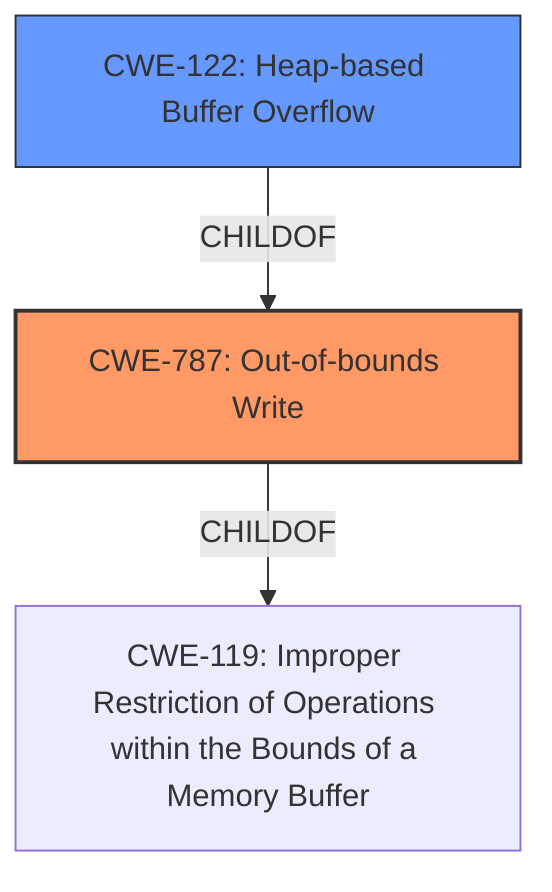

# Analysis Report for CVE-2021-21143

# Vulnerability Analysis Report: CVE-2021-21143

## Description


## Analysis (with Relationship Data)

# Summary
| CWE ID | CWE Name | Confidence | CWE Abstraction Level | CWE Vulnerability Mapping Label | CWE-Vulnerability Mapping Notes |
|---|---|---|---|---|---|
| CWE-787 | Out-of-bounds Write | 1.0 | Base | Allowed | Primary CWE |
| CWE-122 | Heap-based Buffer Overflow | 0.8 | Variant | Allowed | Secondary Candidate |

## Evidence and Confidence

*   **Confidence Score:** 0.9
*   **Evidence Strength:** HIGH

## Relationship Analysis
The primary relationship impacting my decision is the parent-child relationship between CWE-787 and CWE-119, and the child relationship between CWE-122 and CWE-787. While CWE-119 is a broader class, CWE-787 directly addresses the **out-of-bounds write**, which is more specific to the provided vulnerability description. CWE-122 indicates the location of the buffer, heap, where the overflow occurred.



## Vulnerability Chain
The vulnerability chain starts with the installation of a malicious extension by a user, which leads to a **heap buffer overflow**, and potentially results in heap corruption.
  - User installs malicious extension -> **Heap Buffer Overflow** (CWE-787/CWE-122) -> Heap Corruption
In this case, CWE-787 and CWE-122 represent the root cause of the heap corruption.

## Summary of Analysis
The initial assessment strongly points to CWE-787 (Out-of-bounds Write) as the primary CWE, supported by the vulnerability description mentioning "**heap buffer overflow**." This aligns with CWE-787, which describes the condition where a product writes data past the end of a buffer. The CVE reference links further confirm the presence of a "**heap buffer overflow**" vulnerability.

The selection of CWE-787 is further strengthened by its relationship with CWE-119 (Improper Restriction of Operations within the Bounds of a Memory Buffer). While CWE-119 is a broader category, CWE-787 provides a more specific classification of the **out-of-bounds write** condition. CWE-122 (Heap-based Buffer Overflow) is a variant of CWE-787 and specifies the location of the buffer in the heap.

The evidence from the vulnerability description includes "**Heap buffer overflow**" and "potentially exploit heap corruption." This directly relates to CWE-787's definition. The retriever results also list CWE-787 as the top CWE match, with the highest count for similar CVE descriptions.

Therefore, CWE-787 is chosen as the primary CWE due to its direct alignment with the vulnerability description and supporting evidence, and CWE-122 is selected as a secondary candidate.

Relevant CWE Information:

# Enhanced Context (25 CWEs)
The following CWEs were identified as potentially relevant to this vulnerability:

## CWE-787: Out-of-bounds Write
**Abstraction:** Base
**Similarity Score**: 4.33
**Source**: graph

**Description**:
CWE-787: Out-of-bounds Write

**Mapping Guidance**:
- Usage: Allowed
- Rationale: This CWE entry is at the Base level of abstraction, which is a preferred level of abstraction for mapping to the root causes of vulnerabilities.

**Relationships**:
- CANFOLLOW -> CWE-825
- CANFOLLOW -> CWE-824
- CANFOLLOW -> CWE-823
- CANFOLLOW -> CWE-822
- PARENTOF -> CWE-124

*Technical Explanation for CWE-787*:
The vulnerability description states a "**heap buffer overflow**" in Extensions of Google Chrome. This directly corresponds to CWE-787 (Out-of-bounds Write), which occurs when a program writes data beyond the allocated buffer's boundaries. The security implication is heap corruption and potential arbitrary code execution, as mentioned in the CVE description ("potentially exploit heap corruption"). CWE-787 is a base-level CWE, providing a specific description of the weakness.
*   How the vulnerability's details match the CWE's characteristics: The "**heap buffer overflow**" aligns perfectly with the definition of an out-of-bounds write.
*   The security implications and potential impact: Heap corruption and potential arbitrary code execution.
*   Any parent-child relationships or chain patterns that influenced your mapping: CWE-787 is a child of CWE-119, but is more specific.
*   Whether the weakness is primary or secondary in the vulnerability: Primary.
*   How the official MITRE mapping guidance influenced your decision: The mapping guidance allows the use of CWE-787, as it is at the Base level of abstraction.

## CWE-122: Heap-based Buffer Overflow
**Abstraction:** Variant
**Similarity Score**: 0.354
**Source**: sparse

**Description**:
A heap overflow condition is a buffer overflow, where the buffer that can be overwritten is allocated in the heap portion of memory, generally meaning that the buffer was allocated using a routine such as malloc().

*Technical Explanation for CWE-122*:
CWE-122 (Heap-based Buffer Overflow) is considered as a secondary candidate. This CWE is a variant of CWE-787 and indicates that the buffer overflow occurs specifically in the heap memory region. While the description mentions "**heap buffer overflow**", the core issue is still the out-of-bounds write. Thus, CWE-787 is the primary weakness, and CWE-122 provides additional context.
*   How the vulnerability's details match the CWE's characteristics: The vulnerability is specifically a "**heap buffer overflow**," which aligns with CWE-122.
*   The security implications and potential impact: Heap corruption and potential arbitrary code execution.
*   Any parent-child relationships or chain patterns that influenced your mapping: CWE-122 is a child of CWE-787.
*   Whether the weakness is primary or secondary in the vulnerability: Secondary.
*   How the official MITRE mapping guidance influenced your decision: The mapping guidance allows the use of CWE-122, as it is at the Variant level of abstraction.

*CWEs Considered but Not Used*
CWE-119: While a parent of CWE-787, it's a more general class. The description specifies a "**heap buffer overflow**," making CWE-787 a more precise fit. The mapping guidance discourages using CWE-119 when more specific CWEs are available.
CWE-416: Use After Free is not applicable here, as the vulnerability is related to writing beyond the buffer's boundaries, not using memory after it has been freed.
CWE-190 and CWE-191: Integer Overflow or Wraparound and Integer Underflow are not directly mentioned or implied in the provided vulnerability description or reference links. The focus is on the **buffer overflow**, not on integer manipulation.


## CWE Relationship Analysis

Current CWEs represent these abstraction levels: .


### Vulnerability Chain Analysis

**Chain starting from CWE-823:**
- 823 (Use of Out-of-range Pointer Offset) - ROOT


**Chain starting from CWE-787:**
- 787 (Out-of-bounds Write) - ROOT


### CWE Relationship Diagram

```mermaid
graph TD
    classDef primary fill:#f96,stroke:#333,stroke-width:2px
    classDef secondary fill:#69f,stroke:#333
    classDef tertiary fill:#9e9,stroke:#333
```


*Report generated on 2025-04-02 15:16:37*
