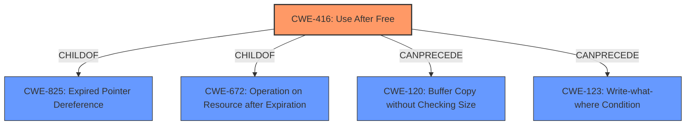

# Enhanced Analysis for CVE-2021-21145

# Summary
| CWE ID | CWE Name | Confidence | CWE Abstraction Level | CWE Vulnerability Mapping Label | CWE-Vulnerability Mapping Notes |
|---|---|---|---|---|---|
| CWE-416 | Use After Free | 1.0 | Variant | Allowed | Primary CWE |

## Evidence and Confidence

*   **Confidence Score:** 1.0
*   **Evidence Strength:** HIGH

## Relationship Analysis
The primary identified CWE is **CWE-416 (Use After Free)**, which is a Variant level CWE. This CWE is a child of **CWE-825 (Expired Pointer Dereference)** and **CWE-672 (Operation on Resource after Expiration)**. The vulnerability description explicitly states a **Use after free** condition.



## Vulnerability Chain
The vulnerability chain starts with a **Use after free** condition (**CWE-416**). The impact of this vulnerability is heap corruption.
  - **Root Cause:** **CWE-416 (Use After Free)** - Reusing memory after it has been freed.
  - **Impact:** Heap corruption.

## Summary of Analysis
The vulnerability description clearly indicates a **Use after free** condition in the Fonts component of Google Chrome. The CVE Reference Links Content Summary confirms the **root cause** as "**Use after free vulnerability exists in the Fonts component of the Chromium browser**". The primary CWE match from similar CVE descriptions is **CWE-416 (Use After Free)**, and the retriever results also list **CWE-416 (Use After Free)** as the top candidate.

The evidence strongly supports mapping this vulnerability to **CWE-416 (Use After Free)**. The abstraction level of Variant is appropriate as it is a specific type of memory corruption. The usage is Allowed per MITRE guidance.

Other CWEs were considered but not selected:

*   **CWE-366 (Race Condition within a Thread):** While concurrency issues can sometimes lead to use-after-free vulnerabilities, there is no specific mention of a race condition in the provided vulnerability description or CVE details.
*   **CWE-122 (Heap-based Buffer Overflow):** Although heap corruption is the impact, the root cause is specifically a use-after-free, not a buffer overflow.
*   **CWE-843 (Access of Resource Using Incompatible Type ('Type Confusion'))**: There's no evidence suggesting that the resource is being accessed using an incompatible type. The issue is that the memory is accessed *after* it has been freed.
*   **CWE-415 (Double Free):** Double free is a related memory corruption issue, but the description clearly states use-after-free.
*   **CWE-451 (User Interface (UI) Misrepresentation of Critical Information):** This is not a UI issue.
*    **CWE-123 (Write-what-where Condition):** Although a write-what-where condition can be the result of memory corruption such as use-after-free, the root cause is the use-after-free.

The selection of **CWE-416 (Use After Free)** is based on the explicit mention of the weakness in the vulnerability description and supporting CVE details, making it the most accurate and specific classification.


## CWE Relationship Analysis

Current CWEs represent these abstraction levels: .


### Vulnerability Chain Analysis

**Chain starting from CWE-415:**
- 415 (Double Free) - ROOT


**Chain starting from CWE-123:**
- 123 (Write-what-where Condition) - ROOT


### CWE Relationship Diagram

```mermaid
graph TD
    classDef primary fill:#f96,stroke:#333,stroke-width:2px
    classDef secondary fill:#69f,stroke:#333
    classDef tertiary fill:#9e9,stroke:#333
```