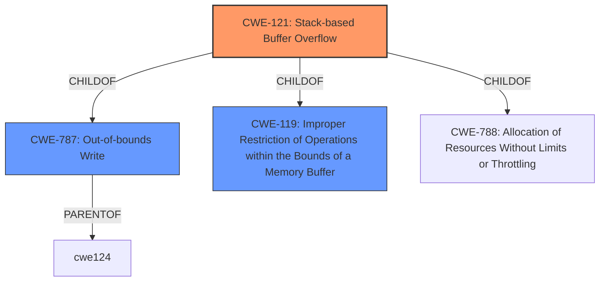

# Raw Analyzer Response for CVE-2021-21149

# Summary
| CWE ID | CWE Name | Confidence | CWE Abstraction Level | CWE Vulnerability Mapping Label | CWE-Vulnerability Mapping Notes |
|---|---|---|---|---|---|
| CWE-121 | Stack-based Buffer Overflow | 1.0 | Variant | Allowed | Primary CWE |

## Evidence and Confidence

*   **Confidence Score:** 1.0
*   **Evidence Strength:** HIGH

## Relationship Analysis
The primary CWE is CWE-121, which is a Variant of CWE-787 (Out-of-bounds Write) and CWE-119 (Improper Restriction of Operations within the Bounds of a Memory Buffer). The relationship analysis shows that CWE-121 is a specific type of out-of-bounds write that occurs on the stack. This specificity makes it the most appropriate choice given the vulnerability description.

## Vulnerability Chain
The vulnerability chain starts with the **stack buffer overflow** due to **improper restriction of operations within the bounds of a memory buffer**, which leads to **out of bounds memory access**. The chain illustrates how a coding error leads to a security impact.

## Summary of Analysis
The initial analysis correctly identified the **stack buffer overflow** as the root cause. The vulnerability description explicitly states "**Stack buffer overflow** in Data Transfer in Google Chrome on Linux prior to 88.0.4324.182 allowed a remote attacker to perform out of bounds memory access via a crafted HTML page." The "**Stack buffer overflow**" is the key phrase that drives the selection of CWE-121. The CVE Reference Links Content Summary also supports this by stating "Stack overflow in Data Transfer."

The selection of CWE-121 is based on the explicit mention of "**Stack buffer overflow**" in the vulnerability description. This is a specific type of buffer overflow, making the variant-level CWE-121 the most appropriate choice. Alternatives like CWE-119 are too general, while CWE-787 doesn't capture the stack-specific nature of the overflow. The evidence is strong and directly supports the selection of CWE-121.

Relevant CWE Information:

# Enhanced Context (25 CWEs)
The following CWEs were identified as potentially relevant to this vulnerability:

## CWE-457: Use of Uninitialized Variable
**Abstraction Level**: Variant
**Similarity Score**: 0.80
**Source**: dense

**Description**:
The code uses a variable that has not been initialized, leading to unpredictable or unintended results.
- *This is not relevant because there is no mention of uninitialized variables.*

## CWE-191: Integer Underflow (Wrap or Wraparound)
**Abstraction Level**: Base
**Similarity Score**: 0.77
**Source**: dense

**Description**:
The product subtracts one value from another, such that the result is less than the minimum allowable integer value, which produces a value that is not equal to the correct result.
- *This is not relevant because there is no mention of integer underflow.*

## CWE-908: Use of Uninitialized Resource
**Abstraction Level**: Base
**Similarity Score**: 0.76
**Source**: dense

**Description**:
The product uses or accesses a resource that has not been initialized.
- *This is not relevant because there is no mention of uninitialized resources.*

## CWE-909: Missing Initialization of Resource
**Abstraction Level**: Class
**Similarity Score**: 0.76
**Source**: dense

**Description**:
The product does not initialize a critical resource.
- *This is not relevant because there is no mention of missing resource initialization.*

## CWE-131: Incorrect Calculation of Buffer Size
**Abstraction Level**: Base
**Similarity Score**: 0.76
**Source**: dense

**Description**:
The product does not correctly calculate the size to be used when allocating a buffer, which could lead to a buffer overflow.
- *While this could lead to a buffer overflow, the description explicitly mentions a stack buffer overflow, making CWE-121 a better fit.*

## CWE-824: Access of Uninitialized Pointer
**Abstraction Level**: Base
**Similarity Score**: 0.75
**Source**: dense

**Description**:
The product accesses or uses a pointer that has not been initialized.
- *This is not relevant because there is no mention of uninitialized pointers.*

## CWE-843: Access of Resource Using Incompatible Type ('Type Confusion')
**Abstraction Level**: Base
**Similarity Score**: 0.75
**Source**: dense

**Description**:
The product allocates or initializes a resource such as a pointer, object, or variable using one type, but it later accesses that resource using a type that is incompatible with the original type.
- *This is not relevant because there is no mention of type confusion.*

## CWE-665: Improper Initialization
**Abstraction Level**: Class
**Similarity Score**: 0.75
**Source**: dense

**Description**:
The product does not initialize or incorrectly initializes a resource, which might leave the resource in an unexpected state when it is accessed or used.
- *This is not relevant because there is no mention of improper initialization.*

## CWE-667: Improper Locking
**Abstraction Level**: Class
**Similarity Score**: 0.75
**Source**: dense

**Description**:
The product does not properly acquire or release a lock on a resource, leading to unexpected resource state changes and behaviors.
- *This is not relevant because there is no mention of improper locking.*

## CWE-125: Out-of-bounds Read
**Abstraction Level**: Base
**Similarity Score**: 0.75
**Source**: dense

**Description**:
The product reads data past the end, or before the beginning, of the intended buffer.
- *While out of bounds memory access is mentioned, the root cause is a stack buffer overflow (write), not a read.*

## CWE-190: Integer Overflow or Wraparound
**Abstraction Level**: Base
**Similarity Score**: 6188.39
**Source**: sparse

**Description**:
The product performs a calculation that can
         produce an integer overflow or wraparound when the logic
         assumes that the resulting value will always be larger than
         the original value. This occurs when an integer value is
         incremented to a value that is too large to store in the
         associated representation. When this occurs, the value may
         become a very small or negative number.
- *This is not relevant because there is no mention of integer overflow.*

## CWE-125: Out-of-bounds Read
**Abstraction Level**: Base
**Similarity Score**: 5946.70
**Source**: sparse

**Description**:
The product reads data past the end, or before the beginning, of the intended buffer.
- *While out of bounds memory access is mentioned, the root cause is a stack buffer overflow (write), not a read.*

## CWE-193: Off-by-one Error
**Abstraction Level**: Base
**Similarity Score**: 5810.95
**Source**: sparse

**Description**:
A product calculates or uses an incorrect maximum or minimum value that is 1 more, or 1 less, than the correct value.
- *This is not relevant because there is no mention of an off-by-one error.*

## CWE-119: Improper Restriction of Operations within the Bounds of a Memory Buffer
**Abstraction Level**: Class
**Similarity Score**: 5670.69
**Source**: sparse

**Description**:
The product performs operations on a memory buffer, but it reads from or writes to a memory location outside the buffer's intended boundary. This may result in read or write operations on unexpected memory locations that could be linked to other variables, data structures, or internal program data.
- *While this is related, CWE-121 is a more specific variant (stack-based) and thus more appropriate.*

## CWE-197: Numeric Truncation Error
**Abstraction Level**: Base
**Similarity Score**: 5609.72
**Source**: sparse

**Description**:
Truncation errors occur when a primitive is cast to a primitive of a smaller size and data is lost