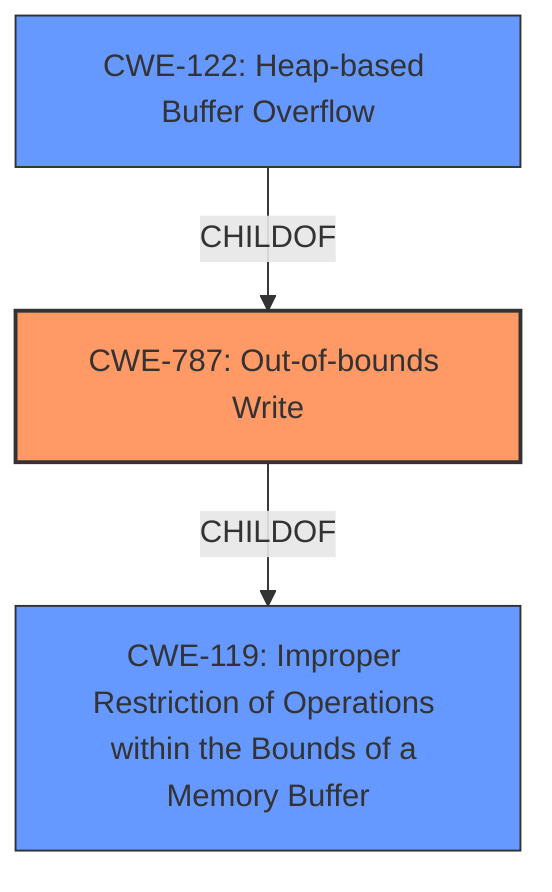

# Raw Analyzer Response for CVE-2021-21154

# Summary
| CWE ID | CWE Name | Confidence | CWE Abstraction Level | CWE Vulnerability Mapping Label | CWE-Vulnerability Mapping Notes |
|---|---|---|---|---|---|
| CWE-787 | Out-of-bounds Write | 1.0 | Base | Allowed | Primary CWE |
| CWE-122 | Heap-based Buffer Overflow | 0.7 | Variant | Allowed | Secondary Candidate |
| CWE-119 | Improper Restriction of Operations within the Bounds of a Memory Buffer | 0.5 | Class | Discouraged | Secondary Candidate |

## Evidence and Confidence

*   **Confidence Score:** 0.9
*   **Evidence Strength:** HIGH

## Relationship Analysis
The primary CWE is CWE-787 **Out-of-bounds Write**, which is a base level CWE. CWE-787 is a child of CWE-119 **Improper Restriction of Operations within the Bounds of a Memory Buffer**. CWE-122 **Heap-based Buffer Overflow** is a variant of CWE-787. The description refers to a heap buffer overflow. CWE-787 is the most specific base CWE to map to.

## Vulnerability Chain
The vulnerability chain starts with a **Heap buffer overflow** (CWE-787), leading to a sandbox escape. The root cause is the **heap buffer overflow**, and the impact is the sandbox escape.

## Summary of Analysis
The initial analysis identified CWE-787 as the primary candidate due to the **Heap buffer overflow** description in the vulnerability details. The CVE Reference Links Content Summary confirms this with the rootCause stating "A heap buffer overflow flaw was found".

CWE-122 was considered as a secondary candidate as the vulnerability is a heap based overflow. However, since CWE-787 is a general **Out-of-bounds Write** and the location of the write is a detail, CWE-787 is the more appropriate primary CWE. The relationship graph helped clarify the hierarchical relationship.

CWE-119 was also considered, but is too general of a class. MITRE's Mapping Guidance discourages the use of CWE-119 and suggests lower-level CWEs such as CWE-787.

The selection of CWE-787 is at the optimal level of specificity because it accurately captures the nature of the vulnerability as an out-of-bounds write, and it is a base level CWE.

Relevant CWE Information:
# Enhanced Context (25 CWEs)
The following CWEs were identified as potentially relevant to this vulnerability:

## CWE-191: Integer Underflow (Wrap or Wraparound)
**Abstraction Level**: Base
**Similarity Score**: 0.78
**Source**: dense

## CWE-805: Buffer Access with Incorrect Length Value
**Abstraction Level**: Base
**Similarity Score**: 0.77
**Source**: dense

## CWE-131: Incorrect Calculation of Buffer Size
**Abstraction Level**: Base
**Similarity Score**: 0.77
**Source**: dense

## CWE-125: Out-of-bounds Read
**Abstraction Level**: Base
**Similarity Score**: 0.76
**Source**: dense

## CWE-126: Buffer Over-read
**Abstraction Level**: Variant
**Similarity Score**: 0.76
**Source**: dense

## CWE-823: Use of Out-of-range Pointer Offset
**Abstraction Level**: Base
**Similarity Score**: 0.76
**Source**: dense

## CWE-197: Numeric Truncation Error
**Abstraction Level**: Base
**Similarity Score**: 0.76
**Source**: dense

## CWE-366: Race Condition within a Thread
**Abstraction Level**: Base
**Similarity Score**: 0.76
**Source**: dense

## CWE-124: Buffer Underwrite ('Buffer Underflow')
**Abstraction Level**: Base
**Similarity Score**: 0.76
**Source**: dense

## CWE-127: Buffer Under-read
**Abstraction Level**: Variant
**Similarity Score**: 0.76
**Source**: dense

## CWE-190: Integer Overflow or Wraparound
**Abstraction Level**: Base
**Similarity Score**: 6686.89
**Source**: sparse

## CWE-125: Out-of-bounds Read
**Abstraction Level**: Base
**Similarity Score**: 6413.84
**Source**: sparse

## CWE-451: User Interface (UI) Misrepresentation of Critical Information
**Abstraction Level**: Class
**Similarity Score**: 6294.12
**Source**: sparse

## CWE-193: Off-by-one Error
**Abstraction Level**: Base
**Similarity Score**: 6257.34
**Source**: sparse

## CWE-119: Improper Restriction of Operations within the Bounds of a Memory Buffer
**Abstraction Level**: Class
**Similarity Score**: 6156.86
**Source**: sparse

## CWE-123: Write-what-where Condition
**Abstraction Level**: base
**Similarity Score**: 4.82
**Source**: graph

## CWE-416: Use After Free
**Abstraction Level**: variant
**Similarity Score**: 4.33
**Source**: graph

## CWE-787: Out-of-bounds Write
**Abstraction Level**: base
**Similarity Score**: 4.33
**Source**: graph

## CWE-825: Expired Pointer Dereference
**Abstraction Level**: base
**Similarity Score**: 4.33
**Source**: graph

## CWE-120: Buffer Copy without Checking Size of Input ('Classic Buffer Overflow')
**Abstraction Level**: base
**Similarity Score**: 4.33
**Source**: graph

## CWE-190: Integer Overflow or Wraparound
**Abstraction Level**: base
**Similarity Score**: 4.33
**Source**: graph

## CWE-170: Improper Null Termination
**Abstraction Level**: base
**Similarity Score**: 4.33
**Source**: graph

## CWE-1284: Improper Validation of Specified Quantity in Input
**Abstraction Level**: base
**Similarity Score**: 4.33
**Source**: graph

## CWE-617: Reachable Assertion
**Abstraction Level**: base
**Similarity Score**: 4.33
**Source**: graph

## CWE-195: Signed to Unsigned Conversion Error
**Abstraction Level**: variant
**Similarity Score**: 3.88
**Source**: graph