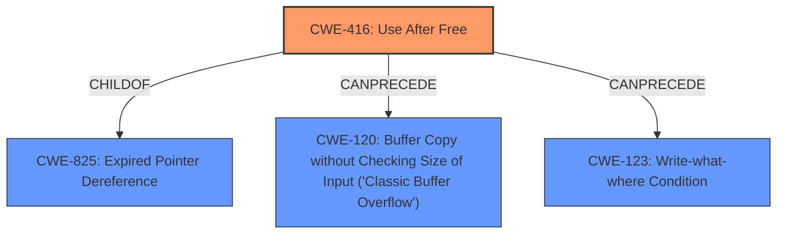

# Enhanced Analysis for CVE-2021-21157

# Summary
| CWE ID  | CWE Name                       | Confidence | CWE Abstraction Level | CWE Vulnerability Mapping Label | CWE-Vulnerability Mapping Notes |
| :------- | :----------------------------- | :--------- | :-------------------- | :------------------------------ | :------------------------------ |
| CWE-416 | Use After Free                 | 1.0       | Variant               | Allowed                         | Primary CWE                    |

## Evidence and Confidence

*   **Confidence Score:** 1.0
*   **Evidence Strength:** HIGH

## Relationship Analysis
The primary weakness, CWE-416 [Use After Free], is a variant-level CWE which accurately reflects the specific vulnerability. It is related to CWE-825 [Expired Pointer Dereference], of which it is a child. The CWE-416 can precede CWE-120 [Buffer Copy without Checking Size of Input ('Classic Buffer Overflow')] and CWE-123 [Write-what-where Condition], indicating potential exploit chains.



## Vulnerability Chain
The vulnerability chain starts with a **use after free** (CWE-416), which leads to heap corruption. The attacker can then exploit this heap corruption via a crafted HTML page, potentially leading to arbitrary code execution.

## Summary of Analysis
The primary CWE is CWE-416 [Use After Free]. This is based on the vulnerability description and the CVE Reference Links Content Summary, both of which explicitly state that the root cause of the vulnerability is a **use after free**.

The vulnerability description states: "**Use after free** in Web Sockets in Google Chrome on Linux prior to 88.0.4324.182 allowed a remote attacker to potentially exploit heap corruption via a crafted HTML page."

The CVE Reference Links Content Summary states:
```
{
  "CVE-2021-21157": {
    "root_cause": "Use after free",
    "vulnerabilities": [
      "Use after free"
    ],
    "impact": "Arbitrary code execution",
     "attack_vectors": [
      "WebSockets"
    ],
    "attacker_capabilities": "An attacker can exploit this vulnerability by crafting malicious content and convincing a user to open it."
  }
}
```

CWE-416 [Use After Free] is a Variant level CWE, which is the preferred level of abstraction for mapping to the root causes of vulnerabilities. The usage is "Allowed" per MITRE mapping guidance. The description of CWE-416 accurately reflects the vulnerability, as it involves reusing or referencing memory after it has been freed.

Other CWEs Considered:

*   CWE-366 [Race Condition within a Thread], CWE-362 [Concurrent Execution using Shared Resource with Improper Synchronization ('Race Condition')], and CWE-364 [Signal Handler Race Condition] were considered but not selected because the vulnerability description does not explicitly mention a race condition. The **use after free** itself is the primary issue, and a race condition isn't necessarily a prerequisite.
*   CWE-122 [Heap-based Buffer Overflow] was considered since the vulnerability allows a remote attacker to potentially exploit heap corruption. However, the root cause is **use after free** which can lead to heap corruption.
*   CWE-843 [Access of Resource Using Incompatible Type ('Type Confusion')] was not selected as the description doesn't indicate type confusion.
*   CWE-1385 [Missing Origin Validation in WebSockets] was not selected because the description focuses on the **use after free** in web sockets, and not on the missing origin validation.
*   CWE-415 [Double Free] was not selected as the root cause is **use after free**.
*   CWE-911 [Improper Update of Reference Count] was not selected as the description doesn't indicate a reference count issue.
*   CWE-451 [User Interface (UI) Misrepresentation of Critical Information] was not selected as the description doesn't indicate a UI issue.

Relevant CWE Information:


## CWE Relationship Analysis

Current CWEs represent these abstraction levels: .


### Vulnerability Chain Analysis

**Chain starting from CWE-415:**
- 415 (Double Free) - ROOT


**Chain starting from CWE-123:**
- 123 (Write-what-where Condition) - ROOT


### CWE Relationship Diagram

```mermaid
graph TD
    classDef primary fill:#f96,stroke:#333,stroke-width:2px
    classDef secondary fill:#69f,stroke:#333
    classDef tertiary fill:#9e9,stroke:#333
```