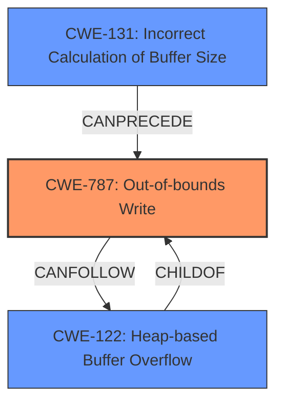

# Enhanced Analysis for CVE-2021-21160

# Summary
| CWE ID  | CWE Name  | Confidence | CWE Abstraction Level | CWE Vulnerability Mapping Label | CWE-Vulnerability Mapping Notes |
|---|---|---|---|---|---|
| CWE-787 | Out-of-bounds Write | 1.0  | Base | Allowed  | Primary CWE |
| CWE-122 | Heap-based Buffer Overflow | 0.75 | Variant | Allowed  | Secondary CWE |
| CWE-131 | Incorrect Calculation of Buffer Size | 0.6 | Base | Allowed | Secondary CWE |

## Evidence and Confidence

*   **Confidence Score:** 0.9
*   **Evidence Strength:** HIGH

## Relationship Analysis

The primary relationship influencing my decision is the parent-child relationship between CWE-787 (Out-of-bounds Write) and CWE-122 (Heap-based Buffer Overflow). Since the vulnerability is explicitly described as a **heap buffer overflow**, CWE-122 is a strong candidate. However, CWE-787 is the direct root cause. CWE-131 describes the **incorrect calculation** of the buffer size, which then leads to the out-of-bounds write.



## Vulnerability Chain

The vulnerability chain starts with an **incorrect calculation of buffer size** (CWE-131). This leads to an **out-of-bounds write** (CWE-787) on the heap, which is then classified as a **heap-based buffer overflow** (CWE-122).

## Summary of Analysis

The initial analysis identified CWE-787 as the primary candidate, supported by the similar CVE descriptions and the "Retriever Results". The vulnerability description explicitly mentions "**Heap buffer overflow**" which aligns well with CWE-787 as the root cause.

The "CVE Reference Links Content Summary" section provides more details:

*   "The vulnerability is a heap-based buffer overflow located in the WebAudio component..."
*   "Specifically, it arises within the blink::AudioDelayDSPKernel::ProcessKRate method."
*   "The vulnerability occurs due to an **incorrect calculation** within the memcpy operation where a negative size is used, causing a large memory copy."
*   "**Heap-based Buffer Overflow**: The primary vulnerability is a heap buffer overflow, meaning that a specially crafted input can write data past the allocated buffer on the heap, potentially overwriting other data structures."
*   "**Incorrect Size Calculation**: The root cause is the incorrect handling of a remainder variable as a signed integer and a failure to validate if buffer_end is smaller than read_pointer, leading to a negative value being used in memcpy which is then cast to size_t, causing it to become very large."

This evidence strongly supports CWE-787 as the primary weakness, as it is the underlying cause of the overflow. CWE-122 is a more specific variant describing the location of the overflow on the heap, and CWE-131 describes the **incorrect calculation** of the buffer size which is a CANPRECEDE weakness.

The selected CWEs are at the optimal level of specificity:

*   CWE-787 is a base CWE that accurately describes the out-of-bounds write.
*   CWE-122 is a variant that specifies that the overflow occurs on the heap.
*   CWE-131 describes the **incorrect calculation** of the buffer size which is a CANPRECEDE weakness.

I am overriding the guidance to select CWE-119. The mapping guidance says, "**Usage:** Discouraged" and "**Rationale:** CWE-119 is commonly misused in low-information vulnerability reports when lower-level CWEs could be used instead, or when more details about the vulnerability are available."

Relevant CWE Information:

# Enhanced Context (25 CWEs)
The following CWEs were identified as potentially relevant to this vulnerability:

## CWE-226: Sensitive Information in Resource Not Removed Before Reuse
**Abstraction Level**: Base
**Similarity Score**: 0.76
**Source**: dense

**Description**:
The product releases a resource such as memory or a file so that it can be made available for reuse, but it does not clear or "zeroize" the information contained in the resource before the product performs a critical state transition or makes the resource available for reuse by other entities.

**Mapping Guidance**:
- Usage: Allowed
- Rationale: This CWE entry is at the Base level of abstraction, which is a preferred level of abstraction for mapping to the root causes of vulnerabilities.

## CWE-415: Double Free
**Abstraction Level**: Variant
**Similarity Score**: 0.76
**Source**: dense

**Description**:
The product calls free() twice on the same memory address, potentially leading to modification of unexpected memory locations.

**Mapping Guidance**:
- Usage: Allowed
- Rationale: This CWE entry is at the Variant level of abstraction, which is a preferred level of abstraction for mapping to the root causes of vulnerabilities.

## CWE-131: Incorrect Calculation of Buffer Size
**Abstraction Level**: Base
**Similarity Score**: 0.75
**Source**: dense

**Description**:
The product does not correctly calculate the size to be used when allocating a buffer, which could lead to a buffer overflow.

**Mapping Guidance**:
- Usage: Allowed
- Rationale: This CWE entry is at the Base level of abstraction, which is a preferred level of abstraction for mapping to the root causes of vulnerabilities.

## CWE-404: Improper Resource Shutdown or Release
**Abstraction Level**: Class
**Similarity Score**: 0.75
**Source**: dense

**Description**:
The product does not release or incorrectly releases a resource before it is made available for re-use.

**Mapping Guidance**:
- Usage: Allowed-with-Review
- Rationale: This CWE entry is a Class and might have Base-level children that would be more appropriate

## CWE-366: Race Condition within a Thread
**Abstraction Level**: Base
**Similarity Score**: 0.75
**Source**: dense

**Description**:
If two threads of execution use a resource simultaneously, there exists the possibility that resources may be used while invalid, in turn making the state of execution undefined.

**Mapping Guidance**:
- Usage: Allowed
- Rationale: This CWE entry is at the Base level of abstraction, which is a preferred level of abstraction for mapping to the root causes of vulnerabilities.

## CWE-193: Off-by-one Error
**Abstraction Level**: Base
**Similarity Score**: 0.74
**Source**: dense

**Description**:
A product calculates or uses an incorrect maximum or minimum value that is 1 more, or 1 less, than the correct value.

**Mapping Guidance**:
- Usage: Allowed
- Rationale: This CWE entry is at the Base level of abstraction, which is a preferred level of abstraction for mapping to the root causes of vulnerabilities.

## CWE-191: Integer Underflow (Wrap or Wraparound)
**Abstraction Level**: Base
**Similarity Score**: 0.74
**Source**: dense

**Description**:
The product subtracts one value from another, such that the result is less than the minimum allowable integer value, which produces a value that is not equal to the correct result.

**Mapping Guidance**:
- Usage: Allowed
- Rationale: This CWE entry is at the Base level of abstraction, which is a preferred level of abstraction for mapping to the root causes of vulnerabilities.

## CWE-124: Buffer Underwrite ('Buffer Underflow')
**Abstraction Level**: Base
**Similarity Score**: 0.74
**Source**: dense

**Description**:
The product writes to a buffer using an index or pointer that references a memory location prior to the beginning of the buffer.

**Mapping Guidance**:
- Usage: Allowed
- Rationale: This CWE entry is at the Base level of abstraction, which is a preferred level of abstraction for mapping to the root causes of vulnerabilities.

## CWE-667: Improper Locking
**Abstraction Level**: Class
**Similarity Score**: 0.74
**Source**: dense

**Description**:
The product does not properly acquire or release a lock on a resource, leading to unexpected resource state changes and behaviors.

**Mapping Guidance**:
- Usage: Allowed-with-Review
- Rationale: This CWE entry is a Class and might have Base-level children that would be more appropriate

## CWE-125: Out-of-bounds Read
**Abstraction Level**: Base
**Similarity Score**: 0.7


## CWE Relationship Analysis

Current CWEs represent these abstraction levels: .


### Vulnerability Chain Analysis

**Chain starting from CWE-667:**
- 667 (Improper Locking) - ROOT


**Chain starting from CWE-787:**
- 787 (Out-of-bounds Write) - ROOT


### CWE Relationship Diagram

```mermaid
graph TD
    classDef primary fill:#f96,stroke:#333,stroke-width:2px
    classDef secondary fill:#69f,stroke:#333
    classDef tertiary fill:#9e9,stroke:#333
```