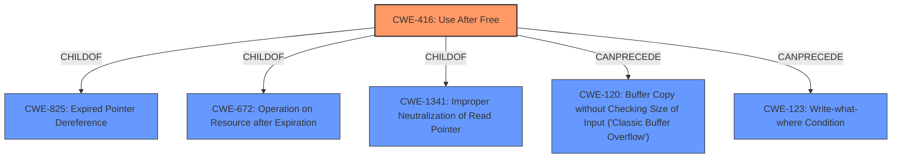

# Analysis Report for CVE-2021-21162

# Vulnerability Analysis Report: CVE-2021-21162

## Description


## Analysis (with Relationship Data)

# Summary
| CWE ID | CWE Name | Confidence | CWE Abstraction Level | CWE Vulnerability Mapping Label | CWE-Vulnerability Mapping Notes |
|---|---|---|---|---|---|
| CWE-416 | Use After Free | 1.0 | Variant | Allowed | Primary CWE |

## Evidence and Confidence

*   **Confidence Score:** 1.0
*   **Evidence Strength:** HIGH

## Relationship Analysis
The primary relationship is the ChildOf relationship where CWE-416 is a child of CWE-825 (Expired Pointer Dereference), CWE-672 (Operation on Resource after Expiration), and CWE-1341 (Improper Neutralization of Read Pointer). CWE-416 can precede CWE-120 (Buffer Copy without Checking Size of Input ('Classic Buffer Overflow')) and CWE-123 (Write-what-where Condition). The selection of CWE-416 as a Variant provides a specific classification of the **use-after-free** vulnerability.



## Vulnerability Chain
The vulnerability chain starts with a **use-after-free** condition in WebRTC, which can lead to heap corruption.

## Summary of Analysis
The vulnerability description clearly states "**Use after free**" as the root cause. The CVE Reference Links Content Summary confirms "**Use after free in WebRTC**" as the root cause. The primary CWE match from similar CVE descriptions is CWE-416. The retriever results list CWE-416 as the top combined result. CWE-416 is a Variant, which is a preferred level of abstraction.

The analysis is based on the provided evidence, including the vulnerability description, key phrases, and CVE reference summary.

CWE-416 aligns directly with the vulnerability description and supporting evidence.

Other CWEs considered but not used:
*   CWE-366, CWE-122, CWE-843, CWE-415, CWE-1021, CWE-123, CWE-362, CWE-911, CWE-404: These CWEs are not as directly related to the identified **use-after-free** condition as CWE-416.


## CWE Relationship Analysis

Current CWEs represent these abstraction levels: .


### Vulnerability Chain Analysis

**Chain starting from CWE-415:**
- 415 (Double Free) - ROOT


**Chain starting from CWE-123:**
- 123 (Write-what-where Condition) - ROOT


### CWE Relationship Diagram

```mermaid
graph TD
    classDef primary fill:#f96,stroke:#333,stroke-width:2px
    classDef secondary fill:#69f,stroke:#333
    classDef tertiary fill:#9e9,stroke:#333
```


*Report generated on 2025-04-02 09:55:22*
