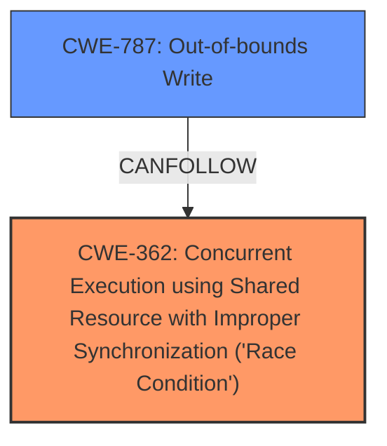

# Analysis Report for CVE-2021-21165

# Vulnerability Analysis Report: CVE-2021-21165

## Description


## Analysis (with Relationship Data)

# Summary
| CWE ID | CWE Name | Confidence | CWE Abstraction Level | CWE Vulnerability Mapping Label | CWE-Vulnerability Mapping Notes |
|---|---|---|---|---|---|
| CWE-362 | Concurrent Execution using Shared Resource with Improper Synchronization ('Race Condition') | 0.8 | Class | Allowed-with-Review | Primary CWE |
| CWE-787 | Out-of-bounds Write | 0.6 | Base | Allowed | Secondary Candidate |

## Evidence and Confidence

*   **Confidence Score:** 0.7
*   **Evidence Strength:** MEDIUM

## Relationship Analysis
The primary relationship considered was the parent-child relationship between CWE-362 (Class) and its potential base-level children. While the description points to a data race, the specific nature of the race and its exploitation leading to heap corruption suggests a potential out-of-bounds write. This connects CWE-362 to CWE-787 through a "CanLeadTo" relationship, where a race condition can lead to memory corruption vulnerabilities.



## Vulnerability Chain
The vulnerability chain starts with a **data race** (CWE-362) in the audio component of Google Chrome. This leads to **heap corruption**, potentially exploitable via a crafted HTML page. The heap corruption can then manifest as an out-of-bounds write (CWE-787) leading to arbitrary code execution.

## Summary of Analysis
The initial assessment identified CWE-362 as the primary candidate due to the explicitly mentioned **data race**. The "CWE for similar CVE Descriptions" section also lists CWE-362 as the primary match. However, the impact of the race condition is **heap corruption**, which hints at a potential memory corruption issue, specifically **Out-of-bounds Write (CWE-787)**.

The provided evidence from the CVE reference links content summary states: "Object lifecycle issue in the audio component" and "Weaknesses: Object lifecycle issue". It is important to note that the term "object lifecycle issue" by itself does not strongly imply a race condition, it could also be a Use-After-Free.

Given the **data race** and **heap corruption**, CWE-362 is a plausible primary cause. However, since the vulnerability is triggered via a crafted HTML page and results in heap corruption, it indicates a possibility of memory corruption through out-of-bounds write. Therefore, CWE-787 could be a secondary candidate to describe the final impact of the vulnerability.

The choice of CWE-362 and CWE-787 is based on the available evidence and the understanding that data races can often lead to memory corruption issues.

Relevant CWE Information:

# Enhanced Context (25 CWEs)

## CWE-366: Race Condition within a Thread
**Abstraction Level**: Base
**Similarity Score**: 0.79
**Source**: dense

**Description**:
If two threads of execution use a resource simultaneously, there exists the possibility that resources may be used while invalid, in turn making the state of execution undefined.

**Mapping Guidance**:
- Usage: Allowed
- Rationale: This CWE entry is at the Base level of abstraction, which is a preferred level of abstraction for mapping to the root causes of vulnerabilities.

*   Not Selected: While related, CWE-366 is more specific to thread-level race conditions, and the initial description doesn't provide enough detail to confirm this level of specificity. CWE-362 is a more general Class-level CWE.

## CWE-362: Concurrent Execution using Shared Resource with Improper Synchronization ('Race Condition')
**Abstraction Level**: Class
**Similarity Score**: 0.77
**Source**: dense

**Description**:
The product contains a concurrent code sequence that requires temporary, exclusive access to a shared resource, but a timing window exists in which the shared resource can be modified by another code sequence operating concurrently.

**Mapping Guidance**:
- Usage: Allowed-with-Review
- Rationale: This CWE entry is a Class and might have Base-level children that would be more appropriate

*   Selected: The vulnerability description explicitly states "Data race". This matches the CWE description perfectly.

## CWE-367: Time-of-check Time-of-use (TOCTOU) Race Condition
**Abstraction Level**: Base
**Similarity Score**: 0.76
**Source**: dense

**Description**:
The product checks the state of a resource before using that resource, but the resource's state can change between the check and the use in a way that invalidates the results of the check. This can cause the product to perform invalid actions when the resource is in an unexpected state.

**Mapping Guidance**:
- Usage: Allowed
- Rationale: This CWE entry is at the Base level of abstraction, which is a preferred level of abstraction for mapping to the root causes of vulnerabilities.

*   Not Selected: TOCTOU is a specific type of race condition, and there's no specific indication of a check-then-use scenario in the description.

## CWE-787: Out-of-bounds Write
**Abstraction Level**: Base
**Similarity Score**: 0.76
**Source**: dense

**Description**:
The product writes data past the end, or before the beginning, of the intended buffer.

**Mapping Guidance**:
- Usage: Allowed
- Rationale: This CWE entry is at the Base level of abstraction, which is a preferred level of abstraction for mapping to the root causes of vulnerabilities.

*   Selected: The impact of the data race is heap corruption which could be caused by writing beyond buffer boundaries.

## CWE-415: Double Free
**Abstraction Level**: Variant
**Similarity Score**: 6866.19
**Source**: sparse

**Description**:
The product calls free() twice on the same memory address, potentially leading to modification of unexpected memory locations.

**Mapping Guidance**:
- Usage: Allowed
- Rationale: This CWE entry is at the Variant level of abstraction, which is a preferred level of abstraction for mapping to the root causes of vulnerabilities.

*   Not Selected: The description specifies heap corruption, which is more indicative of out-of-bounds writes than double-free.

## CWE-120: Buffer Copy without Checking Size of Input ('Classic Buffer Overflow')
**Abstraction Level**: base
**Similarity Score**: 4.33
**Source**: graph

**Description**:
CWE-120: Buffer Copy without Checking Size of Input ('Classic Buffer Overflow')

**Mapping Guidance**:
- Usage: Allowed-with-Review
- Rationale: There are some indications that this CWE ID might be misused and selected simply because it mentions "buffer overflow" - an increasingly vague term. This CWE entry is only appropriate for "Buffer Copy" operations (not buffer reads), in which where there is no "Checking [the] Size of Input", and (by implication of the copy) writing past the end of the buffer.

*   Not Selected: Although buffer overflows can lead to heap corruption, the description doesn't mention any explicit buffer copy operation.

## CWE-416: Use After Free
**Abstraction Level**: Variant
**Status:** Stable

### Description
The product reuses or references memory after it has been freed. At some point afterward, the memory may be allocated again and saved in another pointer, while the original pointer references a location somewhere within the new allocation. Any operations using the original pointer are no longer valid because the memory "belongs" to the code that operates on the new pointer.

### Extended Description
Not provided

### Alternative Terms
Dangling pointer: a pointer that no longer points to valid memory, often after it has been freed
UAF: commonly used acronym for Use After Free
Use-After-Free

### Relationships
ChildOf -> CWE-825
ChildOf -> CWE-672
ChildOf -> CWE-672
ChildOf -> CWE-672
CanPrecede -> CWE-120
CanPrecede -> CWE-123

### Mapping Guidance
**Usage:** Allowed
**Rationale:** This CWE entry is at the Variant level of abstraction, which is a preferred level of abstraction for mapping to the root causes of vulnerabilities.
**Comments:** Carefully read both the name and description to ensure that this mapping is an appropriate fit. Do not try to 'force' a mapping to a lower-level Base/Variant simply to comply with this preferred level of abstraction.
**Reasons:**
- Acceptable-Use

*   Not Selected: Although UAF can lead to memory corruption, the description doesn't explicitly say that memory is freed.


## CWE Relationship Analysis

Current CWEs represent these abstraction levels: .


### Vulnerability Chain Analysis

**Chain starting from CWE-415:**
- 415 (Double Free) - ROOT


**Chain starting from CWE-787:**
- 787 (Out-of-bounds Write) - ROOT


### CWE Relationship Diagram

```mermaid
graph TD
    classDef primary fill:#f96,stroke:#333,stroke-width:2px
    classDef secondary fill:#69f,stroke:#333
    classDef tertiary fill:#9e9,stroke:#333
```


*Report generated on 2025-04-02 15:12:40*
