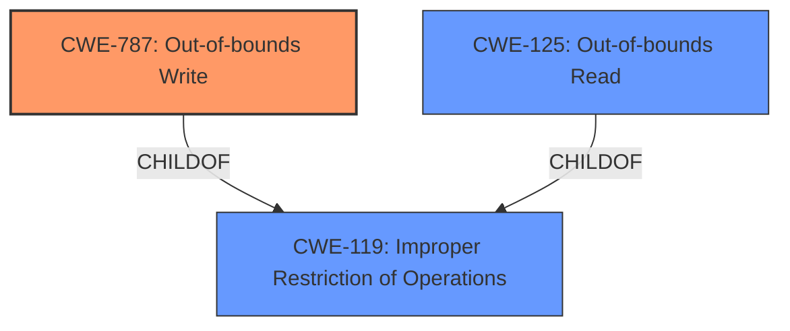

# Raw Analyzer Response for CVE-2021-21169

# Summary
| CWE ID  | CWE Name                                                                                        | Confidence | CWE Abstraction Level | CWE Vulnerability Mapping Label | CWE-Vulnerability Mapping Notes |
| :-------- | :---------------------------------------------------------------------------------------------- | :--------- | :---------------------- | :------------------------------ | :------------------------------ |
| CWE-787   | Out-of-bounds Write                                                                            | 1          | Base                    | Primary CWE                     | Allowed                       |
| CWE-125   | Out-of-bounds Read                                                                             | 0.5         | Base                    | Secondary Candidate             | Allowed                       |
| CWE-119   | Improper Restriction of Operations within the Bounds of a Memory Buffer                        | 0.3         | Class                   | Secondary Candidate             | Discouraged                     |

## Evidence and Confidence

*   **Confidence Score:** 0.9
*   **Evidence Strength:** HIGH

## Relationship Analysis
The primary CWE, CWE-787 **Out-of-bounds Write**, is a child of CWE-119 **Improper Restriction of Operations within the Bounds of a Memory Buffer**, which is a more general class of weakness. CWE-787 is the more specific weakness and more appropriate. CWE-125 **Out-of-bounds Read** is also a child of CWE-119 and a peer of CWE-787, representing a similar but distinct type of memory access error. The relationship analysis confirms that the vulnerability involves out-of-bounds access, specifically writing, making CWE-787 a more precise classification than its parent CWE-119.

## Vulnerability Chain
The vulnerability chain involves an initial cause and its subsequent effect:
  - Root Cause: Out-of-bounds memory access due to a flaw in the V8 JavaScript library.
  - Weakness: **Out-of-bounds Write** (CWE-787) leading to memory corruption.
  - Impact: Potential arbitrary code execution.

## Summary of Analysis
The initial assessment identified **Out of bounds memory access** as the primary weakness, aligning with CWE-787 **Out-of-bounds Write**. The vulnerability description specifically mentions that it allowed a remote attacker to potentially perform out of bounds memory access, indicating a writing operation rather than just reading. The "CVE Reference Links Content Summary" section reinforces this by stating that the root cause is an out-of-bounds memory access flaw exists in the V8 JavaScript library used by Chromium.

The retriever results listed CWE-787 **Out-of-bounds Write** with a good score, and it is also the "Primary CWE Match" based on similar CVE Descriptions.

CWE-119 **Improper Restriction of Operations within the Bounds of a Memory Buffer** was considered but not used as the primary CWE because it is too general. The description specifies "out of bounds memory access" which is more accurately captured by the base CWE-787. While the retriever results had a good score for CWE-119, the mapping guidance discourages its use when more specific CWEs are available.

CWE-125 **Out-of-bounds Read** was considered because out-of-bounds memory access could involve reading, but the description does not specifically state a read operation. Confidence in this mapping is lower because the description focuses on the potential to perform out of bounds memory access, which implies a write operation.

Therefore, CWE-787 **Out-of-bounds Write** is the optimal level of specificity and accurately captures the nature of the vulnerability.