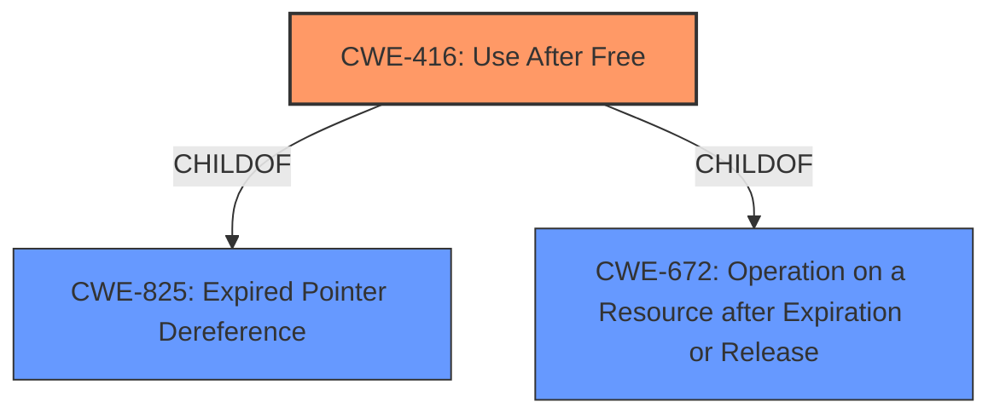

# Enhanced Analysis for CVE-2021-21179

# Summary
| CWE ID  | CWE Name                                                                                                 | Confidence | CWE Abstraction Level | CWE Vulnerability Mapping Label | CWE-Vulnerability Mapping Notes |
| :-------- | :--------------------------------------------------------------------------------------------------------- | :---------- | :---------------------- | :------------------------------ | :-------------------------------- |
| CWE-416 | Use After Free                                                                                             | 1          | Variant               | Allowed                         | Primary CWE                       |
| CWE-672 | Operation on a Resource after Expiration or Release                                                       | 0.7         | Class                 | Allowed-with-Review             | Secondary Candidate                 |
| CWE-825 | Expired Pointer Dereference                                                                                 | 0.6         | Base                  | Allowed                         | Secondary Candidate                 |

## Evidence and Confidence

*   **Confidence Score:** 0.9
*   **Evidence Strength:** HIGH

## Relationship Analysis
The primary CWE is CWE-416 (**Use After Free**), a Variant of CWE-825 (**Expired Pointer Dereference**) and CWE-672 (**Operation on a Resource after Expiration or Release**). The vulnerability description and reference links explicitly mention "use after free," making CWE-416 the most specific and appropriate choice. CWE-825 and CWE-672 are broader classifications that could apply, but CWE-416 provides a more precise characterization of the **weakness**. The Retriever Results also supports CWE-416 as the top candidate.



## Vulnerability Chain
The vulnerability chain starts with the **Use After Free** condition (CWE-416) in the Network Internals component, potentially leading to heap corruption and arbitrary code execution. The chain is:

1.  **Root Cause:** Use After Free (CWE-416)
2.  **Impact:** Heap corruption, arbitrary code execution

## Summary of Analysis
The analysis is strongly based on the provided evidence. The vulnerability description clearly states "**Use after free**" and the "CVE Reference Links Content Summary" confirms the "**root_cause**" as "Use after free vulnerability". The Retriever Results further supports CWE-416 as the top candidate.

The hierarchical relationships influenced the selection by confirming that CWE-416 is a more specific Variant of the broader Class CWE-672 and Base CWE-825. This level of specificity is preferred as per MITRE's mapping guidance.

*   **CWE-416: Use After Free** - This is the primary CWE because the vulnerability description explicitly mentions "use after free," aligning perfectly with the CWE's description. The "CVE Reference Links Content Summary" also confirms it. The impact of heap corruption further supports this classification.
*   **CWE-672: Operation on a Resource after Expiration or Release** - This CWE was considered as a parent of CWE-416. While applicable, it's less specific than CWE-416.
*   **CWE-825: Expired Pointer Dereference** - This CWE was also considered as a parent of CWE-416 and describes the underlying mechanism of using a pointer after the memory it points to has been freed. However, CWE-416 is a more specific description of the vulnerability.
*   **CWE-366: Race Condition within a Thread** - This CWE was considered because use-after-free vulnerabilities can sometimes be triggered by race conditions. However, there's no explicit mention of a race condition in the provided vulnerability description or reference links. Therefore, it's not included in the final mapping.
*   **CWE-415: Double Free** - This CWE was considered because it's another type of memory corruption vulnerability. However, the vulnerability description specifically mentions "use after free," not a double free. Therefore, it's not included in the final mapping.
*   **CWE-123: Write-what-where Condition** - This CWE was considered because use-after-free can potentially lead to an arbitrary write condition. However, this is a potential consequence rather than the direct cause of the vulnerability. Therefore, it's not included in the final mapping.
*   **CWE-843: Access of Resource Using Incompatible Type ('Type Confusion')** - This CWE was considered due to the potential for memory corruption. However, the core issue is the use of freed memory, not the access of a resource with an incompatible type. Therefore, it's not included in the final mapping.
*   **CWE-911: Improper Update of Reference Count** - While reference counting issues could lead to premature freeing of memory, there's no indication of this in the description. Thus, this CWE is not selected.
*   **CWE-252: Unchecked Return Value** - There is no evidence to suggest that an unchecked return value is the cause of the vulnerability.

The selected CWEs are at the optimal level of specificity because CWE-416 directly reflects the stated **weakness** (**Use After Free**), while the other considered CWEs are either too general or not directly supported by the provided evidence. The confidence in this assessment is high (0.9) due to the explicit mention of "use after free" in the vulnerability description and reference links.


## CWE Relationship Analysis

Current CWEs represent these abstraction levels: .


### Vulnerability Chain Analysis

**Chain starting from CWE-415:**
- 415 (Double Free) - ROOT


**Chain starting from CWE-123:**
- 123 (Write-what-where Condition) - ROOT


### CWE Relationship Diagram

```mermaid
graph TD
    classDef primary fill:#f96,stroke:#333,stroke-width:2px
    classDef secondary fill:#69f,stroke:#333
    classDef tertiary fill:#9e9,stroke:#333
```