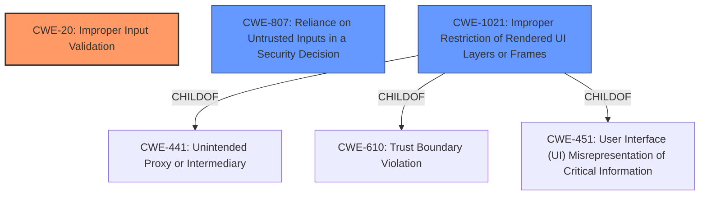

# Enhanced Analysis for CVE-2021-21182

# Summary
| CWE ID | CWE Name | Confidence | CWE Abstraction Level | CWE Vulnerability Mapping Label | CWE-Vulnerability Mapping Notes |
|---|---|---|---|---|---|
| CWE-20 | Improper Input Validation | 0.9 | Base | Primary | Allowed |
| CWE-807 | Reliance on Untrusted Inputs in a Security Decision | 0.7 | Base | Secondary | Allowed |
| CWE-1021 | Improper Restriction of Rendered UI Layers or Frames | 0.6 | Base | Secondary | Allowed |

## Evidence and Confidence

*   **Confidence Score:** 0.8
*   **Evidence Strength:** MEDIUM

## Relationship Analysis
The primary CWE is CWE-20, which is a base-level CWE. The secondary CWEs, CWE-807 and CWE-1021, are also base-level CWEs. CWE-20 is a very general CWE and the other two help to add more context.
CWE-1021 is a child of CWE-441, CWE-610 and CWE-451.



## Vulnerability Chain
The vulnerability chain begins with **insufficient policy enforcement** (CWE-20), leading to a bypass of navigation restrictions. The attacker leverages a crafted HTML page to exploit this weakness.

## Summary of Analysis
The initial assessment, based on the **Vulnerability Description Key Phrases**, pointed to **insufficient policy enforcement** as the root cause and bypassing navigation restrictions as the impact.

The primary CWE match from the "CWE for similar CVE Descriptions" section was CWE-20 (Improper Input Validation).

The **CVE Reference Links Content Summary** confirms that the root cause is indeed **insufficient policy enforcement** in the navigations component.

The Retriever Results suggested several potential CWEs.

The final decision was to select CWE-20 as the primary CWE, supplemented by CWE-807 and CWE-1021 to provide additional context.

*   **CWE-20: Improper Input Validation**
    *   The vulnerability stems from **insufficient policy enforcement** during navigations, which aligns with CWE-20's description of failing to validate input properly.
    *   The security implication is the ability to bypass navigation restrictions, potentially leading to unauthorized access or actions.
    *   CWE-20 is a base-level CWE, appropriate for capturing the general input validation issue.
    *   The description states "**Insufficient policy enforcement** in navigations in Google Chrome prior to 89.0.4389.72 allowed a remote attacker who had compromised the renderer process to bypass navigation restrictions via a crafted HTML page."
*   **CWE-807: Reliance on Untrusted Inputs in a Security Decision**
    *   The browser relies on inputs related to navigation policy, but these inputs can be manipulated by an attacker who has compromised the renderer process. This aligns with CWE-807.
    *   The attacker uses a crafted HTML page, demonstrating their ability to influence the inputs used in the security decision.
    *   CWE-807 is a base-level CWE, which fits the level of detail available.
*   **CWE-1021: Improper Restriction of Rendered UI Layers or Frames**
    *   The attacker crafts an HTML page that bypasses navigation restrictions. This suggests the attacker could be manipulating how the UI is rendered to trick the user.
    *   CWE-1021 focuses on issues with frame objects or UI layers, which are relevant given the use of a crafted HTML page.
    *   This CWE helps refine the description of the attack, beyond general input validation.

The selected CWEs are at the optimal level of specificity, providing a clear and accurate representation of the vulnerability based on the available evidence.


## CWE Relationship Analysis

Current CWEs represent these abstraction levels: .


### Vulnerability Chain Analysis

**Chain starting from CWE-807:**
- 807 (Reliance on Untrusted Inputs in a Security Decision) - ROOT


**Chain starting from CWE-1021:**
- 1021 (Improper Restriction of Rendered UI Layers or Frames) - ROOT


### CWE Relationship Diagram

```mermaid
graph TD
    classDef primary fill:#f96,stroke:#333,stroke-width:2px
    classDef secondary fill:#69f,stroke:#333
    classDef tertiary fill:#9e9,stroke:#333
```