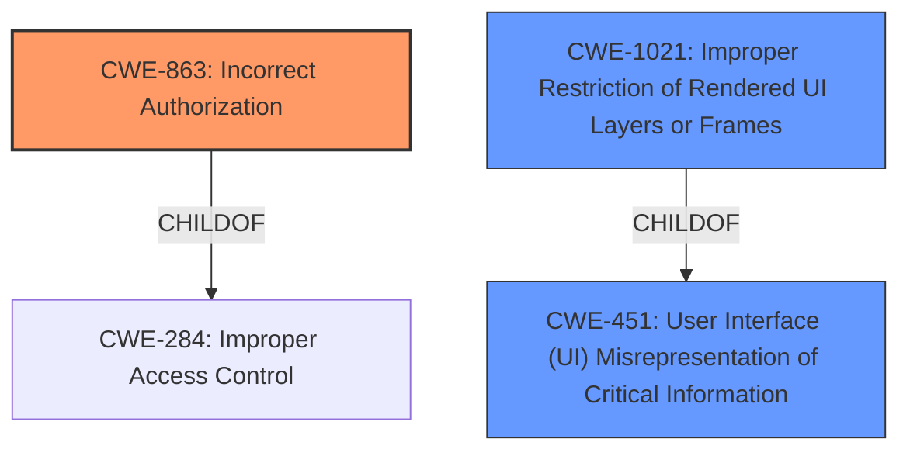

# Raw Analyzer Response for CVE-2021-21186

# Summary
| CWE ID | CWE Name | Confidence | CWE Abstraction Level | CWE Vulnerability Mapping Label | CWE-Vulnerability Mapping Notes |
|---|---|---|---|---|---|
| CWE-863 | Incorrect Authorization | 0.8 | Class | Primary | Allowed-with-Review |
| CWE-1021 | Improper Restriction of Rendered UI Layers or Frames | 0.6 | Base | Secondary | Allowed |
| CWE-451 | User Interface (UI) Misrepresentation of Critical Information | 0.5 | Class | Secondary | Allowed-with-Review |

## Evidence and Confidence

*   **Confidence Score:** 0.7
*   **Evidence Strength:** HIGH

## Relationship Analysis
The primary CWE, CWE-863 (Incorrect Authorization), is a Class-level CWE with potential base-level children that could provide a more specific classification. CWE-863 is related to CWE-284 (Improper Access Control), which is a Pillar-level CWE. However, CWE-284 is discouraged because it is too high-level. CWE-1021 (Improper Restriction of Rendered UI Layers or Frames) is a Base-level CWE, which is desirable. CWE-451 (User Interface (UI) Misrepresentation of Critical Information) is a Class-level CWE, with potential base-level children. CWE-1021 is a child of CWE-451, suggesting a potential link between frame restriction issues and UI misrepresentation.

## Vulnerability Chain
The vulnerability chain starts with **insufficient policy enforcement** in the QR scanning functionality, leading to a bypass of navigation restrictions. The root cause is the **lack of proper authorization**, which allows the attacker to craft a QR code that circumvents the intended security policies. The UI displays misleading information, and the application does not properly restrict frames, which can potentially lead to user interface misrepresentation and clickjacking attacks.

## Summary of Analysis
The initial analysis indicates that the vulnerability involves **insufficient policy enforcement**, leading to a bypass of navigation restrictions through a crafted QR code. The primary CWE selected is CWE-863 (Incorrect Authorization) due to the **lack of proper authorization checks**. The vulnerability description states "**Insufficient policy enforcement** in QR scanning...allowed an attacker...to bypass navigation restrictions via a crafted QR code."

CWE-1021 (Improper Restriction of Rendered UI Layers or Frames) is considered as a secondary CWE, as the vulnerability could potentially lead to clickjacking attacks or UI redress attacks. However, the evidence for this is indirect and depends on the specific implementation of the QR scanning functionality.

CWE-451 (User Interface (UI) Misrepresentation of Critical Information) is also considered as a secondary CWE because a crafted QR code could potentially lead to the UI displaying misleading information, but this is not explicitly stated in the vulnerability description.

The selected CWEs are at an appropriate level of specificity, with CWE-863 being a Class-level CWE that captures the general authorization issue and CWE-1021 being a more specific Base-level CWE.

Relevant CWE Information:

# Enhanced Context (25 CWEs)

## CWE-1220: Insufficient Granularity of Access Control
**Abstraction Level**: Base
**Similarity Score**: 0.77
**Source**: dense

**Description**:
The product implements access controls via a policy or other feature with the intention to disable or restrict accesses (reads and/or writes) to assets in a system from untrusted agents. However, implemented access controls lack required granularity, which renders the control policy too broad because it allows accesses from unauthorized agents to the security-sensitive assets.

**Mapping Guidance**:
- Usage: Allowed
- Rationale: This CWE entry is at the Base level of abstraction, which is a preferred level of abstraction for mapping to the root causes of vulnerabilities.

*Analysis:* While related to authorization, the focus on "granularity" is not the primary issue in the provided vulnerability description.

## CWE-274: Improper Handling of Insufficient Privileges
**Abstraction Level**: Base
**Similarity Score**: 0.76
**Source**: dense

**Description**:
The product does not handle or incorrectly handles when it has insufficient privileges to perform an operation, leading to resultant weaknesses.

**Mapping Guidance**:
- Usage: Discouraged
- Rationale: This CWE entry could be deprecated in a future version of CWE.

*Analysis:* This doesn't seem to be a case of the software not handling its own lack of privileges, but rather a user being able to bypass intended restrictions.

## CWE-451: User Interface (UI) Misrepresentation of Critical Information
**Abstraction Level**: Class
**Similarity Score**: 0.76
**Source**: dense

**Description**:
The user interface (UI) does not properly represent critical information to the user, allowing the information - or its source - to be obscured or spoofed. This is often a component in phishing attacks.

**Mapping Guidance**:
- Usage: Allowed-with-Review
- Rationale: This CWE entry is a Class and might have Base-level children that would be more appropriate

*Analysis:* The vulnerability *could* involve UI misrepresentation, as a crafted QR code might lead the user to believe they are navigating to a safe location. However, this is a potential impact, not the root cause.

## CWE-653: Improper Isolation or Compartmentalization
**Abstraction Level**: Class
**Similarity Score**: 0.76
**Source**: dense

**Description**:
The product does not properly compartmentalize or isolate functionality, processes, or resources that require different privilege levels, rights, or permissions.

**Mapping Guidance**:
- Usage: Allowed
- Rationale: This CWE entry is at the Base level of abstraction, which is a preferred level of abstraction for mapping to the root causes of vulnerabilities.

*Analysis:* While isolation issues *could* be present, the primary issue is that the policy enforcement is insufficient.

## CWE-668: Exposure of Resource to Wrong Sphere
**Abstraction Level**: Class
**Similarity Score**: 0.76
**Source**: dense

**Description**:
The product exposes a resource to the wrong control sphere, providing unintended actors with inappropriate access to the resource.

**Mapping Guidance**:
- Usage: Discouraged
- Rationale: CWE-668 is high-level and is often misused as a catch-all when lower-level CWE IDs might be applicable. It is sometimes used for low-information vulnerability reports [REF-1287]. It is a level-1 Class (i.e., a child of a Pillar). It is not useful for trend analysis.

*Analysis:* Too general, and other CWEs are more applicable.

## CWE-639: Authorization Bypass Through User-Controlled Key
**Abstraction Level**: Base
**Similarity Score**: 0.75
**Source**: dense

**Description**:
The system's authorization functionality does not prevent one user from gaining access to another user's data or record by modifying the key value identifying the data.

**Mapping Guidance**:
- Usage: Allowed
- Rationale: This CWE entry is at the Base level of abstraction, which is a preferred level of abstraction for mapping to the root causes of vulnerabilities.

*Analysis:* This CWE is too specific; it doesn't fit the QR code scenario.

## CWE-41: Improper Resolution of Path Equivalence
**Abstraction Level**: Base
**Similarity Score**: 0.75
**Source**: dense

**Description**:
The product is vulnerable to file system contents disclosure through path equivalence. Path equivalence involves the use of special characters in file and directory names. The associated manipulations are intended to generate multiple names for the same object.

**Mapping Guidance**:
- Usage: Allowed
- Rationale: This CWE entry is at the Base level of abstraction, which is a preferred level of abstraction for mapping to the root causes of vulnerabilities.

*Analysis:* This CWE is not applicable to the QR code scenario.

## CWE-280: Improper Handling of Insufficient Permissions or Privileges
**Abstraction Level**: Base
**Similarity Score**: 0.75
**Source**: dense

**Description**:
The product does not handle or incorrectly handles when it has insufficient privileges to access resources or functionality as specified by their permissions. This may cause it to follow unexpected code paths that may leave the product in an invalid state.

**Mapping Guidance**:
- Usage: Allowed
- Rationale: This CWE entry is at the Base level of abstraction, which is a preferred level of abstraction for mapping