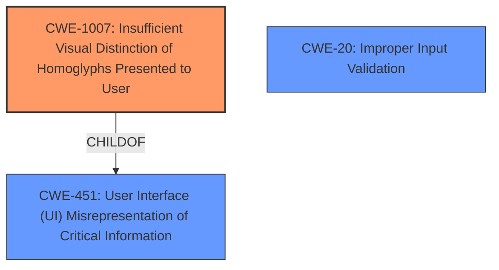

# Analysis Report for CVE-2021-21187

# Vulnerability Analysis Report: CVE-2021-21187

## Description


## Analysis (with Relationship Data)

# Summary
| CWE ID    | CWE Name                                                      | Confidence | CWE Abstraction Level | CWE Vulnerability Mapping Label | CWE-Vulnerability Mapping Notes |
| :-------- | :------------------------------------------------------------ | :--------- | :---------------------- | :------------------------------ | :------------------------------ |
| CWE-1007  | Insufficient Visual Distinction of Homoglyphs Presented to User | 0.9        | Base                    | Allowed                       | Primary CWE                     |
| CWE-451   | User Interface (UI) Misrepresentation of Critical Information | 0.6        | Class                   | Allowed-with-Review           | Secondary candidate             |
| CWE-20    | Improper Input Validation                                     | 0.5        | Class                   | Allowed-with-Review           | Secondary candidate             |

## Evidence and Confidence

*   **Confidence Score:** 0.9
*   **Evidence Strength:** HIGH

## Relationship Analysis
The primary CWE, CWE-1007, is a child of CWE-451, indicating a more specific type of UI misrepresentation. This hierarchical relationship guided the selection towards the more granular CWE-1007. While CWE-20 was suggested by similar CVEs, the description focuses on the visual aspect of domain spoofing, making it a less direct fit than CWE-1007.



## Vulnerability Chain
The chain of root cause and weaknesses for the Vulnerability Description:
  1.  **ROOT CAUSE:** **Insufficient data validation in URL formatting** leads to...
  2.  The rendering of visually similar domain names (IDN homographs) due to...
  3.  **IMPACT:** ...domain spoofing.

## Summary of Analysis
The analysis indicates that **insufficient data validation in URL formatting** (root cause) leads to domain spoofing through IDN homographs. The core issue is the **insufficient visual distinction of homoglyphs** presented to the user.

The vulnerability description explicitly states "**Insufficient data validation in URL formatting** in Google Chrome prior to 89.0.4389.72 allowed a remote attacker to perform domain spoofing via IDN homographs via a crafted domain name." The CVE Reference Links Content Summary confirms this, stating the root cause as "**Insufficient data validation in URL formatting**".

CWE-1007 accurately captures the essence of the vulnerability: "The product displays information or identifiers to a user, but the display mechanism does not make it easy for the user to distinguish between visually similar or identical glyphs (homoglyphs), which may cause the user to misinterpret a glyph and perform an unintended, insecure action."

CWE-451 is a more general class of weakness, and while relevant, CWE-1007 provides a more precise description of the homograph issue. CWE-20 is also relevant as **insufficient data validation** is the root cause, but it doesn't emphasize the user interface misrepresentation aspect.

The selected CWEs are at the optimal level of specificity. CWE-1007 is a Base-level CWE, providing a detailed description of the vulnerability. CWE-451 is a Class-level CWE, representing a broader category of UI misrepresentation issues. CWE-20 is a Class-level CWE and represents a more general weakness of improper validation.

Relevant CWE Information:

# Enhanced Context (25 CWEs)

## CWE-451: User Interface (UI) Misrepresentation of Critical Information
**Abstraction Level**: Class
**Similarity Score**: 0.79
**Source**: dense

**Description**:
The user interface (UI) does not properly represent critical information to the user, allowing the information - or its source - to be obscured or spoofed. This is often a component in phishing attacks.

**Mapping Guidance**:
- Usage: Allowed-with-Review
- Rationale: This CWE entry is a Class and might have Base-level children that would be more appropriate

## CWE-1007: Insufficient Visual Distinction of Homoglyphs Presented to User
**Abstraction Level**: Base
**Similarity Score**: 7477.82
**Source**: sparse

**Description**:
The product displays information or identifiers to a user, but the display mechanism does not make it easy for the user to distinguish between visually similar or identical glyphs (homoglyphs), which may cause the user to misinterpret a glyph and perform an unintended, insecure action.

**Mapping Guidance**:
- Usage: Allowed
- Rationale: This CWE entry is at the Base level of abstraction, which is a preferred level of abstraction for mapping to the root causes of vulnerabilities.


## CWE Relationship Analysis

Current CWEs represent these abstraction levels: .


### Vulnerability Chain Analysis

**Chain starting from CWE-1007:**
- 1007 (Insufficient Visual Distinction of Homoglyphs Presented to User) - ROOT


**Chain starting from CWE-20:**
- 20 (Improper Input Validation) - ROOT


### CWE Relationship Diagram

```mermaid
graph TD
    classDef primary fill:#f96,stroke:#333,stroke-width:2px
    classDef secondary fill:#69f,stroke:#333
    classDef tertiary fill:#9e9,stroke:#333
```


*Report generated on 2025-04-02 02:58:15*
