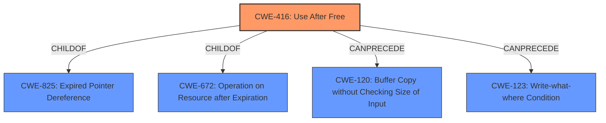

# Analysis for CVE-2021-21191

# Summary
| CWE ID | CWE Name | Confidence | CWE Abstraction Level | CWE Vulnerability Mapping Label | CWE-Vulnerability Mapping Notes |
|---|---|---|---|---|---|
| CWE-416 | Use After Free | 1.0 | Variant | Allowed | Primary CWE |

## Evidence and Confidence

*   **Confidence Score:** 1.0
*   **Evidence Strength:** HIGH

## Relationship Analysis
The primary CWE selected is CWE-416 (Use After Free), which is a variant-level CWE. It is related to other CWEs through hierarchical and chain relationships. Specifically, it is a child of CWE-825 (Expired Pointer Dereference) and CWE-672 (Operation on Resource after Expiration). It can also precede CWE-120 (Buffer Copy without Checking Size of Input) and CWE-123 (Write-what-where Condition). These relationships provide context, but do not change the primary mapping, as CWE-416 is the most specific and accurate representation of the vulnerability.

## Vulnerability Chain
The vulnerability chain starts with a **use after free** condition in the WebRTC component, leading to potential heap corruption and arbitrary code execution.

## Summary of Analysis
The primary **rootcause** of this vulnerability is a **use after free** condition. This is supported by the "Vulnerability Description Key Phrases" which has "**rootcause:** **use after free**" and the "CVE Reference Links Content Summary" section, which states the "**root_cause:** Use after free in the WebRTC component of the Chromium browser." The primary CWE match from similar CVE descriptions is CWE-416 (Use After Free). The retriever results also list CWE-416 as the top candidate. The description of CWE-416 accurately reflects the vulnerability where memory is reused or referenced after it has been freed. This can lead to memory corruption and potentially arbitrary code execution, as stated in the vulnerability description. CWE-416 is a Variant level CWE, which is a preferred level of abstraction. Therefore, CWE-416 is the most appropriate CWE for this vulnerability.

Other CWEs were considered but ultimately not selected:

*   CWE-366 (Race Condition within a Thread): While race conditions can sometimes lead to use-after-free vulnerabilities, there's no direct evidence of a race condition in the provided description.
*   CWE-843 (Access of Resource Using Incompatible Type ('Type Confusion')): Type confusion isn't explicitly mentioned in the description.
*   CWE-122 (Heap-based Buffer Overflow): While heap corruption is mentioned as an impact, the root cause is the use-after-free, not a buffer overflow.
*   CWE-415 (Double Free): Double free isn't mentioned in the description.
*   CWE-1021 (Improper Restriction of Rendered UI Layers or Frames): This CWE is specific to UI redress attacks and is not relevant to the vulnerability.
*   CWE-123 (Write-what-where Condition): While a use-after-free *could* lead to a write-what-where, the vulnerability is more directly related to the memory management issue.
*   CWE-362 (Concurrent Execution using Shared Resource with Improper Synchronization ('Race Condition')): There is no explicit evidence that concurrency is involved.
*   CWE-911 (Improper Update of Reference Count): This CWE is not directly related to the vulnerability.
*   CWE-404 (Improper Resource Shutdown or Release): The resource shutdown is not the issue, but the continued use of the resource.