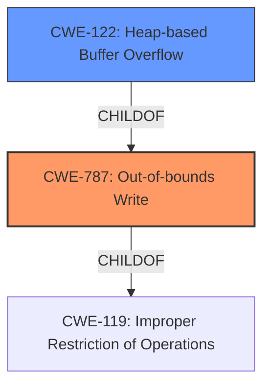

# Analysis for CVE-2021-21192

# Summary
| CWE ID | CWE Name | Confidence | CWE Abstraction Level | CWE Vulnerability Mapping Label | CWE-Vulnerability Mapping Notes |
|---|---|---|---|---|---|
| CWE-787 | Out-of-bounds Write | 1.0 | Base | Allowed | Primary CWE |
| CWE-122 | Heap-based Buffer Overflow | 0.8 | Variant | Allowed | Secondary Candidate |

## Evidence and Confidence

*   **Confidence Score:** 0.9
*   **Evidence Strength:** HIGH

## Relationship Analysis
The primary CWE selected is CWE-787 (**Out-of-bounds Write**), which is a base-level CWE. CWE-787 is related to CWE-119 (**Improper Restriction of Operations within the Bounds of a Memory Buffer**) as a child. CWE-122 (**Heap-based Buffer Overflow**) is a more specific variant of CWE-787. The decision to select CWE-787 as primary and CWE-122 as secondary is based on the provided information, which explicitly mentions "heap buffer overflow".

## Vulnerability Chain
The vulnerability chain starts with a **heap buffer overflow**. The **heap buffer overflow** leads to potential heap corruption, which can further lead to arbitrary code execution.
- The root cause is **Heap buffer overflow** (CWE-787)
- The impact is potential heap corruption and arbitrary code execution

## Summary of Analysis
The initial assessment focused on the provided information, which clearly states a "**Heap buffer overflow**" vulnerability. The selection of CWE-787 (**Out-of-bounds Write**) as the primary CWE is directly supported by this evidence. The relationship analysis shows that CWE-122 (**Heap-based Buffer Overflow**) is a more specific variant of CWE-787. However, due to the broader implications of out-of-bounds writes, and given that the vulnerability could potentially lead to more than just a typical heap overflow scenario, CWE-787 is considered a better primary fit. The retriever results also support this, with CWE-119 (**Improper Restriction of Operations within the Bounds of a Memory Buffer**) being a high-scoring candidate, which is a parent of CWE-787. However, CWE-119 is discouraged.

The evidence supporting the primary CWE is from the "Vulnerability Description Key Phrases" section:
- **weakness:** **Heap buffer overflow**

The final decision is based on mapping the root cause, **Heap buffer overflow**, to CWE-787 (**Out-of-bounds Write**), which allows a more generalized and accurate classification of the vulnerability and CWE-122 (**Heap-based Buffer Overflow**) as a secondary candidate.

Relevant CWE Information:

# Enhanced Context (25 CWEs)

## CWE-415: Double Free
**Abstraction Level**: Variant
**Similarity Score**: 0.77
**Source**: dense

**Description**:
The product calls free() twice on the same memory address, potentially leading to modification of unexpected memory locations.

**Mapping Guidance**:
- Usage: Allowed
- Rationale: This CWE entry is at the Variant level of abstraction, which is a preferred level of abstraction for mapping to the root causes of vulnerabilities.

*Not Selected*: This CWE is not selected because the vulnerability description does not indicate a double free condition.

## CWE-226: Sensitive Information in Resource Not Removed Before Reuse
**Abstraction Level**: Base
**Similarity Score**: 0.77
**Source**: dense

**Description**:
The product releases a resource such as memory or a file so that it can be made available for reuse, but it does not clear or "zeroize" the information contained in the resource before the product performs a critical state transition or makes the resource available for reuse by other entities.

**Mapping Guidance**:
- Usage: Allowed
- Rationale: This CWE entry is at the Base level of abstraction, which is a preferred level of abstraction for mapping to the root causes of vulnerabilities.

*Not Selected*: This CWE is not selected because the vulnerability description does not indicate sensitive information being exposed during resource reuse.

## CWE-366: Race Condition within a Thread
**Abstraction Level**: Base
**Similarity Score**: 0.77
**Source**: dense

**Description**:
If two threads of execution use a resource simultaneously, there exists the possibility that resources may be used while invalid, in turn making the state of execution undefined.

**Mapping Guidance**:
- Usage: Allowed
- Rationale: This CWE entry is at the Base level of abstraction, which is a preferred level of abstraction for mapping to the root causes of vulnerabilities.

*Not Selected*: This CWE is not selected because the vulnerability description does not indicate a race condition within a thread.

## CWE-404: Improper Resource Shutdown or Release
**Abstraction Level**: Class
**Similarity Score**: 0.76
**Source**: dense

**Description**:
The product does not release or incorrectly releases a resource before it is made available for re-use.

**Mapping Guidance**:
- Usage: Allowed-with-Review
- Rationale: This CWE entry is a Class and might have Base-level children that would be more appropriate

*Not Selected*: This CWE is not selected because the vulnerability description does not indicate improper resource shutdown or release.

## CWE-131: Incorrect Calculation of Buffer Size
**Abstraction Level**: Base
**Similarity Score**: 0.76
**Source**: dense

**Description**:
The product does not correctly calculate the size to be used when allocating a buffer, which could lead to a buffer overflow.

**Mapping Guidance**:
- Usage: Allowed
- Rationale: This CWE entry is at the Base level of abstraction, which is a preferred level of abstraction for mapping to the root causes of vulnerabilities.

*Not Selected*: This CWE is not selected because the vulnerability description only mentions **heap buffer overflow**, but not how the buffer size was incorrectly calculated.

## CWE-667: Improper Locking
**Abstraction Level**: Class
**Similarity Score**: 0.75
**Source**: dense

**Description**:
The product does not properly acquire or release a lock on a resource, leading to unexpected resource state changes and behaviors.

**Mapping Guidance**:
- Usage: Allowed-with-Review
- Rationale: This CWE entry is a Class and might have Base-level children that would be more appropriate

*Not Selected*: This CWE is not selected because the vulnerability description does not indicate improper locking.

## CWE-191: Integer Underflow (Wrap or Wraparound)
**Abstraction Level**: Base
**Similarity Score**: 0.75
**Source**: dense

**Description**:
The product subtracts one value from another, such that the result is less than the minimum allowable integer value, which produces a value that is not equal to the correct result.

**Mapping Guidance**:
- Usage: Allowed
- Rationale: This CWE entry is at the Base level of abstraction, which is a preferred level of abstraction for mapping to the root causes of vulnerabilities.

*Not Selected*: This CWE is not selected because the vulnerability description does not indicate integer underflow.

## CWE-193: Off-by-one Error
**Abstraction Level**: Base
**Similarity Score**: 0.74
**Source**: dense

**Description**:
A product calculates or uses an incorrect maximum or minimum value that is 1 more, or 1 less, than the correct value.

**Mapping Guidance**:
- Usage: Allowed
- Rationale: This CWE entry is at the Base level of abstraction, which is a preferred level of abstraction for mapping to the root causes of vulnerabilities.

*Not Selected*: This CWE is not selected because the vulnerability description does not indicate an off-by-one error.

## CWE-124: Buffer Underwrite ('Buffer Underflow')
**Abstraction Level**: Base
**Similarity Score**: 0.74
**Source**: dense

**Description**:
The product writes to a buffer using an index or pointer that references a memory location prior to the beginning of the buffer.

**Mapping Guidance**:
- Usage: Allowed
- Rationale: This CWE entry is at the Base level of abstraction, which is a preferred level of abstraction for mapping to the root causes of vulnerabilities.

*Not Selected*: This CWE is not selected because the vulnerability description indicates a buffer overflow, not a buffer underflow.

## CWE-125: Out-of-bounds Read
**Abstraction Level**: Base
**Similarity Score**: 0.74
**Source**: dense

**Description**:
The product reads data past the end, or before the beginning, of the intended buffer.

**Mapping Guidance**:
- Usage: Allowed