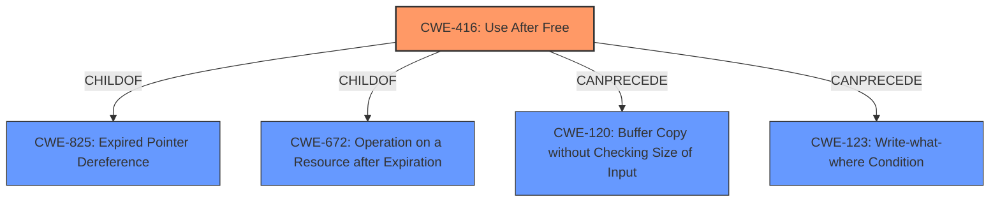

# Analysis Report for CVE-2021-21194

# Vulnerability Analysis Report: CVE-2021-21194

## Description


## Analysis (with Relationship Data)

# Summary
| CWE ID  | CWE Name                           | Confidence | CWE Abstraction Level | CWE Vulnerability Mapping Label | CWE-Vulnerability Mapping Notes |
| :------- | :--------------------------------- | :--------- | :-------------------- | :------------------------------ | :------------------------------ |
| CWE-416  | Use After Free                     | 1          | Variant               | Allowed                       | Primary CWE                     |

## Evidence and Confidence

*   **Confidence Score:** 1
*   **Evidence Strength:** HIGH

## Relationship Analysis
The primary relationship that influenced the decision was the direct match of the **rootcause** "**use after free**" in the vulnerability description with CWE-416 "Use After Free". CWE-416 is a variant, which is a preferred level of abstraction. CWE-416 is a child of CWE-825 (Expired Pointer Dereference), indicating a more general class of issues related to dangling or invalid pointers. It is also related to CWE-672 (Operation on a Resource after Expiration), which represents a broader category of using resources after they are no longer valid. Finally, CWE-416 can precede CWE-120 (Buffer Copy without Checking Size of Input) or CWE-123 (Write-what-where Condition), indicating potential impacts or exploitation paths that may follow a use-after-free vulnerability.



## Vulnerability Chain
The vulnerability chain starts with a **use after free** (**CWE-416**). The impact of this **use after free** is heap corruption. This heap corruption could lead to arbitrary code execution.
  - **CWE-416** (Root Cause: Use After Free) -> Heap Corruption -> Arbitrary Code Execution (Potential Impact)

## Summary of Analysis
The analysis is based on the provided evidence, particularly the "**rootcause:** **use after free**" phrase from the "Vulnerability Description Key Phrases" section and the "Root Cause: The root cause of this vulnerability is a **use-after-free** error" statement from the "CVE Reference Links Content Summary" section. Both of these align directly with the definition of CWE-416.

The graph relationships confirm that CWE-416 is a specific type of memory safety issue (child of CWE-825 and CWE-672) and can lead to further exploitation such as out-of-bounds write (CWE-123).

CWE-416 is selected as the primary CWE due to the explicit mention of "**use after free**" in both the vulnerability description and the CVE reference summary. The confidence is high (1) because the evidence directly supports this classification and aligns with the CWE's definition and mapping guidance.

Other CWEs were considered but not selected:

*   CWE-366 (Race Condition within a Thread): While race conditions can sometimes lead to use-after-free vulnerabilities, there is no direct evidence of a race condition in the provided description.
*   CWE-843 (Access of Resource Using Incompatible Type ('Type Confusion')): There is no evidence of type confusion in the description.
*   CWE-122 (Heap-based Buffer Overflow): While heap corruption is mentioned as an impact, the root cause is the use-after-free, not a buffer overflow directly.
*   CWE-415 (Double Free): There is no mention of a double free in the description.
*   CWE-1021 (Improper Restriction of Rendered UI Layers or Frames): This is related to clickjacking and UI-based attacks, which are not relevant to the vulnerability description.
*   CWE-123 (Write-what-where Condition): While this could be a consequence of the use-after-free, the root cause is the UAF itself.

The selected CWE is at the optimal level of specificity because CWE-416 directly addresses the **rootcause** of the vulnerability, which is the **use after free**.


## CWE Relationship Analysis

Current CWEs represent these abstraction levels: .


### Vulnerability Chain Analysis

**Chain starting from CWE-415:**
- 415 (Double Free) - ROOT


**Chain starting from CWE-123:**
- 123 (Write-what-where Condition) - ROOT


### CWE Relationship Diagram

```mermaid
graph TD
    classDef primary fill:#f96,stroke:#333,stroke-width:2px
    classDef secondary fill:#69f,stroke:#333
    classDef tertiary fill:#9e9,stroke:#333
```


*Report generated on 2025-04-02 04:38:18*
